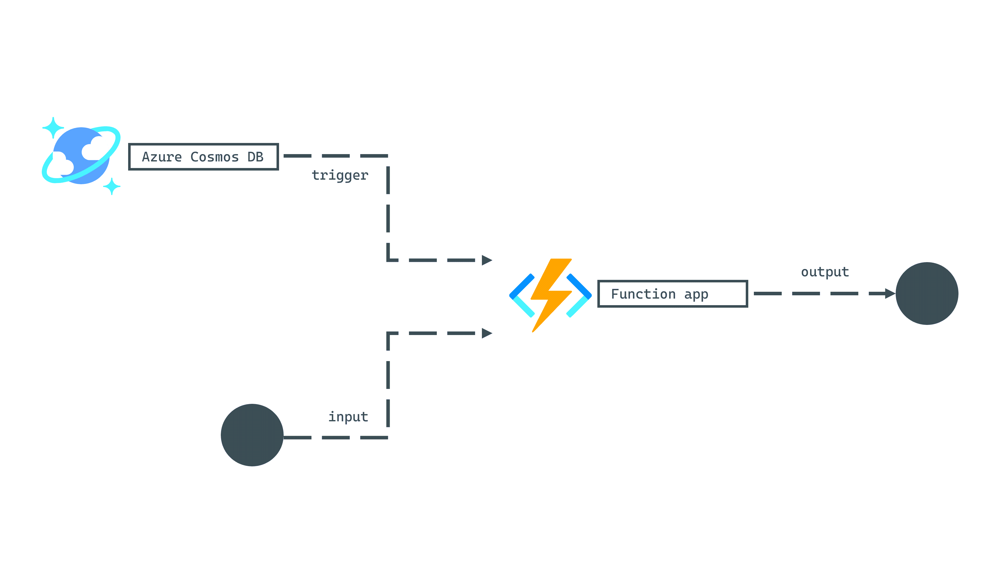

**Azure Functions** is a service that offers serverless blocks of code that can run logic on-demand. Functions are often the building blocks of more complex solutions and are, therefore, reactive in their nature. Typically, some external action invokes a function, the function code performs a small task, and the function returns a response. A complex cloud-native solution could run with as few or as many functions as needed, as they are building blocks that can be used in repeatable and scale-out scenarios.

Each function starts with some external event, called a **trigger** that indicates the function should start. Many triggers also include some payload for the function to process. Azure Functions has triggers for various cloud services to ease the complexity of integrating Azure Functions across your entire solution.

A function can also contain an **input** binding that provides more data after the function has already been triggered. Functions, in addition, can include an **output** binding indicating where the function should send its response.

Azure Cosmos DB has support for all three types of bindings in Azure Functions:

| **Binding** | **Description** |
| ---: | :--- |
| **Trigger** | Start a function’s execution when there is a batch of documents ready from the change feed |
| **Input** | Read one or more items using either a point read or a SQL query |
| **Output** | Write one or more items to a container |

> [!NOTE]
> The bindings referenced here are only supported by the NoSQL API.

