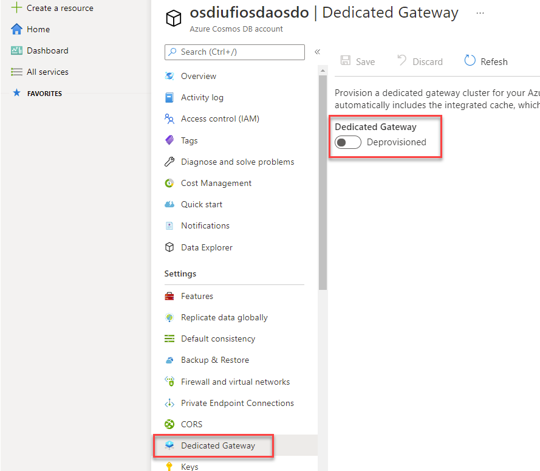
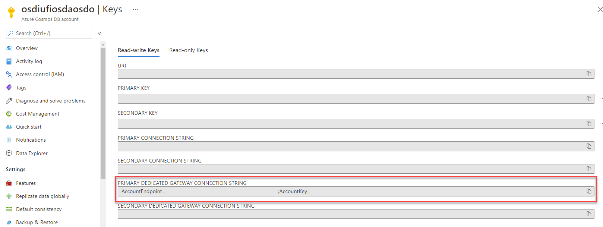

Enabling the integrated cache is done in two primary steps:

- Creating a dedicated gateway in your Azure Cosmos DB for NoSQL account
- Updating your SDK code to use the gateway for requests

## Create a dedicated gateway

First, you must provision a dedicated gateway in your account. This action can be done using the portal and the **Dedicated Gateway** pane.

[](../media/3-dedicated-gateway-full.png#lightbox)

As part of the provisioning process, you will be asked to configure the number of gateway instances and an SKU. These settings determine the number of nodes and the compute and memory size for each gateway node. The number of nodes and SKU can be modified later as the amount of data you need to cache increases.

[](../media/3-dedicated-gateway-config-full.png#lightbox)

Once the new gateway is provisioned, you can get the connection string for the gateway.

> [!NOTE]
> The gateway connection string is a distinct connection string from the one used typically with an Azure Cosmos DB for NoSQL client.

[](../media/3-connection-string-full.png)

## Update .NET SDK code

For the .NET SDK client to use the integrated cache, you must make sure that three things are true:

- The client uses the dedicated gateway connection string instead of the typical connection string
- The client is configured to use **Gateway** mode instead of the default **Direct** connectivity mode
- The client’s consistency level must be set to **session** or **eventual**

First, ensure that the connection string is set to the dedicated gateway’s connection string. Typically, Azure Cosmos DB for NoSQL connection strings are in the format of `<cosmos-account-name>.documents.azure.com`. For the dedicated gateway, the connection string is in the structure of `<cosmos-account-name>.sqlx.cosmos.azure.com`.

```csharp
string connectionString = "AccountEndpoint=https://<cosmos-account-name>.sqlx.cosmos.azure.com/;AccountKey=<cosmos-key>;";
```

> [!NOTE]
> For example, if your account name is **dp420** and your key is: **fDR2ci9QgkdkvERTQ==**, then the connection string would be:
> ``AccountEndpoint=https://dp420.sqlx.cosmos.azure.com/;AccountKey=fDR2ci9QgkdkvERTQ==;``

Next, the .NET **CosmosClient** class must be configured using a **CosmosClientOptions** instance. By default, the .NET SDK uses the **Direct** connectivity mode. The client options object sets the connectivity mode to **Gateway**.

```csharp
CosmosClientOptions options = new()
{
    ConnectionMode = ConnectionMode.Gateway
};

CosmosClient client = new (connectionString, options);
```

### Configure point read operations

To configure a point read operation to use the integrated cache, you must create an object of type **ItemRequestOptions**. In this object, you can manually set the **ConsistencyLevel** property to either **ConsistencyLevel.Session** or **ConsistencyLevel.Eventual**. You can then use the options variable in the **ReadItemAsync** method invocation.

```csharp
string id = "9DB28F2B-ADC8-40A2-A677-B0AAFC32CAC8";
PartitionKey partitionKey = new ("56400CF3-446D-4C3F-B9B2-68286DA3BB99");

ItemResponse<Product> response = await container.ReadItemAsync<Product>(id, partitionKey, requestOptions: operationOptions);
```

To observe the RU usage, use the **RequestCharge** property of the response variable. The first invocation of this read operation will use the expected number of request units. In this example, that would be one RU for a point read operation. Subsequent requests will not use any request units as the data will be pulled from the cache until it expires.

```csharp
Console.WriteLine($"Request charge:\t{response.RequestCharge:0.00} RU/s");
```

### Configure queries

To configure a query to use the integrated cache, create an object of type **QueryRequestOptions**. In this object, you should also manually change the consistency level. Then, pass in the options variable to the **GetItemQueryIterator** method invocation.

```csharp
string sql = "SELECT * FROM products";
QueryDefinition query = new(sql);

QueryRequestOptions queryOptions = new()
{
    ConsistencyLevel = ConsistencyLevel.Eventual
};

FeedIterator<Product> iterator = container.GetItemQueryIterator<Product>(query, requestOptions: queryOptions);
```

You can also observe the RU usage by getting the **RequestCharge** property of each **FeedResponse** object associated with each page of results. If you aggregate the request charges, you will get the total request charge for the entire query. Much like with point reads, the first query will use the typical number of request units. Any extra queries will use no request units until the data expires in the cache.

```csharp
double totalRequestCharge = 0;
while(iterator.HasMoreResults)
{
    FeedResponse<Product> response = await iterator.ReadNextAsync();
    totalRequestCharge += response.RequestCharge;
    Console.WriteLine($"Request charge:\t\t{response.RequestCharge:0.00} RU/s");
}

Console.WriteLine($"Total request charge:\t{totalRequestCharge:0.00} RU/s");
```
