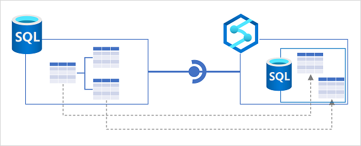

Azure SQL Database is a platform-as-a-service (PaaS) relational database service based on the SQL Server database engine. It's commonly used in cloud-native applications as a scalable, secure, and easy to manage relational database store for operational data.

Azure Synapse Link for Azure SQL Database uses a *link connection* to map one or more tables in an Azure SQL Database instance to tables in a dedicated SQL pool in Azure Synapse Analytics. When the link connection is started, the tables are initialized by copying a snapshot of the source tables to the target tables. Subsequently, the change feed process applies all modifications made in the source tables to the target tables.



## Implementing Azure Synapse Link for Azure SQL Database

To use Azure Synapse Link for Azure SQL Database, you need to configure some settings in your Azure SQL Database server, before creating a link connection in Azure Synapse Analytics.

### Configure Azure SQL Database

Before you can use Azure SQL Database as a source for a linked connection in Azure Synapse Analytics, you must ensure the following  settings are configured in the Azure SQL Database server that hosts the database you want to synchronize:

- **System assigned managed identity** - enable this option so that your Azure SQL Database server uses a system assigned managed identity.
- **Firewall rules** - ensure that Azure services can access your Azure SQL Database server.

In addition to these server-level settings, if you plan to configure the link connection from Azure Synapse Analytics to use a managed identity when connecting to Azure SQL Database, you must create a user for the workspace identity in the database and add it to the **db_owner** role, as shown in the following code example:

```sql
CREATE USER my_synapse_workspace FROM EXTERNAL PROVIDER;
ALTER ROLE [db_owner] ADD MEMBER my_synapse_workspace;
```

> [!TIP]
> If you intend to use SQL authentication, you can omit this step.

### Prepare the target SQL pool

Azure Synapse Link for Azure SQL Database synchronizes the source data to tables in a dedicated SQL pool in Azure Synapse Analytics. You therefore need to create and start a dedicated SQL pool in your Azure Synapse Analytics workspace before you can create the link connection.

The database associated with the dedicated SQL pool must include the appropriate schema for the target table. If source tables are defined in a schema other than the default **dbo** schema, you must create a schema of the same name in the dedicated SQL pool database:

```sql
CREATE SCHEMA myschema;
```

### Create a link connection

To create a linked connection, add a **linked connection** on the **Integrate** page in Azure Synapse Studio. You'll need to:

1. Select or create a *linked service* for your Azure SQL Database. You can create this separately ahead of time, or as part of the process of creating a linked connection for Azure Synapse Link. You can use a managed identity or SQL authentication to connect the linked service to Azure SQL Database.
2. Select the tables in the source database that you want to include in the linked connection.
3. Select the target dedicated SQL pool in which the target tables should be created.
4. Specify the number of CPU cores you want to use to process synchronization. Four driver cores will be used in addition to the number of cores you specify.

After creating the linked connection, you can configure the mappings between the source and target tables. In particular, you can specify the table structure (index) type and distribution configuration for the target tables.

> [!NOTE]
> Some data types in your source tables may not be supported by specific dedicated SQL pool index types. For example, you cannot use a clustered columnstore index for tables that include VARBINARY(MAX) columns. You can map such tables to a *heap* (an unindexed table) in the dedicated SQL pool.

When the linked connection is configured appropriately, you can start it to initialize synchronization. The source tables are initially copied to the target database as snapshots, and then subsequent data modifications are replicated.

> [!TIP]
> Learn more:
> 
> - For more information about Synapse Link for Azure SQL Database, see [Azure Synapse Link for Azure SQL Database](/azure/synapse-analytics/synapse-link/sql-database-synapse-link?azure-portal=true).
> - To learn about limitations and restrictions that apply to Synapse Link for Azure SQL Database, see [Known limitations and issues with Azure Synapse Link for SQL](/azure/synapse-analytics/synapse-link/synapse-link-for-sql-known-issues?azure-portal=true).
> - For a step-by-step guide to setting up Synapse Link for Azure SQL Database, see [Get started with Azure Synapse Link for Azure SQL Database](/azure/synapse-analytics/synapse-link/connect-synapse-link-sql-database?azure-portal=true). You'll also get a chance to try configuring Synapse Link for Azure SQL Database in the exercise, later in this module.
