In this exercise, you will trigger the execution of an AutoML experiment and view its progress in Azure Machine learning studio.

To trigger the execution of a new AutoML experiment, select the `Data` hub and then select the `...` area on the right of the `saleconsolidated` Spark table to activate the context menu.

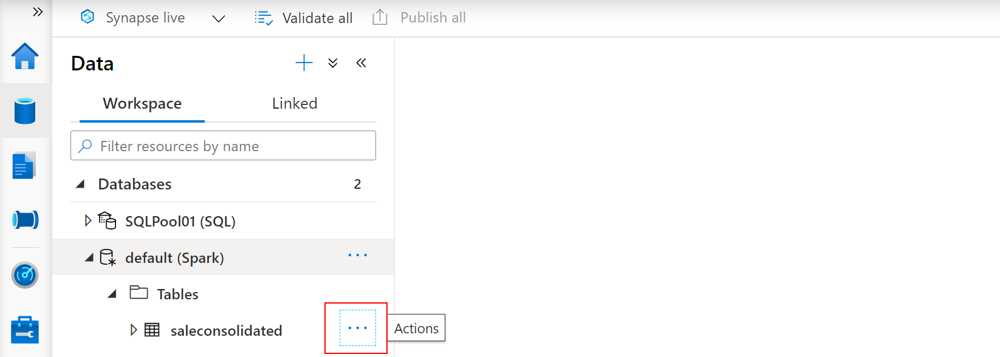

From the context menu, select `Enrich with new model` **(3)**.

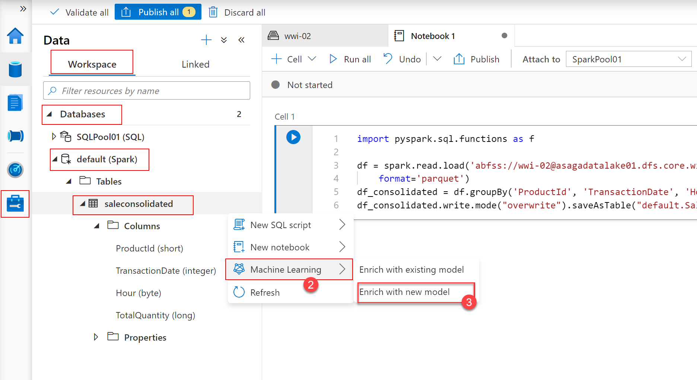

The `Enrich with new model` dialog allows you to set the properties for the Azure Machine Learning experiment. Provide values as follows:

- **Azure Machine Learning workspace (1)**: leave unchanged, should be automatically populated with your Azure Machine Learning workspace name.
- **Experiment name**: leave unchanged, a name will be automatically suggested.
- **Best model name**: leave unchanged, a name will be automatically suggested. Save this name as you will need it later to identify the model in the Azure Machine Learning Studio.
- **Target column (2)**: Select `TotalQuantity(long)` - this is the feature you are looking to predict.
- **Spark pool**: leave unchanged, should be automatically populated with your Spark pool name.

Notice the Apache Spark configuration details **(3)**:

- The number of executors that will be used
- The size of the executor

Select `Continue` **(4)** to advance with the configuration of your AutoML experiment.

Next, you will choose the model type. In this case, the choice will be `Regression` **(1)** as we try to predict a continuous numerical value. After selecting the model type, select `Continue` **(2)** to advance.

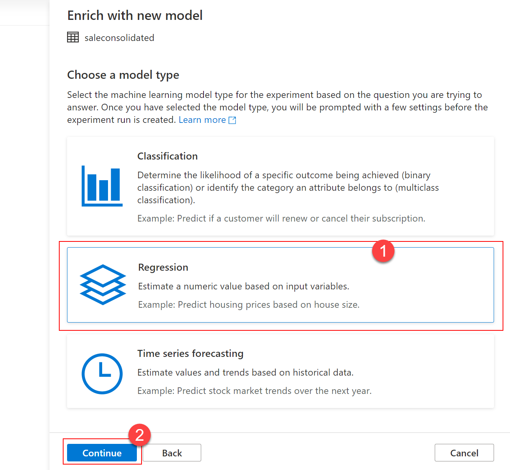

On the `Configure regression model` dialog, provide values as follows:

- **Primary metric**: leave unchanged, `Spearman correlation` should be suggested by default.
- **Training job time (hours) (1)**: set to 0.25 to force the process to finish after 15 minutes.
- **Max concurrent iterations**: leave unchanged.
- **ONNX model compatibility (2)**: set to `Enable` - this is very important as currently only ONNX models are supported in the Synapse Studio integrated experience.

Once you have set all the values, select `Create run (3)` to advance.

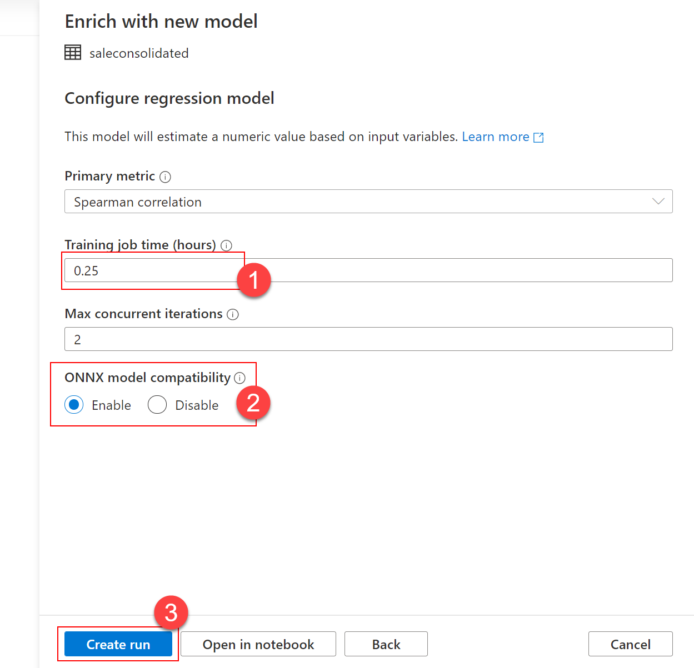

As your run is being submitted, a notification will pop up instructing you to wait until the AutoML run is submitted. You can check the status of the notification by selecting the `Notifications` icon on the top-right part of your screen.

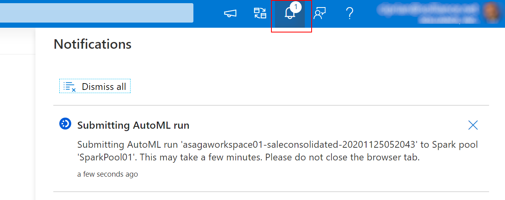

Once your run is successfully submitted, you will get another notification that will inform you about the actual start of the AutoML experiment run.

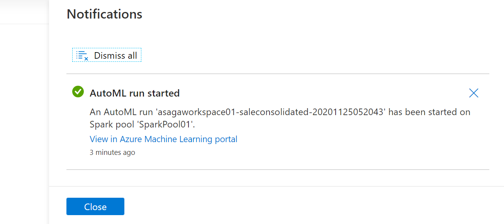

>**NOTE**
>
>Alongside the `Create run` option you might have noticed the `Open in notebook option`. Selecting that option allows you to review the actual Python code that is used to submit the AutoML run. As an exercise, try re-doing all the steps in this task, but instead of selecting `Create run`, select `Open in notebook`. You should see a notebook similar to this:
>
>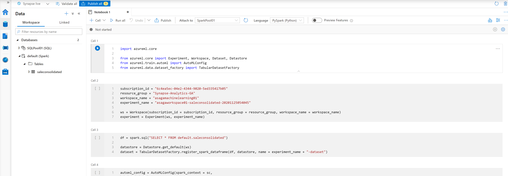
>
>Take a moment to read through the code that is generated for you.

To view the experiment run you just started, open the Azure Portal, select your resource group, and then select the Azure Machine Learning workspace from the resource group.

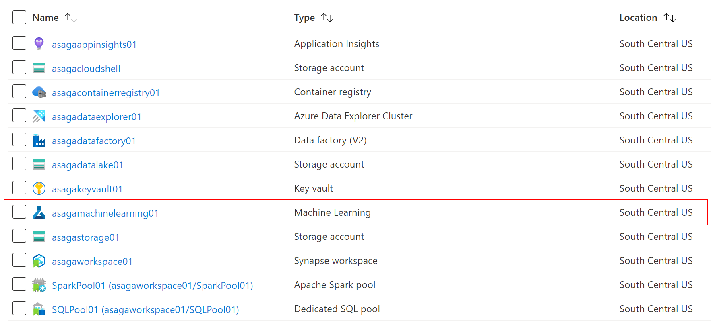

Locate and select the `Launch studio` button to start the Azure Machine Learning Studio.

In Azure Machine Learning Studio, select the `Automated ML` **(1)** section on the left and identify the experiment run you have just started. Note the experiment name, the `Running status` **(2)**, and the `local` **(3)** compute target.

The reason why you see `local` as the compute target is because you are running the AutoML experiment on the Spark pool inside Synapse Analytics. From the point of view of Azure Machine Learning, you are not running your experiment on Azure Machine Learning's compute resources, but on your "local" compute resources.

Select your run, and then select the `Models` tab to view the current list of models being built by your run. The models are listed in descending order of the metric value (which is `Spearman correlation` in this case), the best ones being listed first.

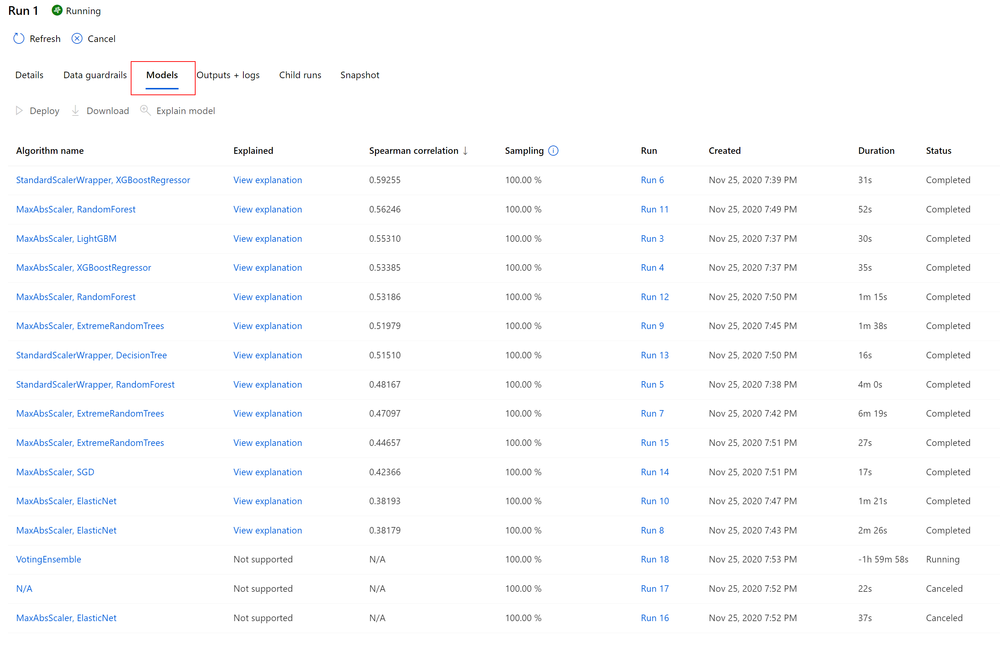

Select the best model (the one at the top of the list) then click on `View Explanations` to open the `Explanations (preview)` tab to see the model explanation. You are now able to see the global importance of the input features. For your model, the feature that influences the most the value of the predicted value is   `ProductId`.

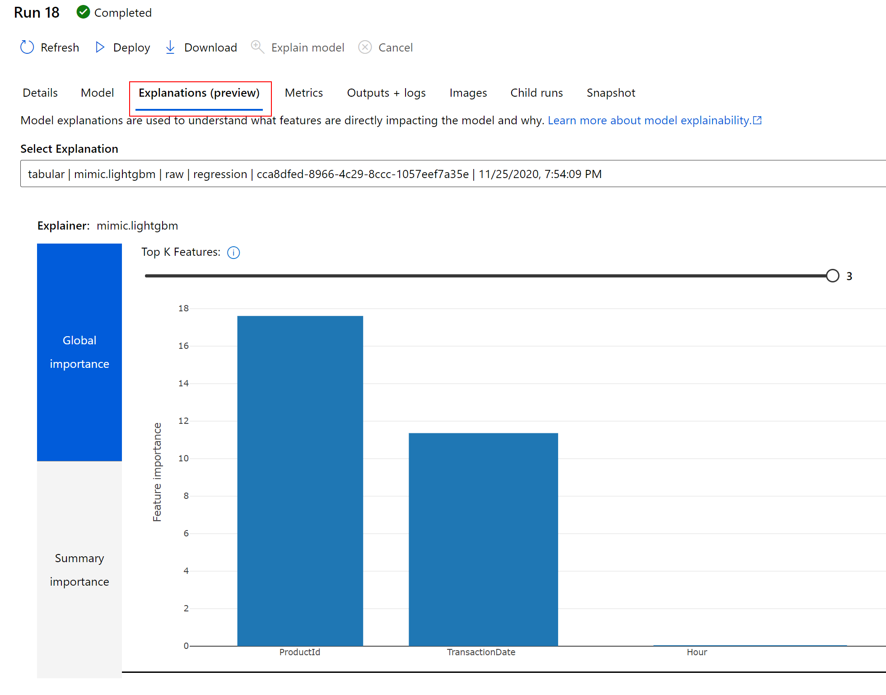

Next, select the `Models` **(1)** section on the left in Azure Machine Learning Studio and see your best model registered with Azure Machine Learning. This allows you to refer to this model later on in this lab.

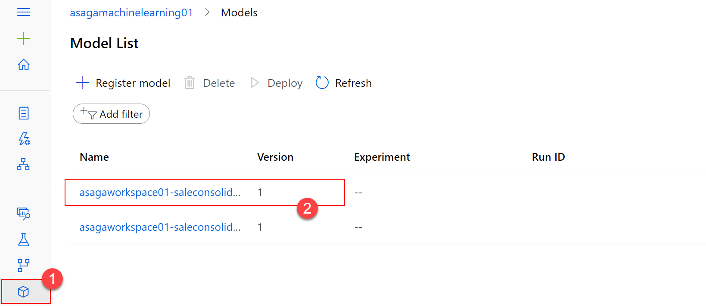
