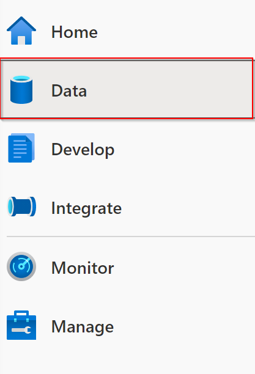
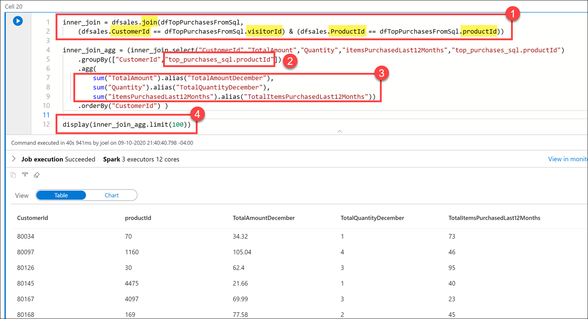

In the following exerercise, we are going to use a fictuous company called Tailwind Traders. 
The use case for Integrating SQL and Spark pools in Azure Synapse Analytics will be outlined.
Continuously you will be shown exercises to see how you can integrate SQL and Spark Pools in Azure Synapse Analytics.
However, it does require a set-up with instructions that can be found here:
[Set up](https://github.com/ctesta-oneillmsft/asa-vtd) 


* Integrating SQL and Spark pools in Azure Synapse Analytics

Tailwind Traders wants to write to the SQL pool after performing data engineering tasks in Spark, then reference the SQL pool data as a source for joining with Spark dataframes that contain data from other files.

You decide to use the Azure Synapse Apache Spark to Synapse SQL connector to efficiently transfer data between Spark pools and SQL pools in Azure Synapse.

Transferring data between Spark pools and SQL pools can be done using JDBC. However, given two distributed systems such as Spark and SQL pools, JDBC tends to be a bottleneck with serial data transfer.

The Azure Synapse Apache Spark pool to Synapse SQL connector is a data source implementation for Apache Spark. It uses the Azure Data Lake Storage Gen2 and PolyBase in SQL pools to efficiently transfer data between the Spark cluster and the Synapse SQL instance.

1. We have been using Python code in these cells up to this point. If we want to use the Apache Spark pool to Synapse SQL connector (`sqlanalytics`), one option is to create a temporary view of the data within the dataframe. Execute the following in a new cell to create a view named `top_purchases`:

    ```python
    # Create a temporary view for top purchases so we can load from Scala
    topPurchases.createOrReplaceTempView("top_purchases")
    ```

    We created a new temporary view from the `topPurchases` dataframe that we created earlier and which contains the flattened JSON user purchases data.

2. We must execute code that uses the Apache Spark pool to Synapse SQL connector in Scala. To do this, we add the `%%spark` magic to the cell. Execute the following in a new cell to read from the `top_purchases` view:

    ```java
    %%spark
    // Make sure the name of the SQL pool (SQLPool01 below) matches the name of your SQL pool.
    val df = spark.sqlContext.sql("select * from top_purchases")
    df.write.sqlanalytics("SQLPool01.wwi.TopPurchases", Constants.INTERNAL)
    ```

    > [!NOTE]
    > The cell may take over a minute to execute. If you have run this command before, you will receive an error stating that "There is already and object named.." because the table already exists.

    After the cell finishes executing, let's take a look at the list of SQL pool tables to verify that the table was successfully created for us.

3. **Leave the notebook open**, then navigate to the **Data** hub (if not already selected).

     

4. Select the **Workspace** tab **(1)**, expand the SQL pool, select the **ellipses (...)** on Tables **(2)** and select **Refresh (3)**. Expand the **`wwi.TopPurchases`** table and columns **(4)**.

    

    As you can see, the `wwi.TopPurchases` table was automatically created for us, based on the derived schema of the Spark dataframe. The Apache Spark pool to Synapse SQL connector was responsible for creating the table and efficiently loading the data into it.

5. **Return to the notebook** and execute the following in a new cell to read sales data from all the Parquet files located in the `sale-small/Year=2019/Quarter=Q4/Month=12/` folder:

    ```python
    dfsales = spark.read.load('abfss://wwi-02@' + datalake + '.dfs.core.windows.net/sale-small/Year=2019/Quarter=Q4/Month=12/*/*.parquet', format='parquet')
    display(dfsales.limit(10))
    ```

    > [!NOTE]
    > It can take over 3 minutes for this cell to execute.
    >
    > The `datalake` variable we created in the first cell is used here as part of the file path.

     

    Compare the file path in the cell above to the file path in the first cell. Here we are using a relative path to load **all December 2019 sales** data from the Parquet files located in `sale-small`, vs. just December 31, 2010 sales data.

    Next, let's load the `TopSales` data from the SQL pool table we created earlier into a new Spark dataframe, then join it with this new `dfsales` dataframe. To do this, we must once again use the `%%spark` magic on a new cell since we'll use the Apache Spark pool to Synapse SQL connector to retrieve data from the SQL pool. Then we need to add the dataframe contents to a new temporary view so we can access the data from Python.

6. Execute the following in a new cell to read from the `TopSales` SQL pool table and save it to a temporary view:

    ```java
    %%spark
    // Make sure the name of the SQL pool (SQLPool01 below) matches the name of your SQL pool.
    val df2 = spark.read.sqlanalytics("SQLPool01.wwi.TopPurchases")
    df2.createTempView("top_purchases_sql")

    df2.head(10)
    ```

    

    The cell's language is set to `Scala` by using the `%%spark` magic **(1)** at the top of the cell. We declared a new variable named `df2` as a new DataFrame created by the `spark.read.sqlanalytics` method, which reads from the `TopPurchases` table **(2)** in the SQL pool. Then we populated a new temporary view named `top_purchases_sql` **(3)**. Finally, we showed the first 10 records with the `df2.head(10))` line **(4)**. The cell output displays the dataframe values **(5)**.

7. Execute the following in a new cell to create a new dataframe in Python from the `top_purchases_sql` temporary view, then display the first 10 results:

    ```python
    dfTopPurchasesFromSql = sqlContext.table("top_purchases_sql")

    display(dfTopPurchasesFromSql.limit(10))
    ```

    

8. Execute the following in a new cell to join the data from the sales Parquet files and the `TopPurchases` SQL pool:

    ```python
    inner_join = dfsales.join(dfTopPurchasesFromSql,
        (dfsales.CustomerId == dfTopPurchasesFromSql.visitorId) & (dfsales.ProductId == dfTopPurchasesFromSql.productId))

    inner_join_agg = (inner_join.select("CustomerId","TotalAmount","Quantity","itemsPurchasedLast12Months","top_purchases_sql.productId")
        .groupBy(["CustomerId","top_purchases_sql.productId"])
        .agg(
            sum("TotalAmount").alias("TotalAmountDecember"),
            sum("Quantity").alias("TotalQuantityDecember"),
            sum("itemsPurchasedLast12Months").alias("TotalItemsPurchasedLast12Months"))
        .orderBy("CustomerId") )

    display(inner_join_agg.limit(100))
    ```

    In the query, we joined the `dfsales` and `dfTopPurchasesFromSql` dataframes, matching on `CustomerId` and `ProductId`. This join combined the `TopPurchases` SQL pool table data with the December 2019 sales Parquet data **(1)**.

    We grouped by the `CustomerId` and `ProductId` fields. Since the `ProductId` field name is ambiguous (it exists in both dataframes), we had to fully qualify the `ProductId` name to refer to the one in the `TopPurchases` dataframe **(2)**.

    Then we created an aggregate that summed the total amount spent on each product in December, the total number of product items in December, and the total product items purchased in the last 12 months **(3)**.

    Finally, we displayed the joined and aggregated data in a table view.

    > **Note to presenter**: Feel free to click on the column headers in the Table view to sort the result set.

    