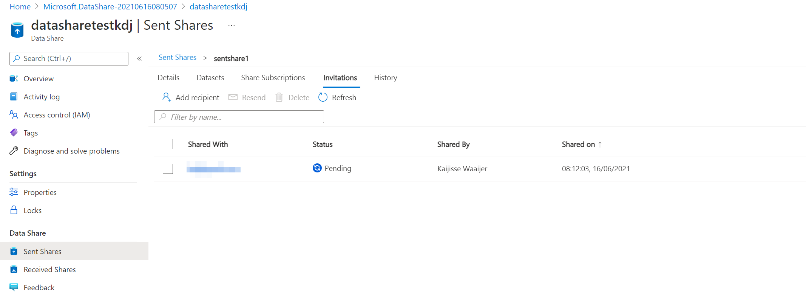

A scenario  where you need to manage existing Azure Data Shares, is when you want to send datasets to additional people or organizations, and when you want to add or remove datasets. 

You can add recipients to an existing Data Share, by navigating to the Sent Share and select the Invitations tab. 

You can click ‘+Add Recipient’ and specify the recipient that needs to gain access to that existing share. 

If you want to add datasets to an existing share, where recipients might need to gain access to other datasets as well, you can add a dataset to the share such that you don’t have to set up a new data share. 

If you have recipients that no longer work for the company you shared your data with, you would need to revoke their access if they have already accepted the invitation. 
If the person did not accept the invitation, a simple delete of the invitation to a recipient will prevent them from creating the share subscription and won’t receive any data that otherwise would have been shared. 
However, if the consumer already accepted the invitation, you would have to revoke their access to the share subscription. 

If you revoke the share subscription access from the consumers, you prevent the consumer from triggering snapshots. However, if the consumer previously has performed a snapshot, the latest data that they have will stay in their account. 