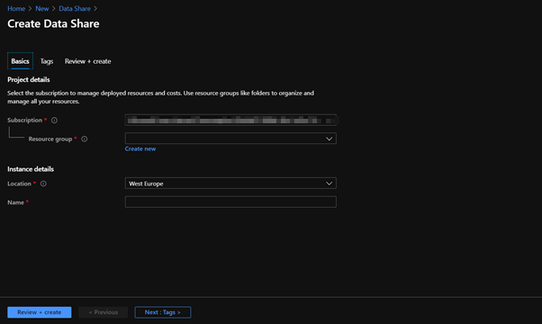
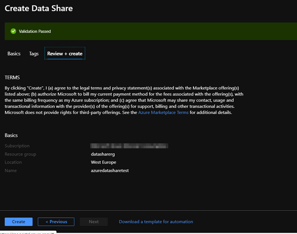

You have two possibilities to provision an Azure Data Share. 

In the below exercise, you’re going to create an Azure Data Share from the portal. 

1.	Navigate to the Azure portal and on the left-hand side, go to Create a Resource:

    

2.	You’ll be directed to the Azure Market Place, where you type in the search: 'Data Share'

    

3.	You’ll be redirected to the product Azure Data Share:

    

4.	Navigate to Create, and you’ll have to provide the following:

    

    **Settings**:

    *Resource Group*:

    If you have an existing resource group in which you would want to create the Azure Data Share in, select it from the drop-down menu for the resource group that you’d like to deploy the Data Share into. 

    If you don’t have an existing Resource group,  navigate through ‘Create new’, and create a new resource group. 

    *Location*:

    Choose the Azure region that's right for you and your customers.

    Azure Data Share does not store a copy of the data itself. The data is stored in the underlying data store that is being shared. For example, if a data producer stores their data in an Azure Data Lake Store account located in West US, that is where the data is stored. If they are sharing data with an Azure Storage account located in West Europe via snapshot, typically the data is transferred directly to the Azure Storage account located in West Europe.

    The Azure Data Share service does not have to be available in your region to leverage the service. For example, if you have data stored in an Azure Storage account located in a region where Azure Data Share is not yet available, you can still leverage the service to share your data.

    *Name*:

    Give the resource a name. 

    Once you have filled out the mandatory marks,  go to ‘Review + create’, which will validate the variables that you filled out in the form in order to deploy the Azure Data Share to the resource group you selected/created. 

5.	You’ll be redirected to the below screen, in which you navigate to create, which will deploy the Azure Data share in your resource group.

    