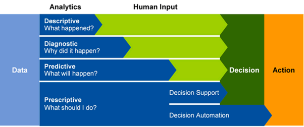

Azure Synapse Analytics is an integrated analytics platform which combines data warehousing, big data analytics, data integration, and visualization into a single environment. Azure Synapse Analytics empowers users of all abilities to gain access and quick insights across all of their data, enabling a whole new level of performance and scale.

Gartner defines a range of analytical types that Azure Synapse Analytics can support including:

## Descriptive Analytics

This answers the question “What is happening in my business?” The data to answer this question is typically answered through the creation of a data warehouse. Azure Synapse Analytics leverages the dedicated SQL Pool capability that enables you to create a persisted data warehouse to perform this type of analysis. You can also make use of SQL Serverless to prepare data from files the create a data warehouse interactively to answer the question too.

## Diagnostic Analytics

Diagnostic analytics deals with answering the question “Why is it happening?” this may involve exploring information that already exists in a data warehouse, but typically involves a wider search of your data estate to find more data to support this type of analysis. 

You can use the same SQL serverless capability within Azure Synapse Analytics that enables you to interactively explore data within a data lake. This can quickly enable a user to search for additional data that may help them to understand “Why is it happening?”

 

## Predictive Analytics 

Azure Synapse Analytics also enables you to answer the question “What is likely to happen in the future based on previous trends and patterns?” by using its integrated Apache Spark engine. This can also be used in conjunction with other services such as Azure Machine Learning Services, or Azure Databricks.

## Prescriptive Analytics

This type of analytics looks at executing actions based on real-time or near real-time analysis of data, using predictive analytics. Azure Synapse Analytics provides this capability through both Apache Spark, Azure Synapse Link, and by integrating streaming technologies such as Azure Stream Analytics.

Azure Synapse Analytics gives the users of the service the freedom to query data on their own terms, using either serverless or dedicated resources at scale. Azure Synapse Analytics brings these two worlds together with a unified data integration experience to ingest, prepare, manage, and serve data using Azure Synapse Pipelines. In addition, you can visualize the data in the form of dashboards and reports for immediate analysis using Power BI which is integrated into the service too.
