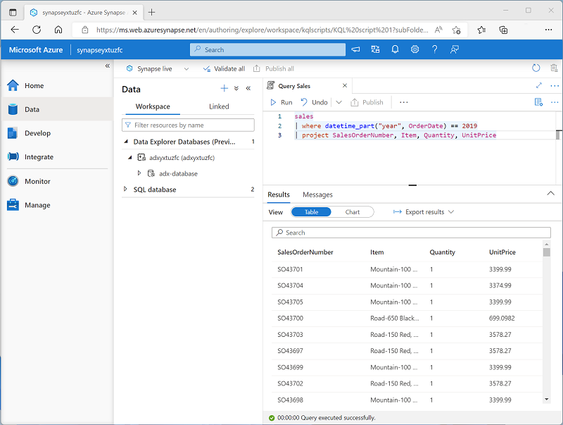

To support the analytics needs of today's organizations, Azure Synapse Analytics combines a centralized service with built-in data storage and processing capabilities with an extensible architecture through which *linked services* enable you to integrate commonly used data stores, processing platforms, and visualization tools.

## Creating and using an Azure Synapse Analytics workspace

A Synapse Analytics *workspace* defines an instance of the Synapse Analytics service in which you can manage the services and data resources needed for your analytics solution. You can create a Synapse Analytics workspace in an Azure subscription interactively by using the Azure portal, or you can automate deployment by using Azure PowerShell, the Azure command-line interface (CLI), or with an Azure Resource Manager or Bicep template.

After creating a Synapse Analytics workspace, you can manage the services in it and perform data analytics tasks with them by using *Synapse Studio*; a web-based portal for Azure Synapse Analytics.

## Working with files in a data lake

One of the core resources in a Synapse Analytics workspace is a *data lake*, in which data files can be stored and processed at scale. A workspace typically has a default data lake, which is implemented as a linked service to an Azure Data Lake Storage Gen2 container. You can add linked services for multiple data lakes that are based on different storage platforms as required.

## Ingesting and transforming data with pipelines

In most enterprise data analytics solutions, data is extracted from multiple operational sources and transferred to a central data lake or data warehouse for analysis. Azure Synapse Analytics includes built-in support for creating, running, and managing *pipelines* that orchestrate the activities necessary to retrieve data from a range of sources, transform the data as required, and load the resulting transformed data into an analytical store.

> [!NOTE]
> Pipelines in Azure Synapse Analytics are based on the same underlying technology as Azure Data Factory. If you are already familiar with Azure Data Factory, you can leverage your existing skills to build data ingestion and transformation solutions in Azure Synapse Analytics.

## Querying and manipulating data with SQL

Structured Query Language (SQL) is a ubiquitous language for querying and manipulating data, and is the foundation for relational databases, including the popular Microsoft SQL Server database platform. Azure Synapse Analytics supports SQL-based data querying and manipulation through two kinds of SQL *pool* that are based on the SQL Server relational database engine:

- A built-in *serverless* pool that is optimized for using relational SQL semantics to query file-based data in a data lake.
- Custom *dedicated* SQL pools that host relational data warehouses.

The Azure Synapse SQL system uses a distributed query processing model to parallelize SQL operations, resulting in a highly scalable solution for relational data processing. You can use the built-in serverless pool for cost-effective analysis and processing of file data in the data lake, and use dedicated SQL pools to create relational data warehouses for enterprise data modeling and reporting.

## Processing and analyzing data with Apache Spark

Apache Spark is an open source platform for big data analytics. Spark performs distributed processing of files in a data lake by running jobs that can be implemented using any of a range of supported programming languages. Languages supported in Spark include Python, Scala, Java, SQL, and C#.

In Azure Synapse Analytics, you can create one or more Spark pools and use interactive *notebooks* to combine code and notes as you build solutions for data analytics, machine learning, and data visualization.

## Exploring data with Data Explorer

Azure Synapse Data Explorer is a data processing engine in Azure Synapse Analytics that is based on the Azure Data Explorer service. Data Explorer uses an intuitive query syntax named Kusto Query Language (KQL) to enable high performance, low-latency analysis of batch and streaming data.

## Integrating with other Azure data services

Azure Synapse Analytics can be integrated with other Azure data services for end-to-end analytics solutions. Integrated solutions include:

- **Azure Synapse Link** enables near-realtime synchronization between operational data in Azure Cosmos DB, Azure SQL Database, SQL Server, and Microsoft Power Platform Dataverse and analytical data storage that can be queried in Azure Synapse Analytics.
- **Microsoft Power BI** integration enables data analysts to integrate a Power BI workspace into a Synapse workspace, and perform interactive data visualization in Azure Synapse Studio.
- **Microsoft Purview** integration enables organizations to catalog data assets in Azure Synapse Analytics, and makes it easier for data engineers to find data assets and track data lineage when implementing data pipelines that ingest data into Azure Synapse Analytics.
- **Azure Machine Learning** integration enables data analysts and data scientists to integrate predictive model training and consumption into analytical solutions.
