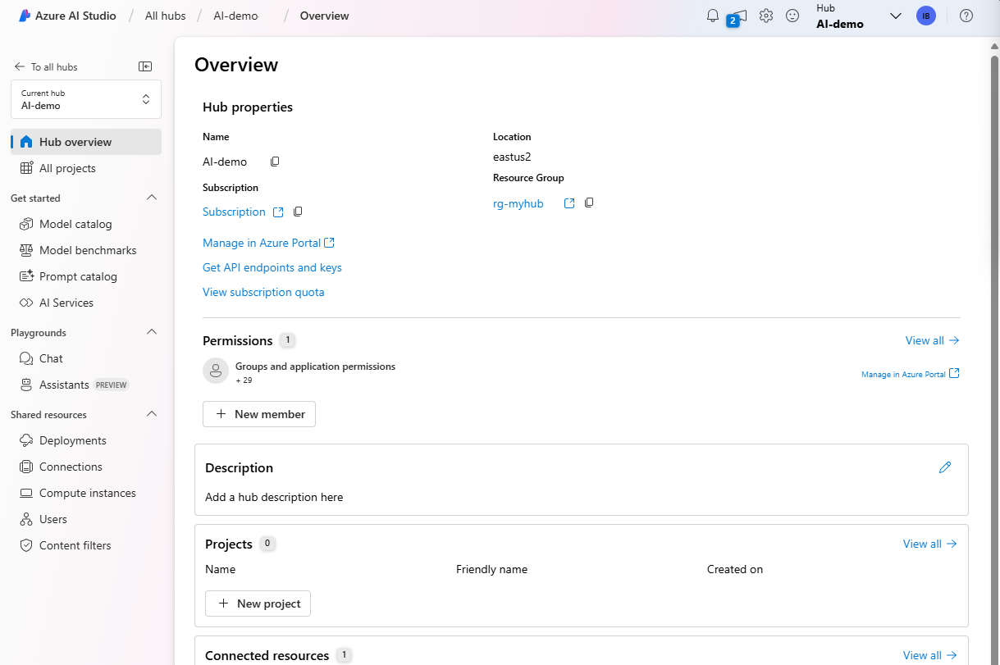

An Azure AI *resource* provides a collaborative workspace for AI solution development and management. You need at least one Azure AI resource to use the solution development features and capabilities of AI Studio.

>

## Associated Azure resources

You can use Azure AI Studio to create an Azure AI resource on the **Manage** page, or you can create one during the process of creating a new project (on the **Build** page). When you do so, an **Azure AI** resource is created in your Azure subscription in the resource group you specify. This resource provides a collaborative workspace for AI development.

In addition to the core **Azure AI** resource, other Azure resources are created to provide supporting services. These include

- A **Storage account** in which the data for your AI projects is stored securely.
- A **Key vault** in which credentials used to access external resources and other sensitive values are secured.
- A **Container registry** to store Docker images used by your AI solutions.
- An **Application insights** resource to record usage and performance metrics.

## What can I do with an Azure AI resource?

An Azure AI resource is the foundation for AI development projects on Azure, and enables you to define shared assets that can be used across multiple projects. You can use AI Studio to perform the following tasks in an Azure AI resource on the **Manage** page:

- Create *members* and assign them to specific roles.
- Create and manage *compute instances* on which to run experiments, prompt flows, and custom code.
- Create and manage *connections* to resources, such as data stores, GitHub, Azure AI Search indexes, and others.
- Define *policies* to manage behavior, such as automatic compute shutdown.
