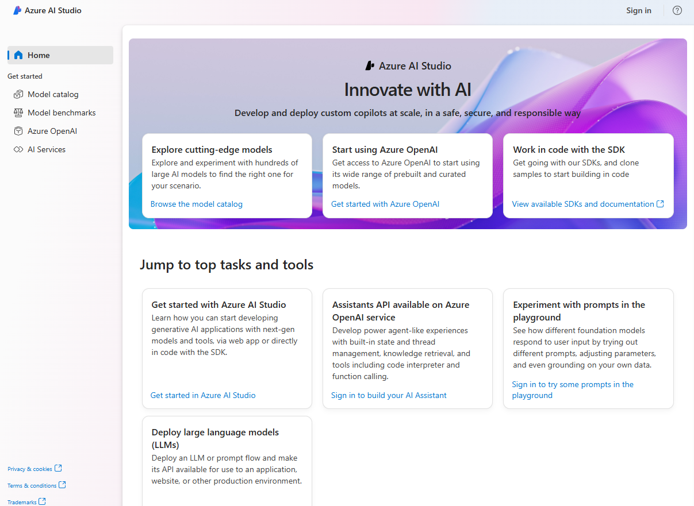
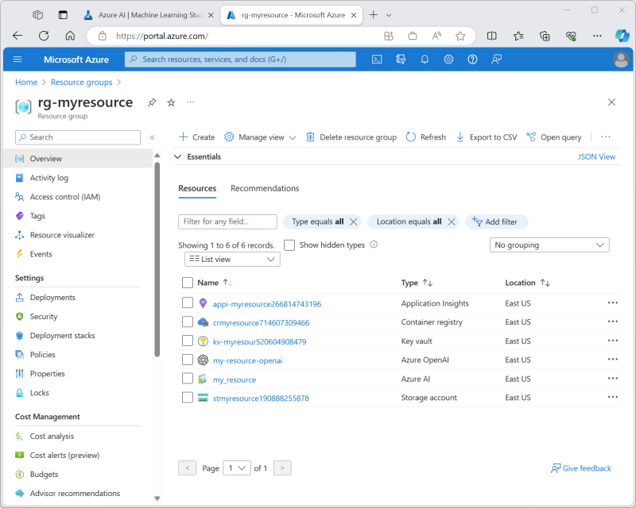
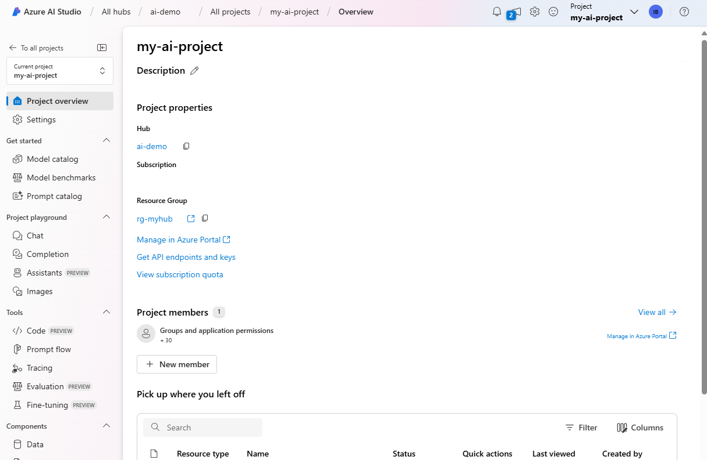
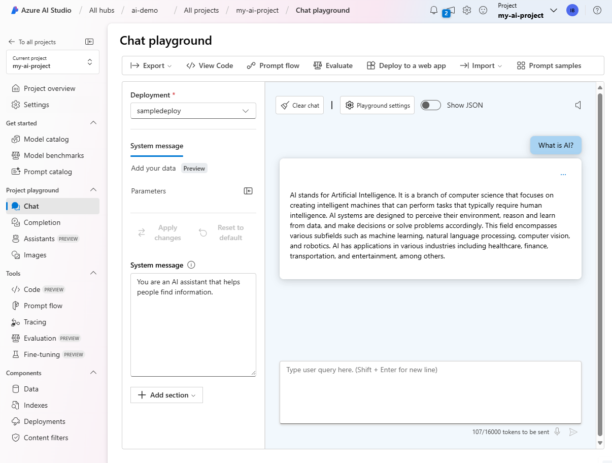
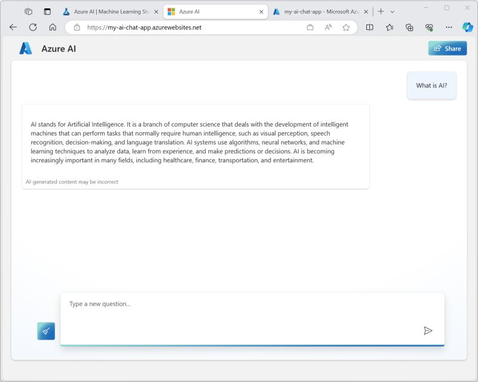

If you have an Azure subscription with access to the Azure OpenAI service, you can explore Azure AI Studio for yourself.

> [!NOTE]
> If you don't have an Azure subscription, and you want to explore Azure AI Studio, you can [sign up for an account](https://azure.microsoft.com/free?azure-portal=true), which includes credits for the first 30 days. After creating your account, you will need to apply for access to the [Azure OpenAI service](/legal/cognitive-services/openai/limited-access?azure-portal=true) for your subscription.

## Open Azure AI Studio

Let's start by viewing Azure AI Studio.

1. In a web browser, open [https://ai.azure.com](https://ai.azure.com) and sign in using your Azure credentials. The home page of Azure AI Studio looks similar to the following image:

    

1. Review the information on the home page and view each of the tabs, noting the options to explore models and capabilities, create projects, and manage resources.

## Create an Azure AI resource

You need an Azure AI resource in your Azure subscription to host projects. You can either create this resource while creating a project, or provision it ahead of time (which is what we'll do in this exercise).

1. On the **Manage** page, select **+ New Azure AI resource**. Then, in the **Create a new Azure AI resource** wizard, create a new resource with the following settings:
    - **Azure AI resource name**: *A unique name*
    - **Subscription**: *Your Azure subscription*
    - **Resource group**: *Create a new resource group with a unique name, or select an existing one*
    - **Location**: *Choose any Azure OpenAI service supported location*
    - **Advanced options**:
        - **AI Services provider**: New multi-service provider
        - **AI Search**: None

    After the resource has been created, it should look similar to the following image:

    

1. Open a new browser tab (leaving the Azure AI Studio tab open) and browse to the Azure portal at [https://portal.azure.com](https://portal.azure.com?azure-portal=true), signing in with your Azure credentials if prompted.
1. Browse to the resource group where you created your Azure AI resource, and view the resource along with some other Azure resources to support it.

    

1. Return to the Azure AI Studio browser tab.
1. View each of the pages in the pane on the left side of the **Azure AI resource details** page, and note the artifacts you can create and manage in your resource.

## Create a project

An Azure AI resource provides a collaborative workspace within which you can define one or more *projects*. Let's create a project in your Azure AI resource.

1. In Azure AI Studio, on the **Build** page, select **+ New project**. Then, in the **Create a new project** wizard, create a project with the following settings:
    - **Project name**: *A unique name for your project*
    - **Azure AI resource**: *Your Azure AI resource*
    - **Advanced options**:
        - **Subscription**: *Your Azure subscription*
        - **Resource group**: *The resource group where you created your Azure AI resource*
1. Wait for your project to be created. When it's ready, it should look similar to the following image:

    

1. View the pages in the pane on the left side, expanding each section, and note the tasks you can perform and the resources you can manage in a project.

## Deploy and test a model

You can use a project to create complex AI solutions based on generative AI models. A full exploration of all of the development options available in Azure AI Studio is beyond the scope of this exercise, but we'll explore some basic ways in which you can work with models in a project.

> [!NOTE]
> To complete this part of the exercise, your Azure subscription must be approved for access to the Azure OpenAI service.

1. In the **Components** section, select the **Deployments** page.
1. On the **Deployments** page, select **+ Create** to create a model deployment.
1. In the **Select a model** list, select the **gpt-35-turbo** model and confirm your selection. Then deploy the model with the following settings:
    - **Deployment name**: *A unique name for your model deployment*
    - **Model**: gpt-35-turbo
    - **Advanced options**: *Use the default settings*

    *The **gpt-35-turbo** model is provided by the Azure OpenAI service, which is is restricted to approved subscriptions. If your subscription does not have access to the Azure OpenAI service, the **gpt-35-turbo** model will not be listed.*

1. After the model has been deployed, in the pane on the left, in the **Tools** section, select the **Playground** page.
1. In the **Playground** page, ensure that your model deployment is selected in the **Configuration** section. Then, in the **Chat session** section, enter a query such as *What is AI?* and view the response:

    

## Deploy a chat application

The model you have deployed can be used to support a chat application hosted in Azure.

### Deploy a web app

1. In the **Playground** page, select **Deploy** and deploy a new web app with the following settings:
    - **Name**: *A unique name for your web app*
    - **Subscription**: *Your Azure subscription*
    - **Resource group**: *The resource group where you created your Azure AI resource*
    - **Location**: *The same location as your Azure AI resource*
    - **Pricing plan**: Free (F1) *(if this option isn't available, select Basic (B1))*
    - **Enable chat history in the web app**: <u>un</u>selected
    - **I acknowledge that web apps will incur usage to my account**: Selected
1. Wait for the app to be deployed, which may take a few minutes. When it's ready, the **Launch** button will be enabled on the toolbar (but don't launch the app yet!).

    *Don't navigate away from the **Playground** page - you'll return to it later!*

### Configure authentication

1. Return to the browser tab containing the Azure portal (or re-open the [Azure portal](https://portal.azure.com?azure-portal=true) in a new browser tab) and view the contents of the resource group where you deployed the Azure AI resource and web app (you may need to refresh the view the see the web app).
1. Select the **App service** resource for your web app to view its details, and then select its **Authentication** page under **Settings** in the pane on the left.
1. Add a provider with the following settings:
    - **Identity provider**: Microsoft
    - **Tenant type**: Workforce
    - **App registration**: Create a new app registration
    - **Name**: *The name of your web app service*
    - **Supported account types**: Current tenant - Single tenant
    - **Restrict access**: Requires authentication
    - **Unauthenticated requests**: HTTP 302 Found redirect - recommended for websites

### Use the web app

1. Wait 10 minutes or so for the authentication settings to take effect.
1. Return to the browser tab containing the **Playground** page in Azure AI Studio.
1. Select **Launch** to launch the deployed web app. If prompted, accept the permissions request.

    *If the authentication settings haven't yet taken effect, close the browser tab for your web app and return to the **Playground** page in Azure AI Studio. Then wait a little longer and try again.*

1. In your web app, enter a question and view the response; like this:

    

## Clean up

If you've finished exploring Azure AI Studio, you should delete the resources you have created in this exercise to avoid incurring unnecessary Azure costs.

1. Return to the browser tab containing the Azure portal (or re-open the [Azure portal](https://portal.azure.com?azure-portal=true) in a new browser tab) and view the contents of the resource group where you deployed the resources used in this exercise.
1. On the toolbar, select **Delete resource group**.
1. Enter the resource group name and confirm that you want to delete it.
