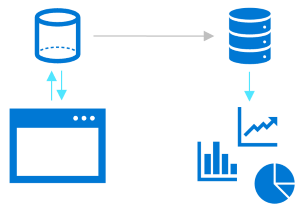

### Operational and analytical data

- Operational: Transactional data used by applications
- Analytical: Optimized for analysis and reporting

### Streaming data

Azure Stream Analytics is a fully managed stream processing engine that is designed to analyze and process large volumes of streaming data with sub-millisecond latencies with no impact upon the event hubs that are responsible for the data movement.

### Data pipeline

- Orchestrated activities to transfer and transform data
- Used to implement extract, transform, and load (ETL) or extract, load, and transform (ELT) operations

### Data Lake

A data lake is a storage repository that holds large amounts of data in native, raw formats. Data lake stores are optimized for scaling to terabytes and petabytes of data. The data typically comes from multiple heterogeneous sources, and may be structured, semi-structured, or unstructured. 

The idea with a data lake is to store everything in its original, untransformed state. This approach differs from a traditional data warehouse, which transforms and processes the data at the time of ingestion.

- Analytical data stored in files
- Distributed storage for massive scalability
- hierarchical and highly secure in design

### Data Warehouse

A data warehouse is a centralized repository of integrated data from one or more disparate sources. Data warehouses store current and historical data and are used for reporting and analysis of the data.

Some characteristics of a data warehouse include:

- Analytical data is stored in a relational database
- Typically modeled as a star schema to optimize summary analysis
- tight integration with the data lake

### Apache Spark

Spark is a parallel processing framework that takes advantage of in-memory processing and a distributed file architecture, such as data lake. It is a common open-source software (oss) tool for big data scenarios and has support for many of what we reviewed above including:

- Extract, Transform, and Load (ETL)
- Real-time data stream processing
- Batch processing
- Support for Graph
- Machine Learning
- Structured data processing with the use of Spark SQL.

Apache Spark has three main components: the driver, executors, and cluster manager. Spark applications run as independent sets of processes on a cluster, coordinated by the driver program.
