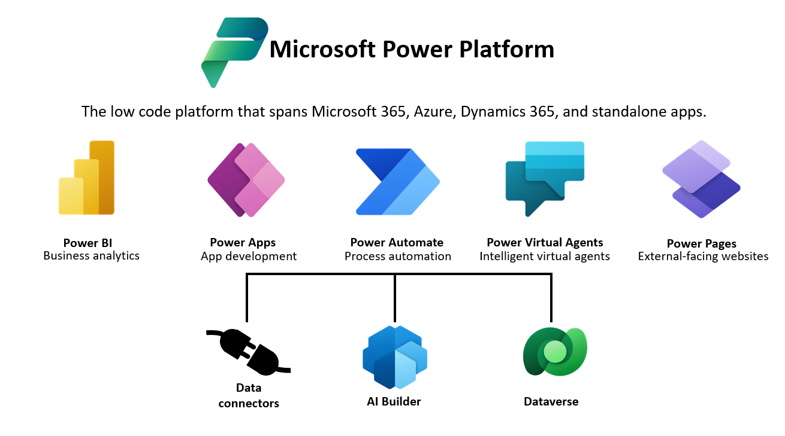

AI embedded in everyday applications may not be enough to power the business applications an organization needs. In these cases, Power Platform is the next step towards more customizable AI solutions. It provides a simple, low-code way to introduce AI in your business applications without having to create or manage the AI yourself.

## What is Microsoft Power Platform?

Microsoft Power Platform is a low-code or no-code set of services designed to simplify the process of building solutions. It provides building blocks that help teams work faster. Even if Power Platform isn't centered on AI, its services are often powered by AI and help you create smart solutions.

The Power Platform portfolio includes five different products: Power BI, Power Apps, Power Automate, Power Virtual Agents, and Power Pages. It also offers three additional tools: AI Builder, Microsoft Dataverse, and Connectors. Let's see what each of them can do for you.

> [!div class="mx-imgBorder"] 

>  

## What can you do with Microsoft Power Platform?

All of the products contained in Power Platform are used to speed up business app development. Beside the specific AI functionalities included in them, they can be connected to Copilot. Thanks to this feature, users can leverage the Copilot generative AI to automatically create the report, workflow, app, website, or chatbot just by describing what they need.

### Power BI

Power BI is a business analytics service. It provides insights on a customizable dashboard. It helps organizations be more data-driven and take better decisions based on data. This idea is one of the pillars of AI as well.

### Power Apps

Power Apps is a low-code development environment. It's used to building custom business apps. With AI Builder, a Power Platform capability that delivers AI models for business process optimization. Developers can use AI Builder to add prebuilt or custom AI.

### Power Automate

Power Automate is a tool for automating repetitive business processes. It saves time in clicks in communication, data collection, and decision approval. It can also be connected to AI Builder, so users can trigger actions based on the insights delivered by prebuilt AI models.

### Power Virtual Agents

Power Virtual Agents is a tool for building chatbots. It's built over many AI models, mostly those enabling natural language understanding (NLU), so the bot can understand what is being said. However, its AI can also detect pieces of the bot that can be improved, and even automatically implement the improvements.

### Power Pages

Power Pages is a low-code SaaS for creating, hosting, and managing websites.

### AI Builder

As previously explained, AI Builder is a tool that offers prebuilt and custom AI models that Power Platform products can use. It can be integrated in Power Apps and Power Automate. It enables developers with no data science expertise to add a layer of AI to their apps and workflows. For example, it includes models to analyze sentiment, classify categories, or detect entities, key phrases, and languages.

### Microsoft Dataverse

Microsoft Dataverse is the storage option of Power Platform. It's designed to integrate with all the Power Platform products and feed them data. Connecting all the data is key for AI.

### Connectors

Connectors is the tool to connect all components provided by Power Platform  products (apps, data) and devices to the cloud.

## What is the business value of Microsoft Power Platform?

There are two main ways in which Power Platform creates business value for organizations:

* **Reducing development costs:** It provides the building blocks for teams to create custom solutions in much less time than required when starting by scratch. Teams can build custom apps in just a matter of days or weeks.
* **Enabling more agile, scalable development:** The low-code philosophy is central to Power Platform. It allows for faster, more agile solution development. It empowers citizen developers, that is, employees with less coding expertise, to provide working solutions to end users. Professional developers can iterate on this version for further improvement. This collaborative development approach implies solutions are available to end users at an earlier stage and are less costly. This structure is easy to escalate by adding custom functionality.

The diagram shows how this fusion development approach works.

> [!div class="mx-imgBorder"] 

>  

### Use Microsoft Power Platform to build a smart inventory app

Let's imagine a retail organization needs an app to manage their inventory. Traditionally, professional developers would build this, but that option would take more time. Thanks to Power Platform, the employees in charge of the inventory can become citizen developers and create an app tailored to what they know they need, based on their expertise.

Citizen developers can use Power Apps to this prototype of the inventory app. They can even explain in natural language their needs and Copilot can translate them to an actual app. Once this prototype is built, professional developers can fill in any potential gaps for further functionalities. Then, professional developers can develop an API to check the inventory in real time and update the data on the app. This data would be stored and managed in Microsoft Dataverse. With the information provided by the API, workflows can be created to automatically detect what's missing and replenish inventory with Power Automate. All these data and operations would be reflected in a Power BI report, so it's easier to understand what's happening with the inventory and take the best data-informed decisions.

Each of the products and services we've covered are prebuilt AI models, so the user doesn't require any data science expertise. If your business requires more ambitious solutions, the next available AI tools require some degree of AI knowledge. To fully benefit from them, let's first learn more about how data science teams work and what's the typical machine learning lifecycle.