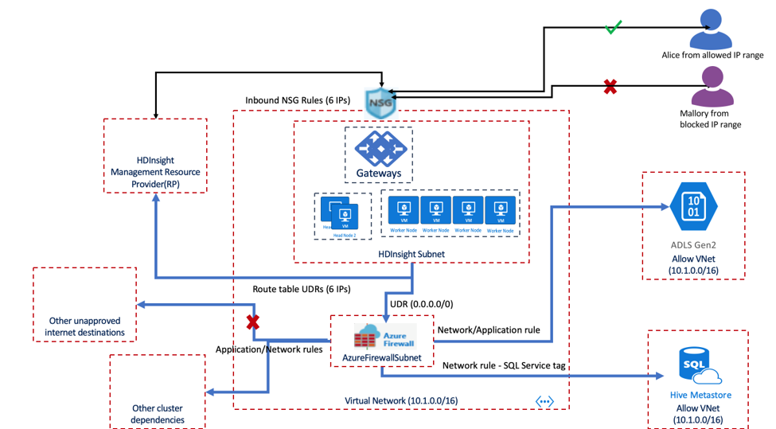
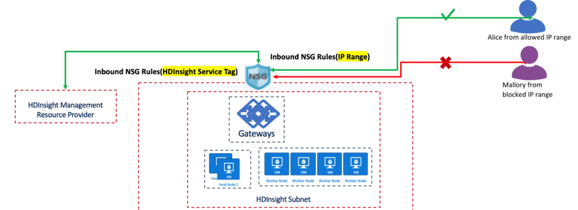
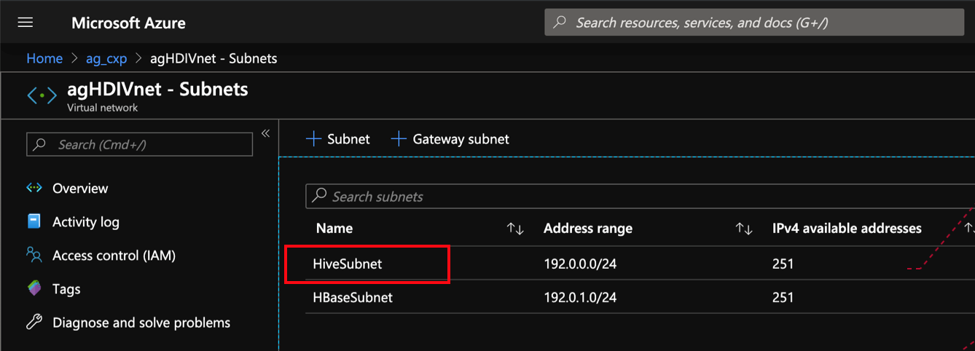
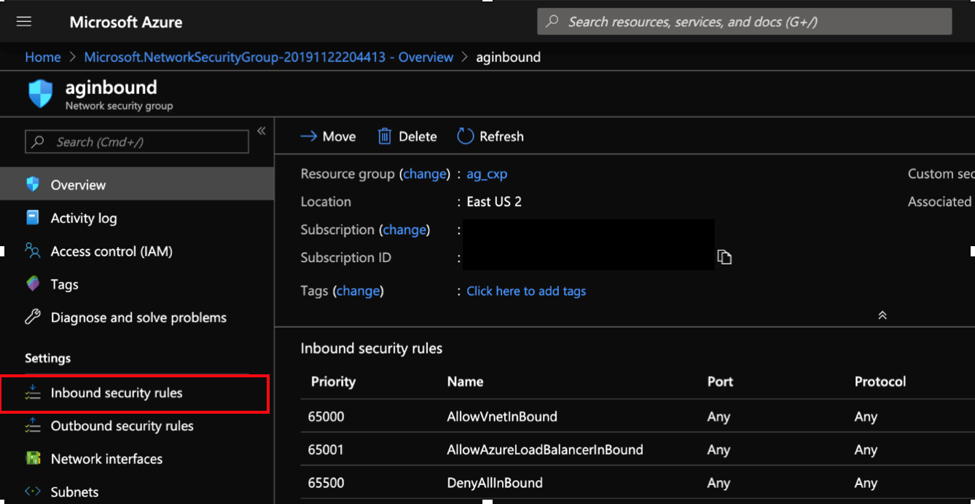
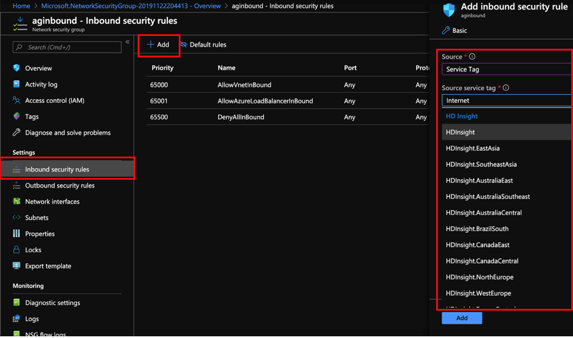
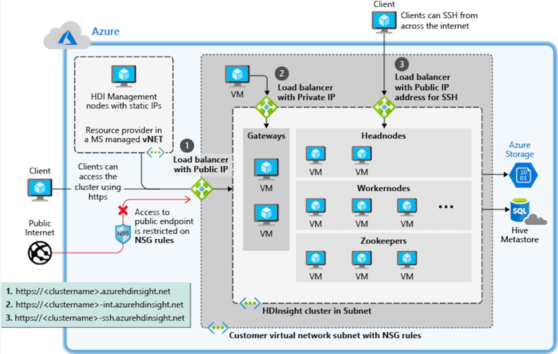
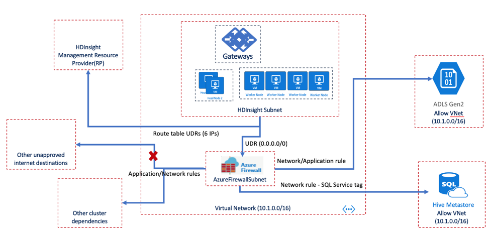
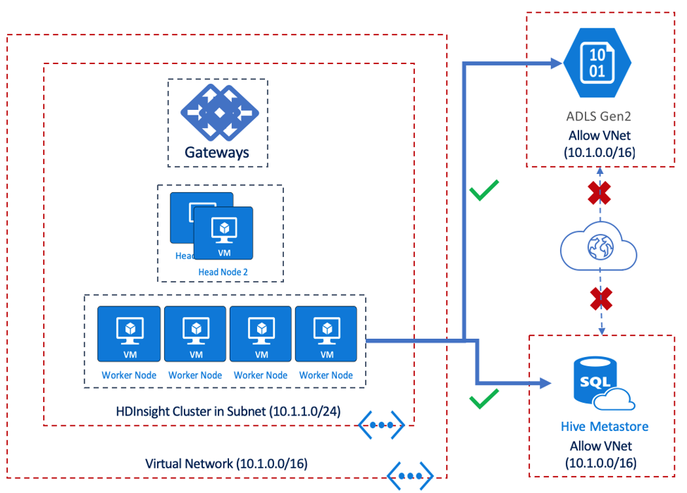

Network security is defined as the process of protecting resources from unauthorized access or attack by applying controls to network traffic. While controls could be applied in various ways, the goal is to ensure that only legitimate traffic is allowed. 

Below is a sample architectural representation of an HDInsight cluster that is deployed with network security and an accompanying discussion on how this is achieved. The black arrows represent inbound traffic and the blue arrows represent outbound traffic 

The goal of the above design is to ensure that only network traffic originating from trusted sources can reach the HDInsight cluster and network traffic leaving from the HDInsight cluster goes to a trusted destination. Further, network traffic reaching Storage and Metastore services is restricted to traffic originating from HDInsight.

Let us drill down into the details of the design above by looking at the following areas
1. Inbound security and cluster access
1. Outbound security 
1. VNet service endpoints. 

## Inbound security 

Inbound network security is achieved using a Network security group (NSG) which is assigned to the subnet. The NSG uses HDInsight services tags and IP ranges to restrict incoming traffic to trusted sources.

In the above representation two sets of Inbound Security Rules are created on the Network Security group. The first Inbound Security Rule uses the HDInsight Service Tag to allow inbound traffic from HDInsight’s health and management services. The second Inbound Security Rule is an IP Range that allows users within a certain IP address range to access specific ports on HDInsight (example SSH port 22). 

Inbound network security is achieved using NSG rules on the subnet in which the HDInsight cluster is deployed. Below is an example of how these NSG’s rules can be created. 

- Create a VNet with multiple Subnets as required. One of these subnets is intended to host the HDInsight cluster and will be associated with the NSG. 

    

- Create a Network Security Group (NSG). In the NSG, there are two sets of security rules, Inbound and Outbound under the Settings section on the left. We would use the Inbound security rules section and add additional rules to the existing set of rules. 

    

- Identify the region into which your HDInsight service is going to deployed and based on the region, identify the [service tags](/azure/virtual-network/security-overview) that would need to be used. Depending on the region and level of restrictive permissions, there may be permutations and combinations of service tags that you would need to apply to achieve the objective. Click on Add to create additional Inbound Security rules on the Network Security Group and assign service tags based on the region of deployment.

    

- Below is an example of the Region to Service tag combination. The exhaustive list of regions to service tag combinations can be found in [Network security group (NSG) service tags for Azure HDInsight](/azure/hdinsight/hdinsight-service-tags). 

| Service Tag type | Country | Region | Service Tag | Description |
|-|-|-|-|-|
| Global | NA | NA | HDInsight | Single Global service tag for HDInsight |
| Regional | United States | West US 2 | HDInsight.WestUS2 | Single service tag |
| Regional | United States | East US 2 | HDInsight.EastUS2 HDInsight.WestUS HDInsight.EastUS | Combination of service tags |
| Regional | China  | China North | HDInsight.ChinaNorth HDInsight.ChinaEast | Combination of service tags |

- Based on your design requirements you could now add additional rules to the Inbound rules section for allowing inbound traffic from other trusted sources. 

## HDInsight cluster access with deployed with a VNet 

From a security point of view, typically all public endpoints to the HDInsight cluster are not accessible in which case there are multiple alternate ways to access an HDInsight cluster in a VNet and are depicted in the sample representation below. HDInsight clusters when created within a VNet expose both public and private load balanced endpoints. 

In network path 1, access to the cluster is blocked over general public internet, but NSG rules can be created to allow specific clients external to Azure secure access to the cluster over a public endpoint using https over port 443 using https://\<clustername\>.azurehdinsight.net. 

In network path 2, to bypass the NSG, a jumpbox is created within the VNet in which the HDInsight subnet lies. Users can RDP into this jumpbox and then access the HDInsight private endpoint with \<clustername\> over port 443 using https://\<clustername\>.azurehdinsight.net.

In network path 3, NSG rules are modified for a client external to Azure to get ssh access to the cluster via the public endpoint over port 22 using https://\<clustername\>-ssh.azurehdinsight.net. 

## Outbound security 

Traffic originating out of HDInsight must be allowed to multiple destinations for the service to function properly. However, one must also be cautious to ensure that these destinations are trusted.  
HDInsight’s outbound traffic dependencies are defined using fully qualified domain names (FQDNs) and do not have static IP addresses. Given that the IP addresses of the FQDNs are subject to change, NSGs cannot be used to control outbound traffic from an HDInsight cluster. Hence the [Azure Firewall service - or a customer hosted Network Virtual Appliance](https://azure.microsoft.com/services/azure-firewall/) is used instead to control outbound traffic originating from a cluster. In practical scenarios, traffic flowing out of the HDInsight Subnet is channeled using an User Defined Route (UDR) into a Network Virtual Appliance or an Azure Firewall that then allows outbound traffic based on security rules defined with the HDInsight service tag.

In the example below, you can see that outbound traffic from the HDInsight subnet flows into an Azure Firewall where an evaluation of the HDInsight Service Tag is performed to ensure that outbound traffic destined for a trusted destination. While traffic is allowed to Metastores, Storage and HDInsight Management IP etc., traffic to unapproved internet destinations is blocked. While the destinations in HDInsight Service tag are maintained by Microsoft, customers with specific requirements for outbound traffic that are not met by the HDInsight service tag can choose to create their own service tag from a [published listed to HDInsight FQDNs](https://github.com/Azure-Samples/hdinsight-fqdn-lists/blob/master/HDInsightFQDNTags.json) which they could maintain and update. Details around Route Table Configurations and Firewall settings can be reviewed at the [Restrict Outbound traffic page for HDInsight](/azure/hdinsight/hdinsight-restrict-outbound-traffic)

The below steps are needed to enable outbound traffic restrictions:

1. Create an Azure Firewall
1. Add Application and outbound security network rules to the firewall
1. Create a user-defined route

## Virtual Network Service endpoints 

[Virtual Network Service Endpoints](/azure/virtual-network/virtual-network-service-endpoints-overview) extend the identity of a VNet to an Azure Service. Enabling VNet Service endpoints on a service grants access to the service from a specific VNet/Subnet combination and then routes traffic from that Subnet to the service through an optimal and secure path. Resources such as storage account and SQL Metastores that the HDInsight service needs access to can be secured via VNET service endpoints as shown in the sample architecture below.  
 
In this example VNet Service endpoints are configured on ADLS Gen2 Storage and the Hive Metastore Service (on Azure SQL Server) and will allow traffic from the HDInsight VNet. 

Steps to create VNet Service Endpoints are covered in greater detail in the Data Access Security section. 

