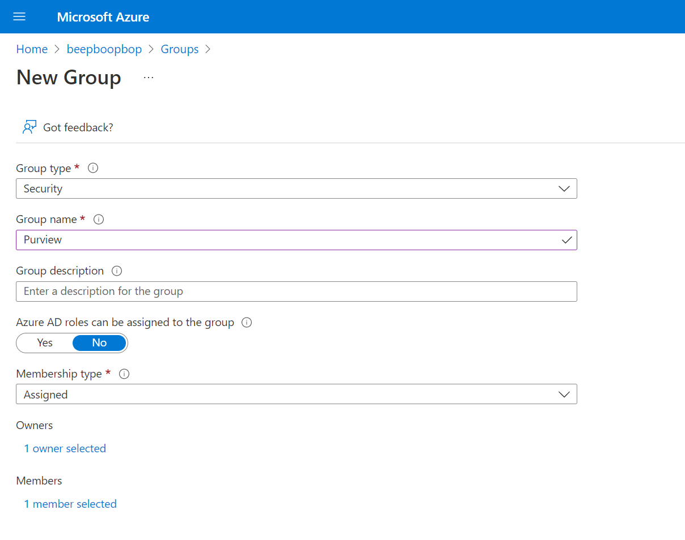
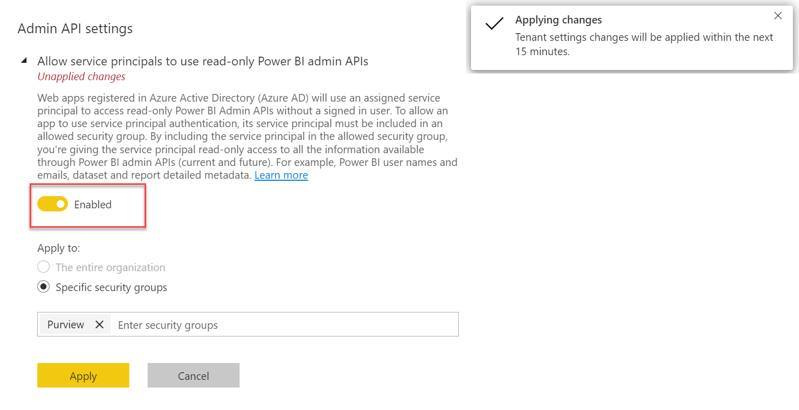
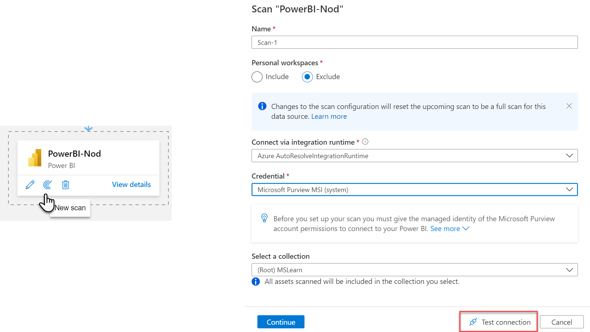
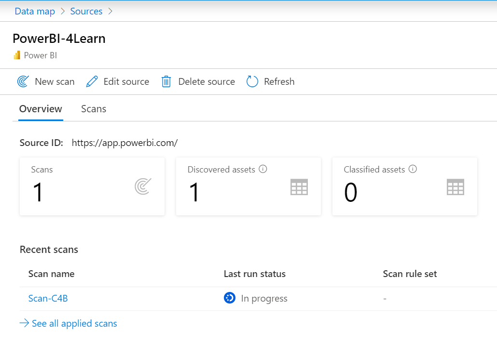

To get an understanding of what is going on in your Power BI tenant, you can perform a full scan in Microsoft Purview to view the schema and lineage of assets across all workspaces. After, you can schedule incremental scans on workspaces that have changed since the previous scan.

There are a few pre-requisite steps required to scan your Power BI tenant in Microsoft Purview.

>[!TIP]
>If you need to create a Microsoft Purview account, see the [quickstart guide](/azure/purview/create-catalog-portal) to create a Microsoft Purview account in the Azure Portal.

## Establish a connection between Microsoft Purview and Power BI

Microsoft Purview can connect to and scan Power BI either in the same tenant or across tenants. You'll need to set up authentication either by using a Managed Identity or a Delegated Authentication.

>[!NOTE]
>See [Register and scan a Power BI tenant](/azure/purview/register-scan-power-bi-tenant) to learn more about the set-up and authentication of Power BI connections in same and cross-tenant scenarios.

### Authenticate to Power BI tenant

Give Microsoft Purview permissions to access your Power BI tenant.

If you're using **Managed Identity** to authenticate to Power BI, you'll need to create a security group in Azure Active Directory, and add your Microsoft Purview managed identity to this security group.

If a security group containing the Purview managed identity already exists, you can proceed to configuring the Power BI tenant.

### Configure Power BI tenant

Next you need to enable access to Power BI by Microsoft Purview in Power BI itself. This is done by enabling *Allow service principals to use read-only Power BI admin APIs* in the Power BI admin portal. 

## Register and scan Power BI

Now that you've got access set up in both Microsoft Purview and Power BI, you can register and scan your Power BI tenant.

After registering the Power BI tenant, initiate the scan by selecting **New scan**. Give your scan a name and step through the interface, where you'll be able to to exclude personal workspaces, confirm integration runtime and credentials, and select a connection. Test the connection to ensure authentication is set up properly.

Note, if you're performing the scan, you must be both a Data Source Administrator and a Data Reader. 

>[!Information]
>See [Access control in the Microsoft Purview Data Map](/azure/purview/catalog-permissions) for details on permissions.

You're able to track the progress of the scan in the data map, and once the scan is complete, you'll be able to search and browse the contents of your entire Power BI tenant!

If you're having any issues with scanning your Power BI tenant, see [Troubleshoot Power BI tenant scans in Microsoft Purview](/azure/purview/register-scan-power-bi-tenant-troubleshoot) for details and helpful hints.
