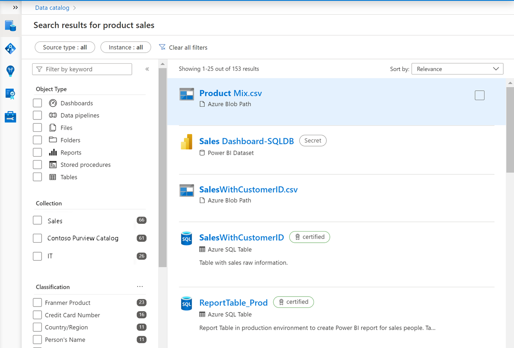
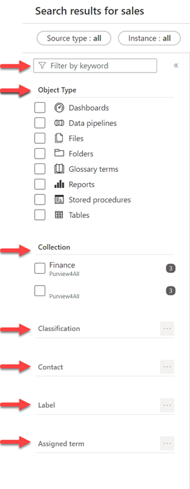
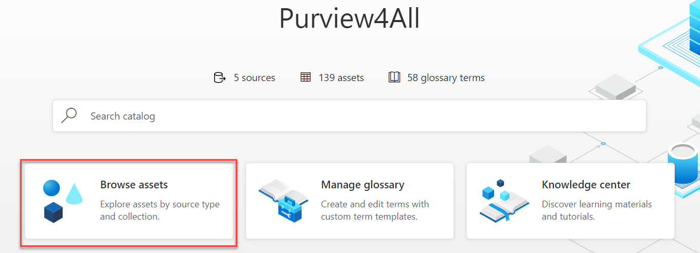
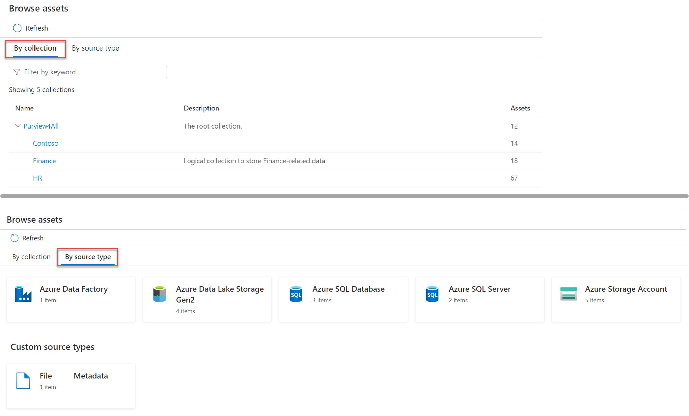
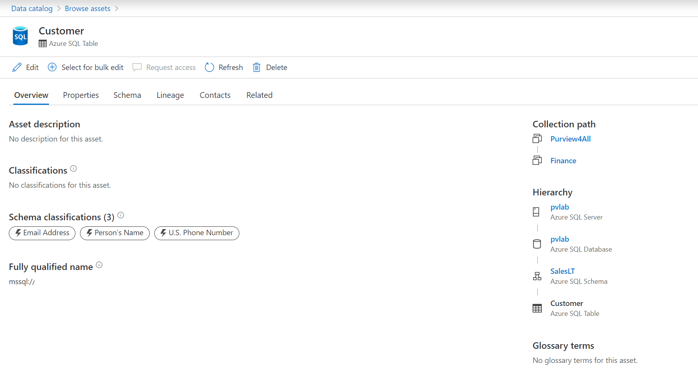

After data is registered and scanned, analysts and data consumers need to be able to find data, view enhanced metadata, and track data lineage. Search and browse in the Purview Data Catalog enables you to quickly find trustworthy data.

After scanning your Power BI tenant, you'll see those assets appear in the search results, including underlying data sources.

## Search the Microsoft Purview Data Catalog

From the Microsoft Purview Governance Portal, you can type relevant keywords to start discovering assets. In this scenario, you're looking for "sales."

The screenshot below displays the search result, with all assets corresponding to the keywords entered in the search engine. Notice the appearance of Power BI assets.

You can fine-tune your search using the filters on the left side of the page. Filters available include source type, keyword, object type, collection, classification, contact, label, and glossary term.

## Browse the Microsoft Purview Data Catalog

Searching for specific assets is great if you know what you're looking for, but analysts and data consumers may not know exactly how their data estate is structured. The browse experience enables you to explore what data is available, either by collection or through traversing the hierarchy of each data source in the catalog.

To access the browse experience, select **Browse assets** from the governance portal home page.

You can browse the data catalog either by collection or by source type, depending on your needs. Browsing by either collection or source type allows you to see assets you have access to. Once you find the asset you're looking for, you can select it to see details on schema, lineage, and a detailed classification list.

Uniquely, browsing by source type allows you to see the hierarchies of data sources using an explorer view. This is a helpful and familiar way to navigate to see lists of scanned assets.

>[!NOTE]
>Assets in Purview are organized by collection and permissions are granted at collection level. Both searching and browsing require data reader permissions. See [Access control in the Microsoft Purview Data Map](/azure/purview/catalog-permissions) for details on permissions.

Select an asset to see details about the properties, schema, lineage, contacts, and related assets.

