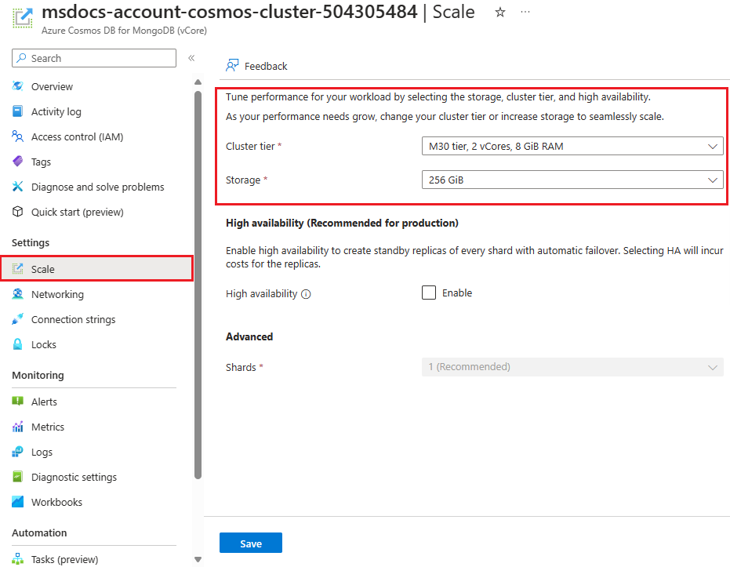

This unit explores the importance of scaling and configuring your vCore-based Azure Cosmos DB for MongoDB cluster to adapt to both increasing and decreasing demands. Adjusting your database infrastructure is essential to ensure it continues to perform well under varying workloads.

## Assess when to scale your cluster

Scaling your cluster is essential for maintaining performance and accommodating the growth of your applications:

- **Analyze Performance Requirements**: Evaluate the need for adjustments in your cluster’s configuration to handle changing workloads effectively.
- **Evaluate Capacity Needs**: Determine when to modify disk sizes to support data growth or to scale down when demand decreases. Selecting the correct storage sizes ensures that the database can continue to store and manage data effectively without hitting resource limits.

## Understand cluster tiers

Cluster tiers in vCore-based Azure Cosmos DB for MongoDB specify the resources allocated to your cluster, such as CPU (vCores) and memory (RAM), tailored to different application needs:

- **Lower Tiers** (for example, M30, M40): Best for lighter workloads or development environments.
- **Higher Tiers** (for example, M50, M60, M80): Best for production environments with demanding workloads, providing more resources to manage larger data volumes and complex operations.

Selecting the appropriate tier is based on your specific requirements for processing power and memory. Upgrading to a higher tier increases available resource, hence boosting your database’s cluster capacity to handle more data and complex queries.

## Configure scale and capacity changes

Modifications to your cluster, such as tier changes or disk size adjustments, happen live, without downtime. This means your applications remain operational while updates are being applied in the background.

To make these adjustments, go to the vCore-based Azure Cosmos DB for MongoDB cluster's *scale* setting in the Azure portal, select the desired tier or disk size, and save the changes.

> 

Understanding how to scale and configure your vCore-based Azure Cosmos DB for MongoDB cluster allows you to manage your database environment proactively. These settings ensure that your applications remain efficient and responsive as they grow, seamlessly scaling to meet evolving demands.
