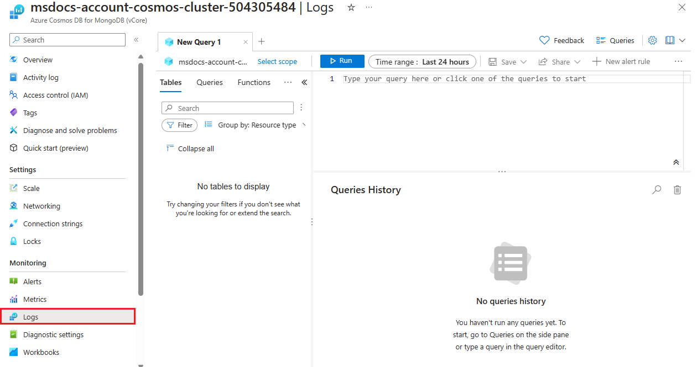

Monitoring your vCore-based Azure Cosmos DB for MongoDB helps maintain its health and performance. Azure Monitor, combined with either an Azure Log Analytics workspace or an Azure Storage account, allows you to capture and store diagnostic logs that provide clarity on your database operations.

## Use Azure Monitor with Azure Log Analytics or Azure Storage

Azure Log Analytics workspace and Azure Storage account provide different benefits for monitoring your vCore-based Azure Cosmos DB for MongoDB:

**Azure Log Analytics workspace** enables real-time and complex analysis of log data, which provides you with:

- Detailed analysis and visualization of data to understand database operations and performance.
- Advanced querying capabilities to investigate specific issues or identify operational trends.

**Azure Storage account** offers a reliable solution for long-term data retention, essential for:

- Securely storing logs for extended periods, supporting compliance, and historical analysis.
- Accessing historical data to analyze performance trends and conduct audits.

## Monitoring with Azure Monitor

Azure Monitor's diagnostic logs detail the operations within your vCore-based Azure Cosmos DB for MongoDB. These logs are instrumental for:

- Tracking requests and analyzing performance metrics.
- Identifying and resolving operational or performance anomalies.

## Utilizing Diagnostic Logs

With either a Log Analytics workspace or an Azure Storage account setup, you can configure diagnostic settings to channel logs to these services, enabling you to:

- Continuously monitor and maintain the performance and health of your vCore-based Azure Cosmos DB for MongoDB cluster.
- Proactively respond to changes in database behavior and usage patterns.

### Examples of Monitoring with Kusto Queries

Use Kusto Query Language (KQL) within the Log Analytics workspace for thorough analysis. You can run these queries in the Azure portal on the cluster's *Monitoring* **Logs** page.

> 

Let's review some example KQL queries:

1. **Count of Failed Requests by Error Code**:

    ```kusto
    VCoreMongoRequests
    | where ErrorCode != 0
    | summarize count() by bin(TimeGenerated, 5m), ErrorCode=tostring(ErrorCode)
    ```

1. **API Requests Performance**:

    ```kusto
    VCoreMongoRequests
    | summarize percentile(DurationMs, 99) by bin(TimeGenerated, 1h), OperationName
    ```

1. **Distribution of Requests by User Agent**:

    ```kusto
    VCoreMongoRequests
    | summarize count() by bin(TimeGenerated, 1h), UserAgent
    ```

These queries provide actionable insights, helping you to optimize operations and troubleshoot issues effectively. For more information on the Kusto Query Language, review the [Kusto Query Language documentation](azure/data-explorer/kusto/query/).

Effective monitoring is crucial for managing your vCore-based Azure Cosmos DB for MongoDB. Using Azure Monitor helps ensure your database runs efficiently. Setting up diagnostic logs through Azure Log Analytics or Azure Storage allows you to maintain optimal performance.
