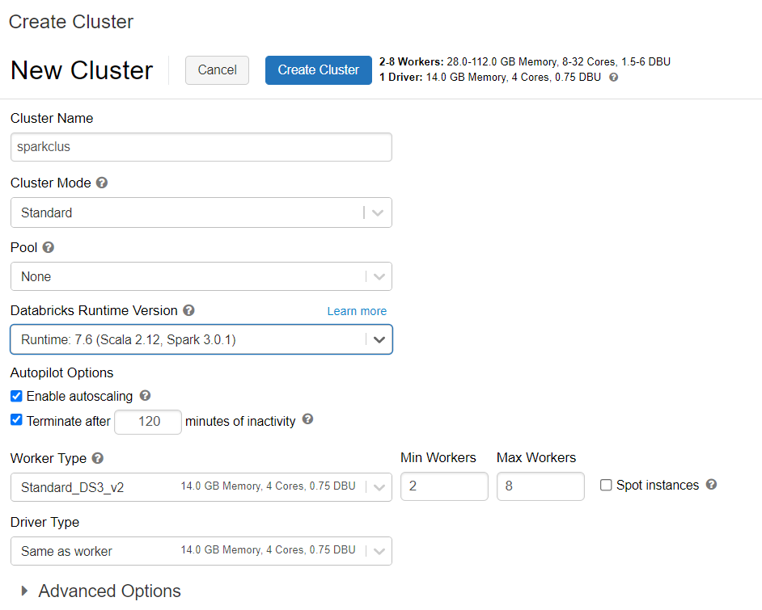

In this unit, you learn how using Azure Databricks offers a practical solution for migrating large-scale MongoDB datasets to vCore-based Azure Cosmos DB for MongoDB. It allows for detailed control over the migration pace and data transformations, effectively handling very large datasets.

## Why use Azure Databricks?

Azure Databricks, a Platform as a Service (PaaS) for Apache Spark, introduces a streamlined, efficient method for both offline and online migration of databases from MongoDB. Its architecture is specifically designed to support extensive datasets, making it a suitable choice for your migration projects.

## Prerequisites

Before you start the migration, ensure you have the following prerequisites:

- Confirm that your vCore-based Azure Cosmos DB for MongoDB account is active and properly configured.
- Provision an Azure Databricks cluster, selecting Databricks runtime *version 7.6* for optimal *Spark 3.0* compatibility.



- Add the Maven *MongoDB Connector for Spark* library to your cluster. This library enables connections to both native MongoDB and Azure Cosmos DB endpoints.

## Perform the migration

You can create either a Python or Scala notebook in Azure Databricks to perform the migration. For example, if you want to migrate data from MongoDB to vCore-based Azure Cosmos DB for MongoDB using a Python notebook, you would add this code snippet to your notebook:

```python
from pyspark.sql import SparkSession

sourceConnectionString = "mongodb://<USERNAME>:<PASSWORD>@<HOST>:<PORT>/<AUTHDB>"
sourceDb = "<DB NAME>"
sourceCollection =  "<COLLECTIONNAME>"
targetConnectionString = "mongodb://<ACCOUNTNAME>:<PASSWORD>@<ACCOUNTNAME>.mongo.cosmos.azure.com:10255/?ssl=true&replicaSet=globaldb&retrywrites=false&maxIdleTimeMS=120000&appName=@<ACCOUNTNAME>@"
targetDb = "<DB NAME>"
targetCollection =  "<COLLECTIONNAME>"

my_spark = SparkSession \
    .builder \
    .appName("myApp") \
    .getOrCreate()

df = my_spark.read.format("com.mongodb.spark.sql.DefaultSource").option("uri", sourceConnectionString).option("database", sourceDb).option("collection", sourceCollection).load()

df.write.format("mongo").mode("append").option("uri", targetConnectionString).option("maxBatchSize",2500).option("database", targetDb).option("collection", targetCollection).save()
```

### Execute the migration

Execute your migration notebook, monitoring the process for any potential rate-limiting errors and adjusting parameters as necessary to ensure a smooth data transfer.

### Enhance the migration performance

Depending on your vCore-based Azure Cosmos DB for MongoDB cluster tier, you might want to tweak some settings to improve the migration performance. A couple of those settings include:

- **Spark Cluster Configuration**: Optimizing the number of workers and cores directly impacts the computational capability to process your data migration.
- **Batch Size Adjustments**: Tuning the **maxBatchSize** parameter can help mitigate rate-limiting errors. This parameter controls the number of documents sent to the target database in each batch.

Regardless if you're doing an online or offline migration, using Azure Databricks for your migration project offers a robust, scalable solution for transferring large datasets from MongoDB to vCore-based Azure Cosmos DB for MongoDB. It provides the flexibility to adjust migration speed and data transformation, ensuring a successful migration process.
