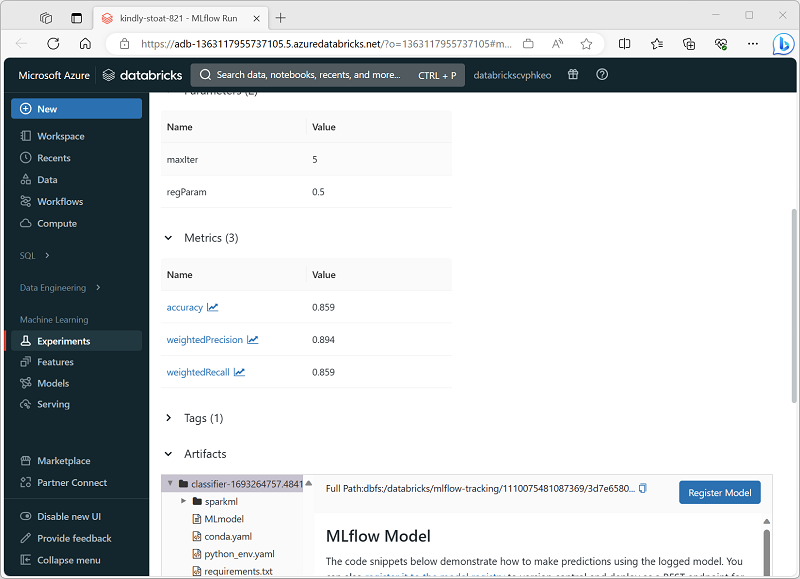

MLflow experiments allow data scientists to track training runs in a collection called an **experiment**. Experiment runs are useful for comparing changes over time or comparing the relative performance of models with different hyperparameter values.

## Running an experiment

Creating an experiment in Azure Databricks happens automatically when you start a run. Here's an example of starting a run in MLflow, logging two parameters, and logging one metric:

```python
with mlflow.start_run():
    mlflow.log_param("input1", input1)
    mlflow.log_param("input2", input2)
    # Perform operations here like model training.
    mlflow.log_metric("rmse", rmse)
```

In this case, the experiment's name is the name of the notebook. It's possible to export a variable named *MLFLOW_EXPERIMENT_NAME* to change the name of your experiment should you choose.

## Reviewing an experiment run

In the Azure Databricks portal, the **Experiments** page enables you to view details of each experiment run; including logged values for parameters, metrics, and other artifacts.


