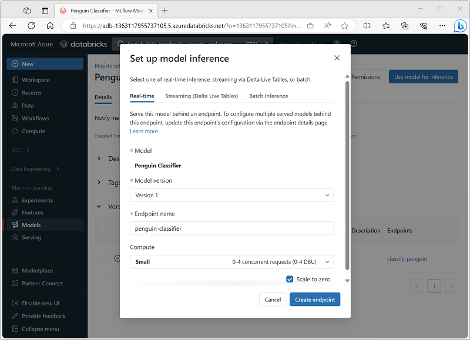

Model registration allows MLflow and Azure Databricks to keep track of models; which is important for two reasons:

- Registering a model allows you to serve the model for real-time, streaming, or batch inferencing. Registration makes the process of using a trained model easy, as now data scientists don't need to develop application code; the serving process builds that wrapper and exposes a REST API or method for batch scoring automatically.
- Registering a model allows you to create new versions of that model over time; giving you the opportunity to track model changes and even perform comparisons between different historical versions of models.

## Registering a model

When you run an experiment to train a model, you can log the model itself as part of the experiment run, as shown here:

```python
with mlflow.start_run():
    # code to train model goes here

    # log the model itself (and the environment it needs to be used)
    unique_model_name = "my_model-" + str(time.time())
    mlflow.spark.log_model(spark_model = model,
                           artifact_path=unique_model_name,
                           conda_env=mlflow.spark.get_default_conda_env())
```

When you review the experiment run, including the logged metrics that indicate how well the model predicts, the model is included in the run artifacts. You can then select the option to *register* the model using the user interface in the experiment viewer.

Alternatively, if you want to register the model without reviewing the metrics in the run, you can include the **registered_model_name** parameter in the **log_model** method; in which case the model is automatically registered during the experiment run.

```python
with mlflow.start_run():
    # code to train model goes here

    # log the model itself (and the environment it needs to be used)
    unique_model_name = "my_model-" + str(time.time())
    mlflow.spark.log_model(spark_model=model,
                           artifact_path=unique_model_name
                           conda_env=mlflow.spark.get_default_conda_env(),
                           registered_model_name="my_model")
```

You can register multiple versions of a model, enabling you to compare the performance of model versions over a period of time before moving all client applications to the best performing version.

## Using a model for inferencing

The process of using a model to predict labels from new feature data is known as *inferencing*. You can use MLflow in Azure Databricks to make models available for inferencing in the following ways:

- Host the model as a real-time service with an HTTP endpoint to which client applications can make REST requests.
- Use the model to perform perpetual streaming inferencing of labels based on a delta table of features, writing the results to an output table.
- Use the model for batch inferencing based on a delta table, writing the results of each batch operation to a specific folder.

You can deploy a model for inferencing from its page in the **Models** section of the Azure Databricks portal as shown here:


