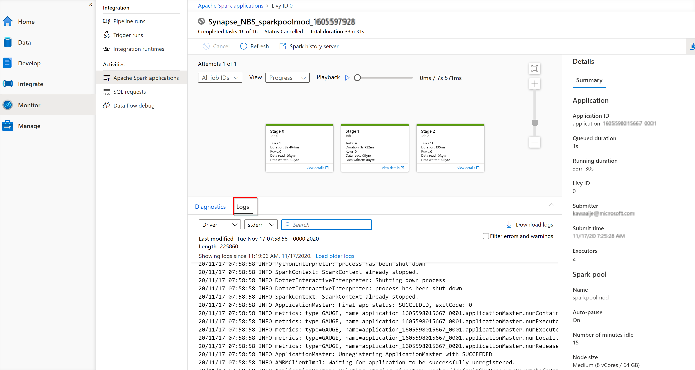
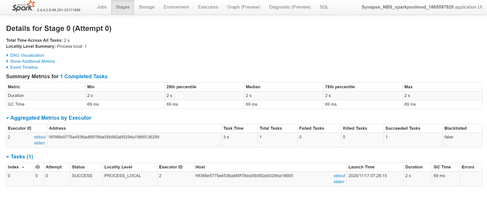

If you want to monitor your Apache Spark pool, the best place to go is the **Monitor** tab in Azure Synapse Studio. 

The Monitor hub enables you to view various Azure Synapse Analytics activities including pipeline and trigger runs, and the status of the various integration runtimes that are running. You can also view Apache Spark jobs, SQL requests, and data flow debug activities. 

The Monitor hub is your first stop for debugging issues and gaining insights on the resource usage of your Apache Spark pool. You can see the history of all the activities that have taken place in the workspace, and which ones are currently active. 

You may have Apache Spark pool activities that are part of Azure Synapse Pipeline activities. If you have created a pipeline, and you ran that pipeline, you can see all the pipeline run activities here. It is also possible to view run details where you can see inputs and outputs for the activities in the pipeline and any error messages. If you automated a pipeline run by setting up automated triggers, you can find the runs here as well.

In relation to Apache Spark applications, you can see all the Apache Spark applications that are running or have run in your workspace. Let's say you ran some Apache Spark activities, what do you do for monitoring?

First, within Azure Synapse Studio, you should navigate to the **Monitor** hub, the select **Activities**, and select **Apache Spark applications**. It's here where you can see all the Apache Spark applications that are running or have run in your workspace.

If you want to find out more information about an Apache Spark Application that is no longer running, you should select the application name in the **Monitor** hub, select the **Apache Spark Application** name. Here you will find all the details of the Apache Spark application.

If you are familiar with Apache Spark, you can find the standard Apache Spark history server UI by clicking on Apache Spark history server. Not only can you check the diagnostics of the Apache Spark application that ran, such as a notebook attached to an Apache Spark pool, but you can also check the logs if you navigate to the logs tab:

On the right-hand side, you'll find the details of the Apache Spark pool application and the running duration, number of executors, the Apache Spark pool details, and much more. Additionally, if you want to view details for each stage, you can go to the View details tab of one of the stages that looks like the follows:

It will redirect you to the Apache Spark UI where you can find more details in relation to the stages of the Apache Spark Pool. You can also check details of all the stages by selecting **Spark UI**.