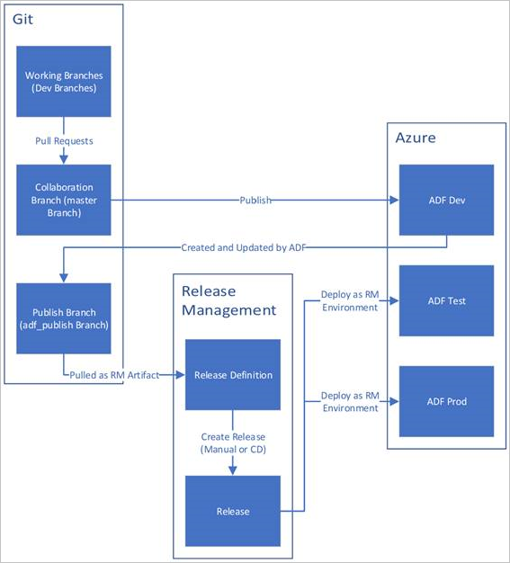
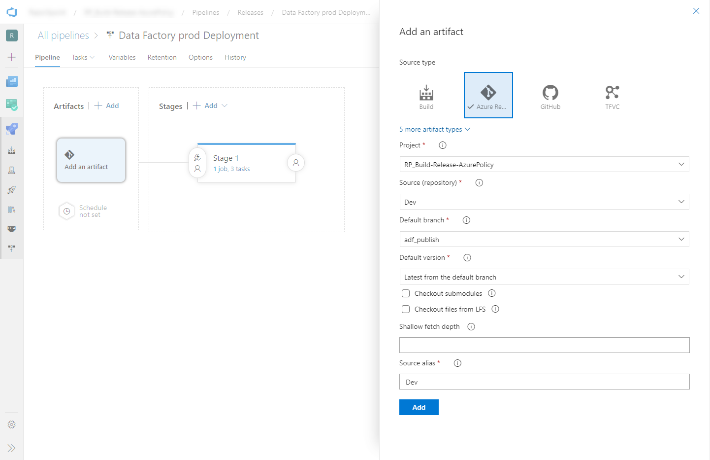
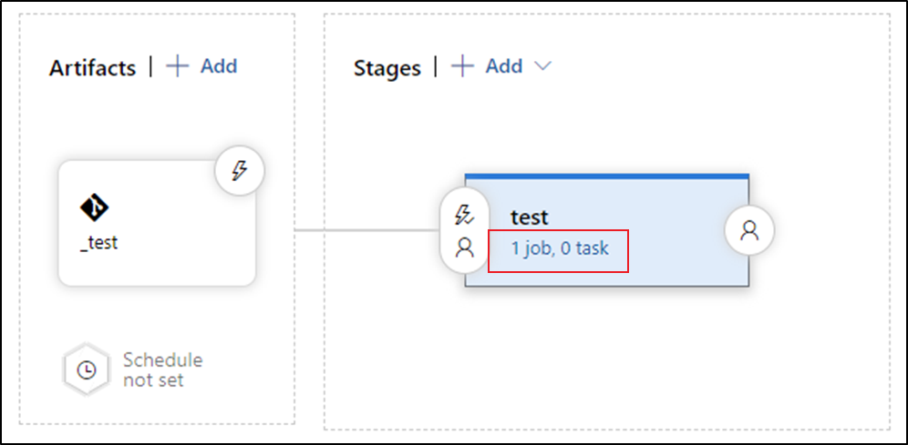
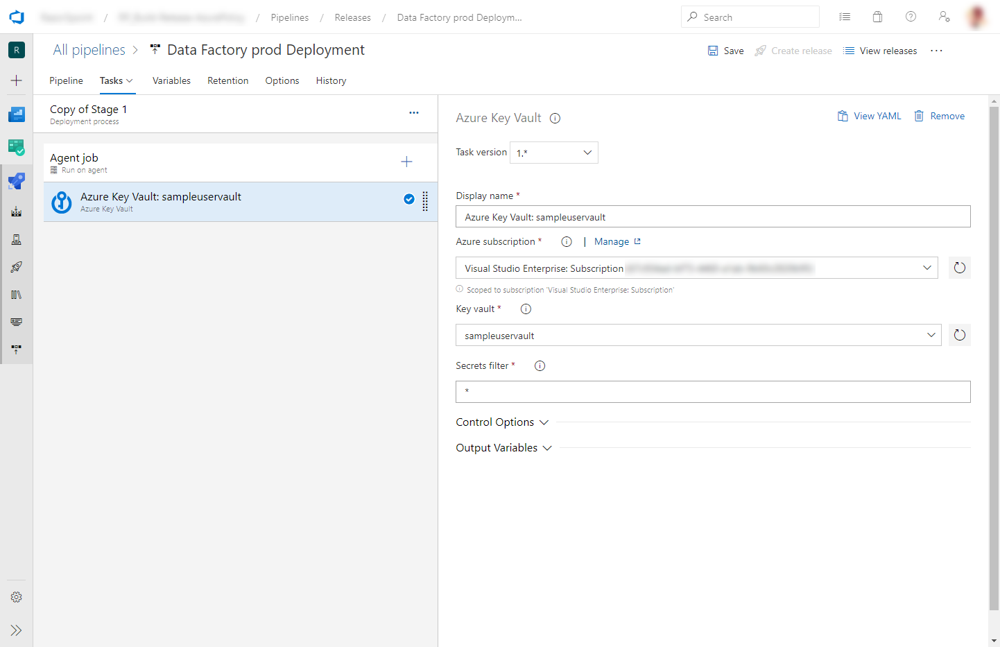
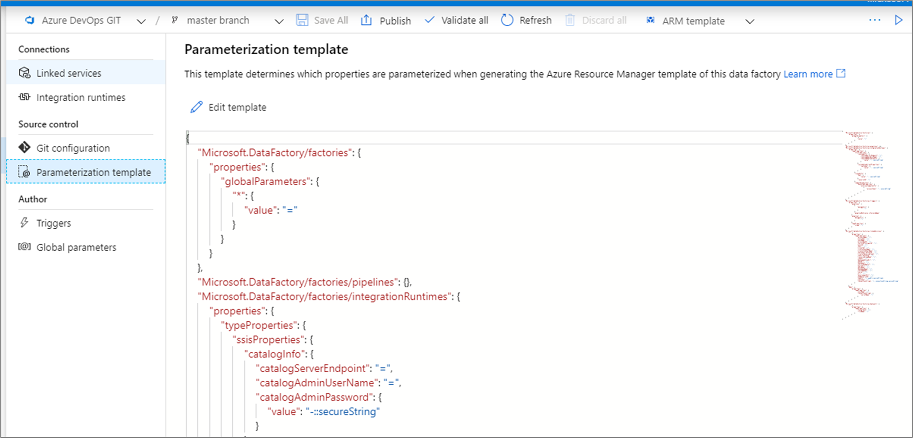
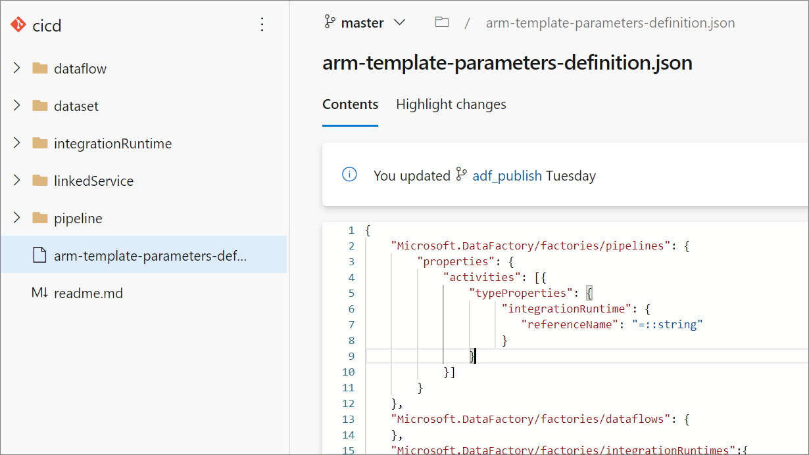

Continuous integration is the practice of testing each change made to your codebase automatically and as early as possible. Continuous delivery follows the testing that happens during continuous integration and pushes changes to a staging or production system.

In Azure Data Factory, continuous integration and delivery (CI/CD) means moving Data Factory pipelines from one environment (development, test, production) to another. Azure Data Factory utilizes Azure Resource Manager templates to store the configuration of your various Azure Data Factory entities (pipelines, datasets, data flows, and so on). There are two suggested methods to promote a data factory to another environment:

-    Automated deployment using Data Factory's integration with Azure Pipelines.
-    Manually upload a Resource Manager template using Data Factory UX integration with Azure Resource Manager.


## Continuous Integration/Continuous Delivery lifecycle

Below is a sample overview of the CI/CD lifecycle in an Azure data factory that's configured with Azure Repos Git.

1.  A development data factory is created and configured with Azure Repos Git. All developers should have permission to author Data Factory resources like pipelines and datasets.

1.  A developer creates a feature branch to make a change. They debug their pipeline runs with their most recent changes.

1.  After a developer is satisfied with their changes, they create a pull request from their feature branch to the master or collaboration branch to get their changes reviewed by peers.

1.  After a pull request is approved and changes are merged in the master branch, the changes get published to the development factory.

1.  When the team is ready to deploy the changes to a test or UAT (User Acceptance Testing) factory, the team goes to their Azure Pipelines release and deploys the desired version of the development factory to UAT. This deployment takes place as part of an Azure Pipelines task and uses Resource Manager template parameters to apply the appropriate configuration.

1.  After the changes have been verified in the test factory, deploy to the production factory by using the next task of the pipelines release.

> [!NOTE]
> Only the development factory is associated with a git repository. The test and production factories shouldn't have a git repository associated with them and should only be updated via an Azure DevOps pipeline or via a Resource Management template.

The below image highlights the different steps of this lifecycle.



## Automate continuous integration by using Azure Pipelines releases

The following is a guide for setting up an Azure Pipelines release that automates the deployment of a data factory to multiple environments.

### Requirements

-   An Azure subscription linked to Visual Studio Team Foundation Server or Azure Repos that uses the Azure Resource Manager service endpoint

-   A data factory configured with Azure Repos Git integration.

-   An Azure key vault that contains the secrets for each environment.

### Set up an Azure Pipelines release

1.  In Azure DevOps, open the project that's configured with your data factory.

1.  On the left side of the page, select **Pipelines**, and then select **Releases**.

    

1.  Select **New pipeline**, or, if you have existing pipelines, select **New** and then **New release pipeline**.

1.  Select the **Empty job** template.

    

1.  In the **Stage name** box, enter the name of your environment.

1.  Select **Add artifact**, and then select the git repository configured with your development data factory. Select the publish branch of the repository for the **Default branch**. By default, this publish branch is `adf_publish`. For the **Default version**, select **Latest from default branch**.
    > [!div class="mx-imgBorder"]  
    > [](../media/continuous-integration-image-7.png#lightbox)

1.  Add an Azure Resource Manager Deployment task:

    a.  In the stage view, select **View stage tasks**.

    

    b.  Create a new task. Search for **ARM Template Deployment**, and then select **Add**.

    c.  In the Deployment task, select the subscription, resource group, and location for the target data factory. Provide credentials if necessary.

    d.  In the **Action** list, select **Create or update resource group**.

    e.  Select the ellipsis button (**…**) next to the **Template** box. Browse for the Azure Resource Manager template that is generated in your publish branch of the configured git repository. Look for the file `ARMTemplateForFactory.json` in the \<FactoryName\> folder of the adf_publish branch.

    f.  Select **…** next to the **Template parameters** box to choose the parameters file. Look for the file `ARMTemplateParametersForFactory.json` in the \<FactoryName\> folder of the adf_publish branch.

    g.  Select **…** next to the **Override template parameters** box, and enter the desired parameter values for the target data factory. For credentials that come from Azure Key Vault, enter the secret's name between double quotation marks. For example, if the secret's name is cred1, enter **"$(cred1)"** for this value.

    h. Select **Incremental** for the **Deployment mode**.

    > [!WARNING]
    > In Complete deployment mode, resources that exist in the resource group but aren't specified in the new Resource Manager template will be **deleted**.
    
    > [!div class="mx-imgBorder"]  
    > [](../media/continuous-integration-image-9.png#lightbox)

1.  Save the release pipeline.

1. To trigger a release, select **Create release**. In Azure DevOps, this can be automated. 

   

> [!IMPORTANT]
> In CI/CD scenarios, the integration runtime (IR) type in different environments must be the same. For example, if you have a self-hosted IR in the development environment, the same IR must also be of type self-hosted in other environments, such as test and production. Similarly, if you're sharing integration runtimes across multiple stages, you have to configure the integration runtimes as linked self-hosted in all environments, such as development, test, and production.

### Get secrets from Azure Key Vault

If you have secrets to pass in an Azure Resource Manager template, we recommend that you use Azure Key Vault with the Azure Pipelines release.

There are two ways to handle secrets:

1.  Add the secrets to parameters file.

    Create a copy of the parameters file that's uploaded to the publish branch. Set the values of the parameters that you want to get from Key Vault by using this format:

    ```json
    {
        "parameters": {
            "azureSqlReportingDbPassword": {
                "reference": {
                    "keyVault": {
                        "id": "/subscriptions/<subId>/resourceGroups/<resourcegroupId> /providers/Microsoft.KeyVault/vaults/<vault-name> "
                    },
                    "secretName": " < secret - name > "
                }
            }
        }
    }
    ```

    When you use this method, the secret is pulled from the key vault automatically.

    The parameters file needs to be in the publish branch as well.

1. Add an Azure Key Vault task before the Azure Resource Manager Deployment task described in the previous section:

    1.  On the **Tasks** tab, create a new task. Search for **Azure Key Vault** and add it.

    1.  In the Key Vault task, select the subscription in which you created the key vault. Provide credentials if necessary, and then select the key vault.
    > [!div class="mx-imgBorder"]  
    > [](../media/continuous-integration-image-8.png#lightbox)

#### Grant permissions to the Azure Pipelines agent

The Azure Key Vault task might fail with an Access Denied error if the correct permissions aren't set. Download the logs for the release, and locate the .ps1 file that contains the command to give permissions to the Azure Pipelines agent. You can run the command directly. Or you can copy the principal ID from the file and add the access policy manually in the Azure portal. `Get` and `List` are the minimum permissions required.

### Updating active triggers

Deployment can fail if you try to update active triggers. To update active triggers, you need to manually stop them and then restart them after the deployment. You can do this by using an Azure PowerShell task:

1.  On the **Tasks** tab of the release, add an **Azure PowerShell** task. Choose task version 4.*. 

1.  Select the subscription your factory is in.

1.  Select **Script File Path** as the script type. This requires you to save your PowerShell script in your repository. The following PowerShell script can be used to stop triggers:

    ```powershell
    $triggersADF = Get-AzDataFactoryV2Trigger -DataFactoryName $DataFactoryName -ResourceGroupName $ResourceGroupName

    $triggersADF | ForEach-Object { Stop-AzDataFactoryV2Trigger -ResourceGroupName $ResourceGroupName -DataFactoryName $DataFactoryName -Name $_.name -Force }
    ```

You can complete similar steps (with the `Start-AzDataFactoryV2Trigger` function) to restart the triggers after deployment.

> [!NOTE]
> These steps are already included in the pre and post deployment scripts provided by the Azure Data Factory team

## Manually promote a Resource Manager template for each environment

If you are unable to use Azure DevOps or a different release management tool, you can manually promote a data factory using an ARM Template.

1. In the **ARM Template** list, select **Export ARM Template** to export the Resource Manager template for your data factory in the development environment.

   

1. In your test and production data factories, select **Import ARM Template**. This action takes you to the Azure portal, where you can import the exported template. Select **Build your own template in the editor** to open the Resource Manager template editor.

    

1. Select **Load file**, and then select the generated Resource Manager template. This is the **arm_template.json** file located in the .zip file exported in step 1.

   

1. In the settings section, enter the configuration values, like linked service credentials. When you're done, select **Purchase** to deploy the Resource Manager template.

   

## Customize Azure Resource Manager template parameters

If your development factory has an associated git repository, you can override the default Resource Manager template parameters of the Resource Manager template generated by publishing or exporting the template. You might want to override the default parameterization template in these scenarios:

* You use automated CI/CD and you want to change some properties during Resource Manager deployment, but the properties aren't parameterized by default.
* Your factory is so large that the default Resource Manager template is invalid because it has more than the maximum allowed parameters (256).

To override the default parameterization template, go to the management hub and select **Parameterization template** in the source control section. Select **Edit template** to open the parameterization template code editor. 



Creating a custom parameterization template creates a file named **arm-template-parameters-definition.json** in the root folder of your git branch. You must use that exact file name.



When publishing from the collaboration branch, Data Factory will read this file and use its configuration to generate which properties get parameterized. If no file is found, the default template is used.

When exporting a Resource Manager template, Data Factory reads this file from whichever branch you're currently working on, not the collaboration branch. You can create or edit the file from a private branch, where you can test your changes by selecting **Export ARM Template** in the UI. You can then merge the file into the collaboration branch.

> [!NOTE]
> A custom parameterization template doesn't change the ARM template parameter limit of 256. It lets you choose and decrease the number of parameterized properties.

### Custom parameter syntax

The following are some guidelines to follow when you create the custom parameters file, **arm-template-parameters-definition.json**. The file consists of a section for each entity type: trigger, pipeline, linked service, dataset, integration runtime, and data flow.

* Enter the property path under the relevant entity type.
* Setting a property name to `*` indicates that you want to parameterize all properties under it (only down to the first level, not recursively). You can also provide exceptions to this configuration.
* Setting the value of a property as a string indicates that you want to parameterize the property. Use the format `<action>:<name>:<stype>`.
   *  `<action>` can be one of these characters:
      * `=` means keep the current value as the default value for the parameter.
      * `-` means don't keep the default value for the parameter.
      * `|` is a special case for secrets from Azure Key Vault for connection strings or keys.
   * `<name>` is the name of the parameter. If it's blank, it takes the name of the property. If the value starts with a `-` character, the name is shortened. For example, `AzureStorage1_properties_typeProperties_connectionString` would be shortened to `AzureStorage1_connectionString`.
   * `<stype>` is the type of parameter. If `<stype>` is blank, the default type is `string`. Supported values: `string`, `bool`, `number`, `object`, and `securestring`.
* Specifying an array in the definition file indicates that the matching property in the template is an array. Data Factory iterates through all the objects in the array by using the definition that's specified in the integration runtime object of the array. The second object, a string, becomes the name of the property, which is used as the name for the parameter for each iteration.
* A definition can't be specific to a resource instance. Any definition applies to all resources of that type.
* By default, all secure strings, like Key Vault secrets, and secure strings, like connection strings, keys, and tokens, are parameterized.
 
## Linked templates

If you've set up CI/CD for your data factories, you might exceed the Azure Resource Manager template limits as your factory grows bigger. For example, one limit is the maximum number of resources in a Resource Manager template. To accommodate large factories while generating the full Resource Manager template for a factory, Data Factory now generates linked Resource Manager templates. With this feature, the entire factory payload is broken down into several files so that you aren't constrained by the limits.

If you've configured Git, the linked templates are generated and saved alongside the full Resource Manager templates in the adf_publish branch in a new folder called linkedTemplates. The linked Resource Manager templates usually consist of a master template and a set of child templates that are linked to the master. The parent template is called ArmTemplate_master.json, and child templates are named with the pattern ArmTemplate_0.json, ArmTemplate_1.json, and so on. 

To use linked templates instead of the full Resource Manager template, update your CI/CD task to point to ArmTemplate_master.json instead of ArmTemplateForFactory.json (the full Resource Manager template). Resource Manager also requires that you upload the linked templates into a storage account so Azure can access them during deployment.

## Hotfix production environment

If you deploy a factory to production and realize there's a bug that needs to be fixed right away, but you can't deploy the current collaboration branch, you might need to deploy a hotfix. This approach is as known as quick-fix engineering or QFE.

1.    In Azure DevOps, go to the release that was deployed to production. Find the last commit that was deployed.

2.    From the commit message, get the commit ID of the collaboration branch.

3.    Create a new hotfix branch from that commit.

4.    Go to the Azure Data Factory UX and switch to the hotfix branch.

5.    By using the Azure Data Factory UX, fix the bug. Test your changes.

6.    After the fix is verified, select **Export ARM Template** to get the hotfix Resource Manager template.

7.    Manually check this build into the publish branch.

8.    If you've configured your release pipeline to automatically trigger based on adf_publish check-ins, a new release will start automatically. Otherwise, manually queue a release.

9.    Deploy the hotfix release to the test and production factories. This release contains the previous production payload plus the fix that you made in step 5.

10.   Add the changes from the hotfix to the development branch so that later releases won't include the same bug.

## Best practices for Continuous Integration/Continuous Delivery

If you're using Git integration with your data factory and have a CI/CD pipeline that moves your changes from development into test and then to production, we recommend these best practices:

-   **Git integration**. Configure only your development data factory with Git integration. Changes to test and production are deployed via CI/CD and don't need Git integration.

-   **Pre- and post-deployment script**. Before the Resource Manager deployment step in CI/CD, you need to complete certain tasks, like stopping and restarting triggers and performing cleanup. We recommend that you use PowerShell scripts before and after the deployment task. The data factory team has provided a script to use located in the Azure Data Factory CI/CD documentation page. 

-   **Integration runtimes and sharing**. Integration runtimes don't change often and are similar across all stages in your CI/CD. So Data Factory expects you to have the same name and type of integration runtime across all stages of CI/CD. If you want to share integration runtimes across all stages, consider using a ternary factory just to contain the shared integration runtimes. You can use this shared factory in all of your environments as a linked integration runtime type.

-   **Managed private endpoint deployment**. If a private endpoint already exists in a factory and you try to deploy an ARM template that contains a private endpoint with the same name but with modified properties, the deployment will fail. In other words, you can successfully deploy a private endpoint as long as it has the same properties as the one that already exists in the factory. If any property is different between environments, you can override it by parameterizing that property and providing the respective value during deployment.

-   **Key Vault**. When you use linked services whose connection information is stored in Azure Key Vault, it is recommended to keep separate key vaults for different environments. You can also configure separate permission levels for each key vault. For example, you might not want your team members to have permissions to production secrets. If you follow this approach, we recommend that you to keep the same secret names across all stages. If you keep the same secret names, you don't need to parameterize each connection string across CI/CD environments because the only thing that changes is the key vault name, which is a separate parameter.

-  **Resource naming** Due to ARM template constraints, issues in deployment may arise if your resources contain spaces in the name. The Azure Data Factory team recommends using '_' or '-' characters instead of spaces for resources. For example, 'Pipeline_1' would be a preferable name over 'Pipeline 1'.
