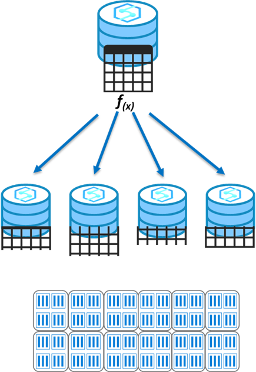
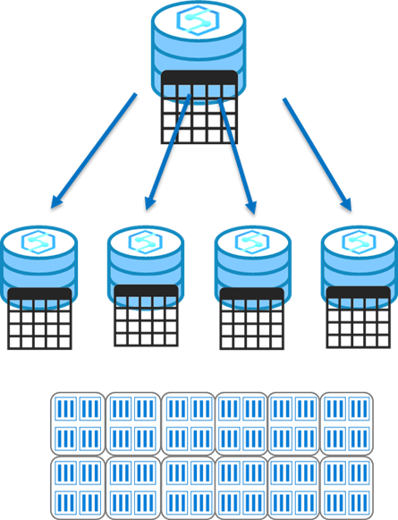

When data is loaded into Synapse Analytics dedicated SQL pools, the datasets are broken up and dispersed among the compute nodes for processing, and then written to a decoupled and scalable storage layer. This action is termed sharding.

The design decisions around how to split and disperse this data among the nodes and then to the storage is important to querying workloads, as the correct selection minimizes data movement that is a primary cause of performance issues in an Azure Synapse dedicated SQL Pool environment.

There are three main table distributions available in Synapse Analytics SQL Pools that will be described below:

> [!VIDEO https://channel9.msdn.com/Shows/Learn-Azure/Table-Geometries/player?format=ny] 

Selecting the correct table distribution can have an impact on the data load and query performance as follows:

## Round robin distribution
> [!div class="mx-imgBorder"]  
> 

This is the default distribution created for a table and delivers fast performance when used for loading data.

A round-robin distributed table distributes data evenly across the table but without any further optimization. A distribution is first chosen at random and then buffers of rows are assigned to distributions sequentially.

It is quick to load data into a round-robin table, but query performance can often be better with hash distributed tables for larger datasets.

Joins on round-robin tables may negatively affect query workloads, as data that is gathered for processing then has to be reshuffled to other compute nodes, which take additional time and processing.

## Hash distribution
> [!div class="mx-imgBorder"]  
> 

This distribution can deliver the highest query performance for joins and aggregations on large tables.

To shard data, a hash function is used to deterministically assign each row to a distribution. In the table definition, one of the columns is designated as the distribution column.

There are performance considerations for the selection of a distribution column, such as distinctness, data skew, and the types of queries that run on the system.

## Replicated tables
> [!div class="mx-imgBorder"]  
> 

A replicated table provides the fastest query performance for small tables.

A table that is replicated caches a full copy of the table on each compute node. Consequently, replicating a table removes the need to transfer data among compute nodes before a join or aggregation. As such extra storage is required and there is additional overhead that is incurred when writing data, which make large tables impractical.

Frequent data modifications will cause the cached copy to be invalidated, and require the table be recached.

Scaling the SQL Pool will also require the table be recached.

