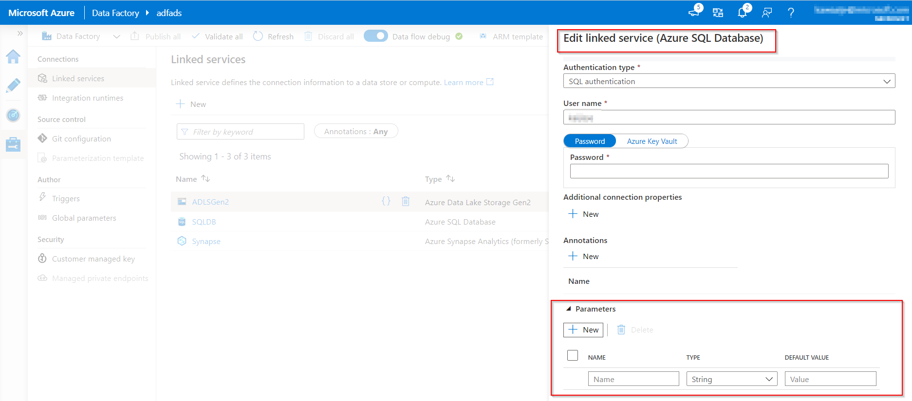
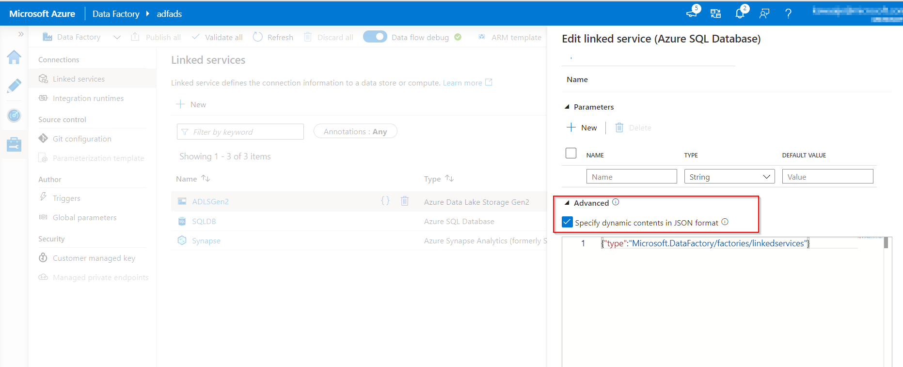
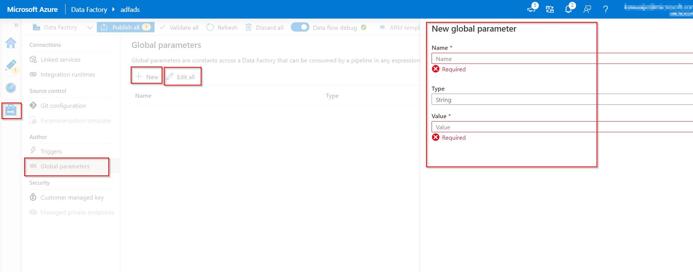
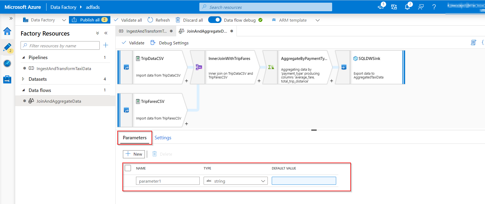

**Parameterize linked services in Azure Data Factory**

Within Azure Data Factory it is possible to parameterize a linked service in which you can pass through dynamic values while at run time. 
A use-case for this situation could be connecting to several different databases that are on the same SQL server, in which you might think about parameterizing the database name in the linked service definition. 
The benefit of doing so, is that you don't have to create a single linked service for each database that is on the same SQL Server. 
It is also possible to parameterize other properties of the linked service like a Username. 

If you decide to parameterize linked services in Azure Data Factory, you have the possibility to do so in the Azure Data Factory User Interface, the Azure Portal or a programming interface to your liking. 

If you choose to author the linked service through the User Interface, Data Factory can provide you with built-in parameterization for some of the connectors:

* Amazon Redshift
* Azure Cosmos DB (SQL API)
* Azure Database for MySQL
* Azure SQL Database
* Azure Synapse Analytics (formerly SQL DW)
* MySQL
* Oracle
* SQL Server
* Generic HTTP
* Generic REST

If you navigate to the creation/edit blade of the linked service, you will find the options for the parameterizing. 

If you can not use the built-in parameterization since you're using a different type of connector, you are able to edit the JSON through the UI:

In linked service creation/edit blade -> expand "Advanced" at the bottom -> check "Specify dynamic contents in JSON format" checkbox -> specify the linked service JSON payload.

Or, after you create a linked service without parameterization, in Management hub -> Linked services -> find the specific linked service -> click "Code" (button "{}") to edit the JSON.

**Global Parameters in ADF**

Setting Global parameters in an Azure Data Factory pipeline, allows you to use these constants for consumption in pipeline expressions. 
A use-case for setting global parameters is when you have multiple pipelines where the parameters names and values are identical. 
If you use the continuous integration and deployment process with Azure Data Factory, the global parameters can be overridden if you wish so, for each and every environment that you have created. 

**Exercise creating global parameters in ADF**

To create a global parameter, go to the Global parameters tab in the Manage section. Select New to open the creation side-nav.

In the side-nav, enter a name, select a data type, and specify the value of your parameter.

After a global parameter is created, you can edit it by clicking the parameter's name. To alter multiple parameters at once, select Edit all.

**Using Global Parameters in a pipeline**
When using global parameters in a pipeline in Azure Data Factory, it is mostly referenced in pipeline expressions. 
For example, if a pipeline references to a resource like a dataset or data flow, you can pass down the global parameter value through the resource parameter. The command or reference of global parameters in Azure Data Factory flows as follows: pipeline().globalParameters.<parameterName>.

**Global Parameters in CI/CD**
When you integrate global parameters in a pipeline using CI/CD with Azure Data Factory, you have two ways in order to do so:

* Include global parameters in the ARM template
* Deploy global parameters via a PowerShell script

In most CI/CD practices, it is beneficial to include global parameters in the ARM template. 
The reason why it's recommended is of the native integration with CI/CD where global parameters are added as an ARM Template parameter due to changes in several environment that are worked in. 
In order to enable global parameters in an ARM template, you navigate to the management hub. 
You do have to be aware that once you add global parameters to an ARM template, it adds an Azure Data Factory level setting, which can override other settings like git configs. 

The use case for deploying global parameters through a PowerShell script, could be because you might have the above mentioned settings enabled in an elevated environment like UAT or PROD.

**Parameterizing Mapping Dataflows**

Within Azure Data Factory you are able to use mapping data flows and therefore, enabling you to use parameters. 
If you set parameters inside a data flow definition, you can use the parameters in expressions. 
The parameter values will be set by the calling pipeline through the Execute Data Flow activity. 

There are three options for setting the values in the data flow activity expressions:

* Use the pipeline control flow expression language to set a dynamic value
* Use the data flow expression language to set a dynamic value
* Use either expression language to set a static literal value

The reason for parameterizing mapping data flows, is to make sure that your data flows are generalized, flexible, and reusable. 

**Create parameters in dataflow**

To add parameters to your data flow, click on the blank portion of the data flow canvas to see the general properties. In the settings pane, you will see a tab called Parameter. 

Select New to generate a new parameter. For each parameter, you must assign a name, select a type, and optionally set a default value.

**Assign Parameters from a Pipeline in Mapping Dataflow**

If you have created a data flow in which you have set parameters, it is possible to execute it from a pipeline using the Execute Data Flow Activity. 
Once you have added the activity to the pipeline canvas, you'll find the data flow parameters in the activity's Parameters tab. 
Assigning parameter values, ensures that you are able to use the parameters in a pipeline expression language or data flow expression language based on spark types. You can also combine the two, that is, pipeline and data flow expression parameters. 

