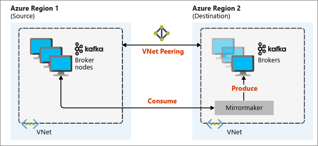

Kafka is often deployed in multiple environments for disaster recovery, high availability, and on-prem to cloud hybrid scenarios. These scenarios require replication of the data from one Kafka instance to the other by using Apache Kafka's mirroring feature. Mirroring can be run as a continuous process, or used intermittently as a method of migrating data from one cluster to another.

Mirroring should not be considered as a means to achieve fault-tolerance. The offset to items within a topic are different between the primary and secondary clusters, so clients cannot use the two interchangeably.

## How does mirroring work?

Mirroring works by using the MirrorMaker tool (part of Apache Kafka) to consume records from topics on the primary cluster and then create a local copy on the secondary cluster. MirrorMaker uses one or more consumers that read from the primary cluster, and a producer that writes to the local secondary cluster.

The most useful mirroring setup for disaster recovery utilizes Kafka clusters in different Azure regions. To achieve this, the virtual networks where the clusters reside are peered together.

The following diagram illustrates the mirroring process and how the communication flows between clusters:

The primary and secondary clusters can be different in the number of nodes and partitions, and offsets within the topics are different also. Mirroring maintains the key value that is used for partitioning, so record order is preserved on a per-key basis.

## Mirroring across network boundaries

If you need to mirror between Kafka clusters in different networks, there are the following additional considerations:

- **Gateways**: The networks must be able to communicate at the TCP/IP level.
- **Server addressing**: You can choose to address your cluster nodes using their IP addresses or fully qualified domain names.
    - **IP addresses**: If you configure your Kafka clusters to use IP address advertising, you can proceed with the mirroring setup using the IP addresses of the broker nodes and zookeeper nodes.
    - **Domain names**: If you don't configure your Kafka clusters for IP address advertising, the clusters must be able to connect to each other by using Fully Qualified Domain Names (FQDNs). This requires a Domain Name System (DNS) server in each network that is configured to forward requests to the other networks. When creating an Azure Virtual Network, instead of using the automatic DNS provided with the network, you must specify a custom DNS server and the IP address for the server. After the Virtual Network has been created, you must then create an Azure Virtual Machine that uses that IP address, then install and configure DNS software on it.

> [!Warning]
>  Create and configure the custom DNS server before installing HDInsight into the Virtual Network. There is no additional configuration required for HDInsight to use the DNS server configured for the Virtual Network.
