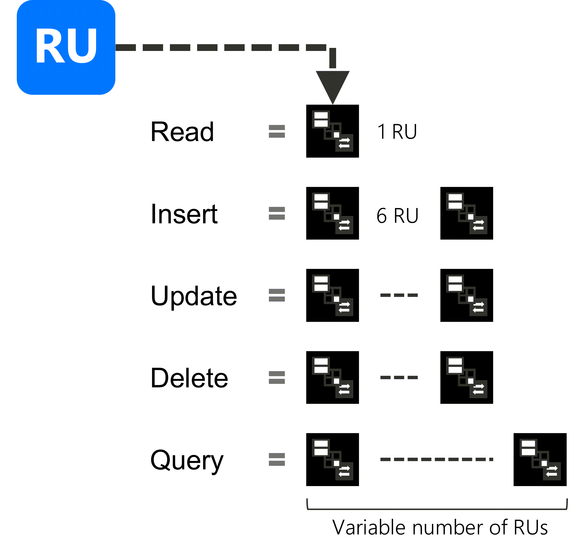

Request units are a rate-based currency. They are used to make it simple to talk about physical resources like memory, CPU, and IO when performing requests in Azure Cosmos DB. For example, it’s easier to think of 10 request units as roughly twice as much as five request units in a relative sense without worrying about the physical resources that are abstracted away. Request units are used to measure both foreground and background activities.

Every request consumes a fixed number of request units, including but not limited to:

- Reads
- Writes
- Queries
- Stored procedures

## Configuring throughput

When you create a database or container in Azure Cosmos DB, you can provision request units in an increment of request units per second (or RU/s for short). You cannot provision less than 400 RU/s, and they are provisioned in increments of 100.

## Estimating ad-hoc RU/s consumption

Some RU/s are normalized across various access methods, making many common operations predictable. Using this knowledge, you can perform some basic estimations for simple workloads. For example, you can estimate the RU/s required for common database operations such as one RU for a read and six RU/s for a write operation of a 1-KB document in optimal conditions.

Using this strategy, you should identify your solution's query and access patterns to make an educated guess as to how many request units will be needed in Azure Cosmos DB. To accomplish this, you will want information such as:

- Top five queries
- Number of read operations per second
- Number of write operations per second

> &#128161; Measuring RU/s for queries should be done at scale. Measuring queries running on a single physical partition will not yield significant data on the actual throughput used in your real world scenario once it is deployed and scaled out.

You can use a spreadsheet application to build a quick table to figure out a rough estimate of your needed request unit capacity. Here's a quick example:

| **Operation type** | **Number of requests per second** | **Number of RU per request** | **RU/s needed** |
| ---: | :---: | :---: | :--- |
| **Write Single Document** | 10,000 | 10 | 100,000 |
| **Top Query #1** | 700 | 100 | 70,000 |
| **Top Query #2** | 200 | 100 | 20,000 |
| **Top Query #3** | 100 | 100 | 10,000 |
| **Total RU/s** | | | 200,000 RU/s |

> &#128161; You can also run a proof of concept application, and use the **request charge** property of the SDK to measure the real-world RU charge of running the operations that you intend to make against Azure Cosmos DB.
