In this exercise, you create a Data flow for a Type 1 SCD using Azure Synapse dedicated SQL pool as the source and destination. This data flow could then be added to a Synapse Pipeline and run as part of the extract, transform, load (ETL) process.

### Setup source and dimension table
For this exercise you want to load a dimension table in Azure Synapse from source data that could be from many different system types, such as Azure SQL, Azure storage, etc. For this example you keep it simple by creating the source data in your Azure Synapse database.

1. From Synapse Studio, navigate to the **Data** hub.

    

2. Select the **Workspace** tab **(1)**, expand Databases, then right-click on **SQLPool01 (2)**. Select **New SQL script (3)**, then select **Empty script (4)**.

    

3. Paste the following script into the empty script window, then select **Run** or hit `F5` to execute the query:

    ```sql
    CREATE TABLE [dbo].[CustomerSource] (
        [CustomerID] [int] NOT NULL,
        [Title] [nvarchar](8),
        [FirstName] [nvarchar](50),
        [MiddleName] [nvarchar](50),
        [LastName] [nvarchar](50),
        [Suffix] [nvarchar](10),
        [CompanyName] [nvarchar](128),
        [SalesPerson] [nvarchar](256),
        [EmailAddress] [nvarchar](50),
        [Phone] [nvarchar](25)
    ) WITH ( HEAP )

    COPY INTO [dbo].[CustomerSource]
    FROM 'https://solliancepublicdata.blob.core.windows.net/dataengineering/dp-203/awdata/CustomerSource.csv'
    WITH (
        FILE_TYPE='CSV',
        FIELDTERMINATOR='|',
        FIELDQUOTE='',
        ROWTERMINATOR='0x0a',
        ENCODING = 'UTF16'
    )

    CREATE TABLE dbo.[DimCustomer](
        [CustomerID] [int] NOT NULL,
        [Title] [nvarchar](8) NULL,
        [FirstName] [nvarchar](50) NOT NULL,
        [MiddleName] [nvarchar](50) NULL,
        [LastName] [nvarchar](50) NOT NULL,
        [Suffix] [nvarchar](10) NULL,
        [CompanyName] [nvarchar](128) NULL,
        [SalesPerson] [nvarchar](256) NULL,
        [EmailAddress] [nvarchar](50) NULL,
        [Phone] [nvarchar](25) NULL,
        [InsertedDate] [datetime] NOT NULL,
        [ModifiedDate] [datetime] NOT NULL,
        [HashKey] [char](66)
    )
    WITH
    (
        DISTRIBUTION = REPLICATE,
        CLUSTERED COLUMNSTORE INDEX
    )
    ```

    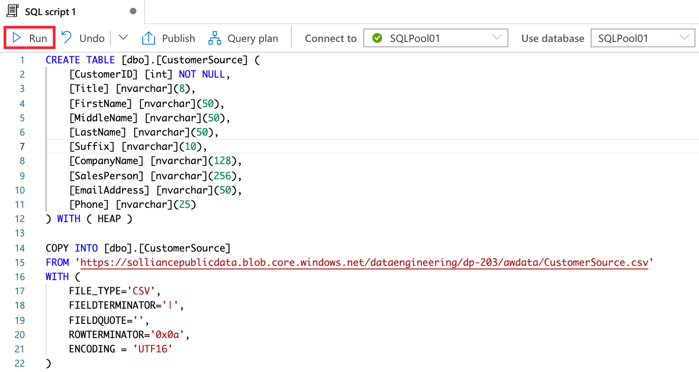

### Create a mapping data flow

Mapping Data flows are pipeline activities that provide a visual way of specifying how to transform data, through a code-free experience. Next you will create a mapping data flow to create a Type 1 SCD.

1. Navigate to the **Develop** hub.

    

2. Select **+**, then select **Data flow**.

    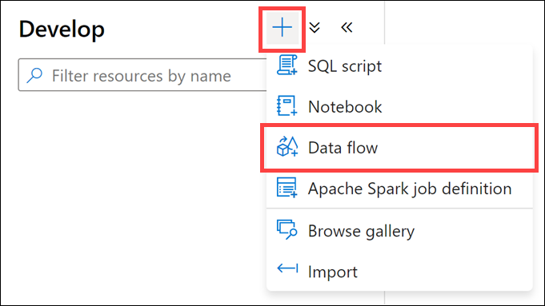

3. In the properties pane of the new data flow, enter `UpdateCustomerDimension` in the **Name** field **(1)**, then select the **Properties** button **(2)** to hide the properties pane.

    

3. Select **Add Source** on the canvas.

    

4. Under `Source settings`, configure the following properties:

    - **Output stream name**: Enter `SourceDB`
    - **Source type**: Select `Dataset`
    - **Options**: Check `Allow schema drift` and leave the other options unchecked
    - **Sampling**: Select `Disable`
    - **Dataset**: Select **+ New** to create a new dataset

    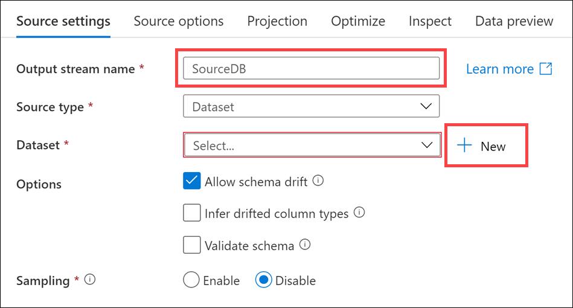

5. In the new integration dataset dialog, select **Azure Synapse Analytics**, then select **Continue**.

    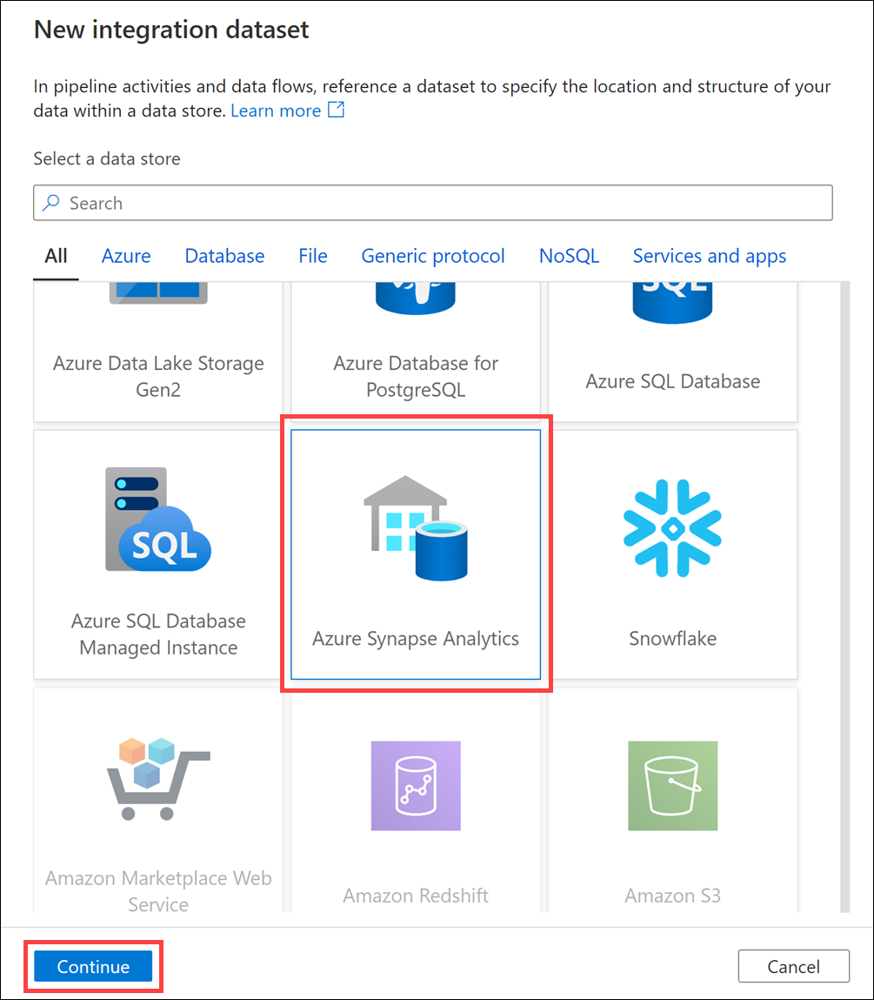

6. In the dataset properties, configure the following:

    - **Name**: Enter `CustomerSource`
    - **Linked service**: Select the Synapse workspace linked service
    - **Table name**: Select the **Refresh button** next to the dropdown

    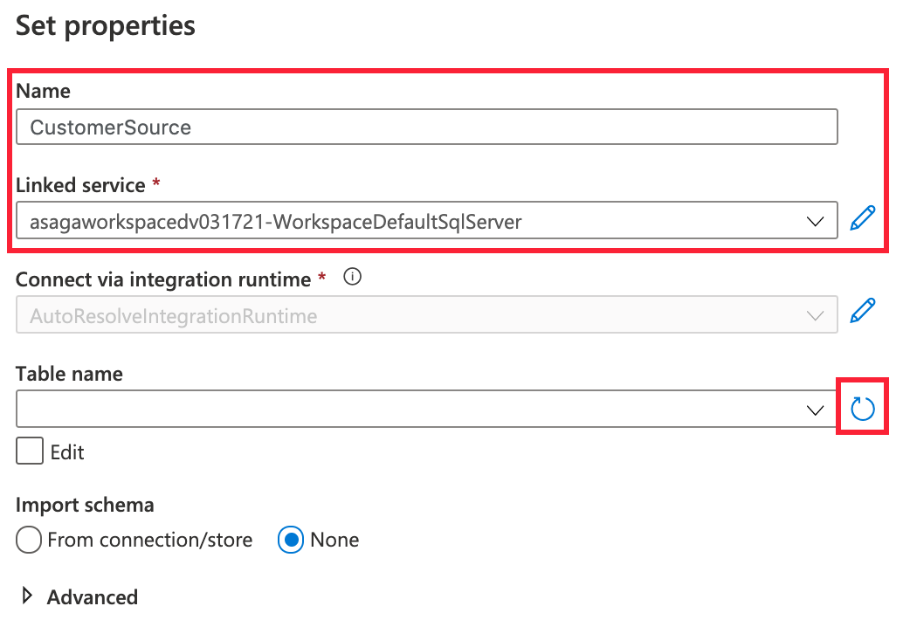

7. In the **Value** field, enter your SQL Pool name, then select **OK**.

    

8. Select `dbo.CustomerSource` under **Table name**, select `From connection/store` under **Import schema**, then select **OK** to create the dataset.

    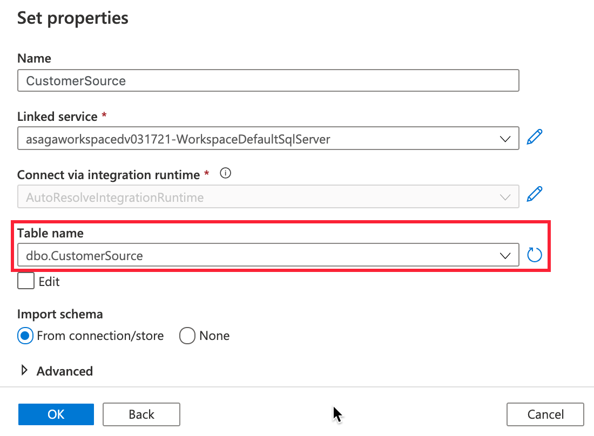

9. Select **Open** next to the `CustomerSource` dataset that you added.

    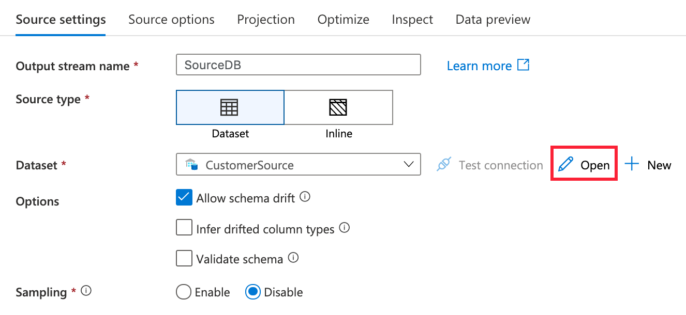

10. Enter **your SQL Pool name** in the **Value** field next to `DBName`.

11. In the data flow editor, select the **Add Source** box below the SourceDB activity. Configure this source as the **DimCustomer** table following the same steps used for CustomerSource.
    - **Output stream name**: Enter `DimCustomer`
    - **Source type**: Select `Dataset`
    - **Options**: Check `Allow schema drift` and leave the other options unchecked
    - **Sampling**: Select `Disable`
    - **Dataset**: Select **+ New** to create a new dataset. Use the Azure Synapse linked service and choose DimCustomer table. Be sure to set the DBName to your SQL Pool name.
    
    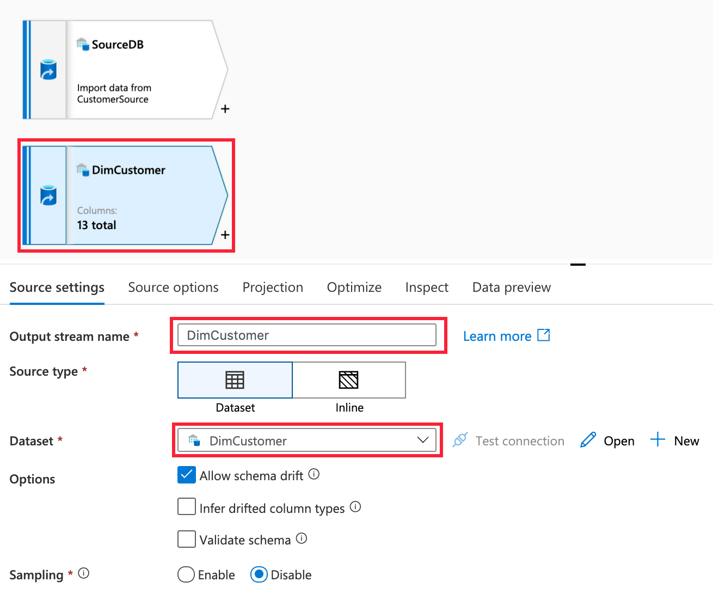

### Add transformations to data flow

1. Select **+** to the right of the `SourceDB` source on the canvas, then select **Derived Column**.

    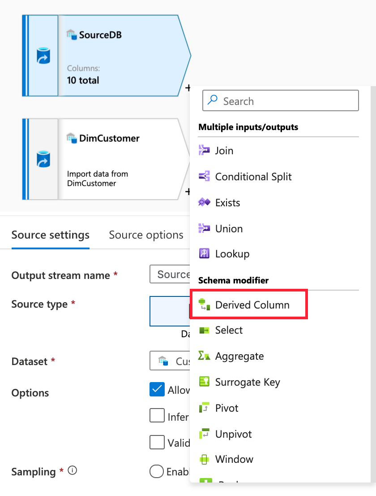

2. Under `Derived column's settings`, configure the following properties:

    - **Output stream name**: Enter `CreateCustomerHash`
    - **Incoming stream**: Select `SourceDB`
    - **Columns**: Enter the following:

    | Column | Expression | Description |
    | --- | --- | --- |
    | Type in `HashKey` | `sha2(256, iifNull(Title,'') +FirstName +iifNull(MiddleName,'') +LastName +iifNull(Suffix,'') +iifNull(CompanyName,'') +iifNull(SalesPerson,'') +iifNull(EmailAddress,'') +iifNull(Phone,''))` | Creates a SHA256 hash of the table values. We use this to detect row changes by comparing the hash of the incoming records to the hash value of the destination records, matching on the `CustomerID` value. The `iifNull` function replaces null values with empty strings. Otherwise, the hash values tend to duplicate when null entries are present. |

    

3. Select **+** to the right of the `CreateCustomerHash` derived column on the canvas, then select **Exists**.

    

4. Under `Exists settings`, configure the following properties:

    - **Output stream name**: Enter `Exists`
    - **Left stream**: Select `CreateCustomerHash`
    - **Right stream**: Select `SynapseDimCustomer`
    - **Exist type**: Select `Doesn't exist`
    - **Exists conditions**: Set the following for Left and Right:

    | Left: CreateCustomerHash's column | Right: SynapseDimCustomer's column |
    | --- | --- |
    | `HashKey` | `HashKey` |

    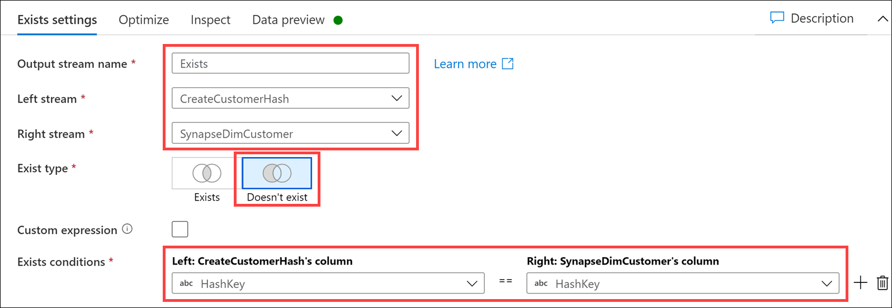

5. Select **+** to the right of `Exists` on the canvas, then select **Lookup**.

    

6. Under `Lookup settings`, configure the following properties:

    - **Output stream name**: Enter `LookupCustomerID`
    - **Primary stream**: Select `Exists`
    - **Lookup stream**: Select `SynapseDimCustomer`
    - **Match multiple rows**: Unchecked
    - **Match on**: Select `Any row`
    - **Lookup conditions**: Set the following for Left and Right:

    | Left: Exists's column | Right: SynapseDimCustomer's column |
    | --- | --- |
    | `CustomerID` | `CustomerID` |

    

7. Select **+** to the right of `LookupCustomerID` on the canvas, then select **Derived Column**.

    

8. Under `Derived column's settings`, configure the following properties:

    - **Output stream name**: Enter `SetDates`
    - **Incoming stream**: Select `LookupCustomerID`
    - **Columns**: Enter the following:

    | Column | Expression | Description |
    | --- | --- | --- |
    | Select `InsertedDate` | `iif(isNull(InsertedDate), currentTimestamp(), {InsertedDate})` | If the `InsertedDate` value is null, insert the current timestamp. Otherwise, use the `InsertedDate` value. |
    | Select `ModifiedDate` | `currentTimestamp()` | Always update the `ModifiedDate` value with the current timestamp. |

    

    > [!NOTE]
    > To insert the second column, select **+ Add** above the Columns list, then select **Add column**.

9. Select **+** to the right of the `SetDates` derived column step on the canvas, then select **Alter Row**.

    

10. Under `Alter row settings`, configure the following properties:

    - **Output stream name**: Enter `AllowUpserts`
    - **Incoming stream**: Select `SetDates`
    - **Alter row conditions**: Enter the following:

    | Condition | Expression | Description |
    | --- | --- | --- |
    | Select `Upsert if` | `true()` | Set the condition to `true()` on the `Upsert if` condition to allow upserts. This ensures that all data that passes through the steps in the mapping data flow will be inserted or updated into the sink. |

    

11. Select **+** to the right of the `AllowUpserts` alter row step on the canvas, then select **Sink**.

    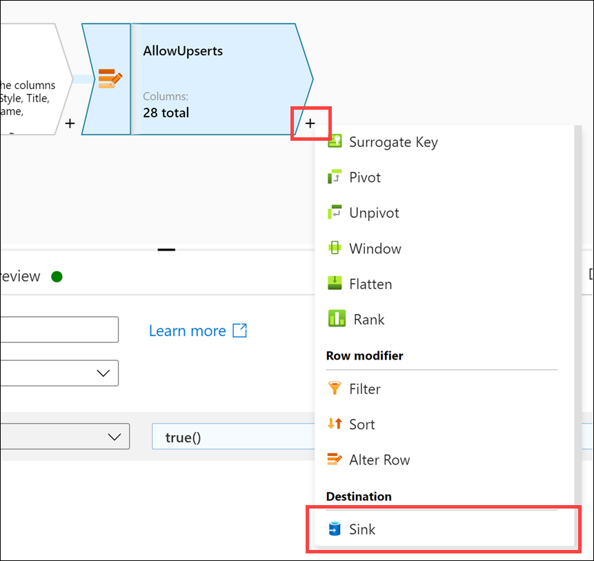

12. Under `Sink`, configure the following properties:

    - **Output stream name**: Enter `Sink`
    - **Incoming stream**: Select `AllowUpserts`
    - **Sink type**: Select `Dataset`
    - **Dataset**: Select `DimCustomer`
    - **Options**: Check `Allow schema drift` and uncheck `Validate schema`

    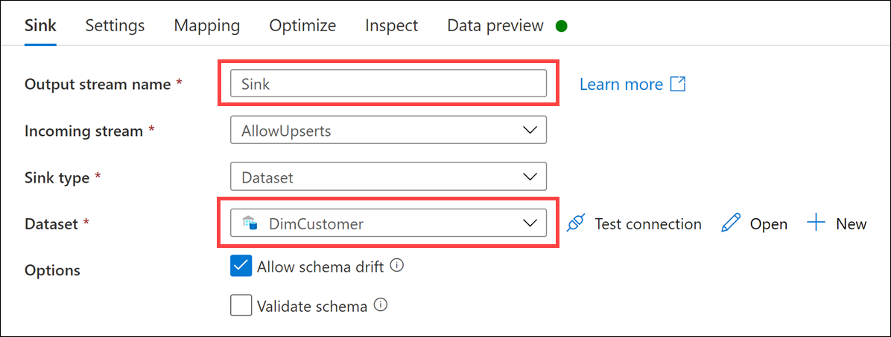

13. Select the **Settings** tab and configure the following properties:

    - **Update method**: Check `Allow upsert` and uncheck all other options
    - **Key columns**: Select `List of columns`, then select `CustomerID` in the list
    - **Table action**: Select `None`
    - **Enable staging**: Unchecked

    

14. Select the **Mapping** tab, then uncheck **Auto mapping**. Configure the input columns mapping as outlined below:

    | Input columns | Output columns |
    | --- | --- |
    | `SourceDB@CustomerID` | `CustomerID` |
    | `SourceDB@Title` | `Title` |
    | `SourceDB@FirstName` | `FirstName` |
    | `SourceDB@MiddleName` | `MiddleName` |
    | `SourceDB@LastName` | `LastName` |
    | `SourceDB@Suffix` | `Suffix` |
    | `SourceDB@CompanyName` | `CompanyName` |
    | `SourceDB@SalesPerson` | `SalesPerson` |
    | `SourceDB@EmailAddress` | `EmailAddress` |
    | `SourceDB@Phone` | `Phone` |
    | `InsertedDate` | `InsertedDate` |
    | `ModifiedDate` | `ModifiedDate` |
    | `CreateCustomerHash@HashKey` | `HashKey` |

    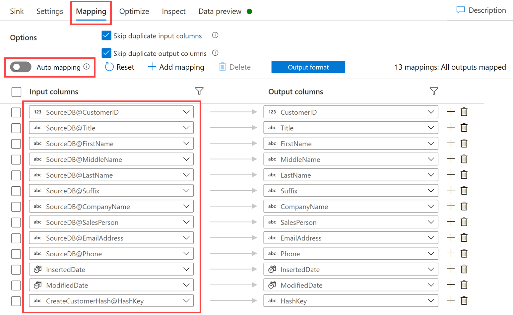

15. The completed mapping flow should look like the following. Select **Publish all** to save your changes.

    

16. Select **Publish**.

    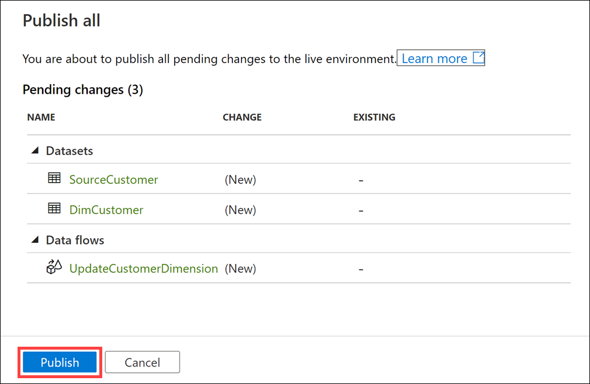

### How to test the data flow

You have completed a Type 1 SCD data flow. If you choose to test it out you could add this data flow to a Synapse integration pipeline. Then you could run the pipeline once to do the initial load of the customer source data to the DimCustomer destination.

Each additional run of the pipeline will compare the data in the source table to what is already in the dimension table (using the HashKey) and **only update records that have changed**. In order to test this, you could update a record in the source table then run the pipeline again and verify the record updates in the dimension table.

Take the customer Janet Gates as an example. The initial load shows the `LastName` is Gates and the `CustomerId` is 4.


Here is an example statement that would update the customer last name in the source table.

```sql
UPDATE [dbo].[CustomerSource]
SET LastName = 'Lopez'
WHERE [CustomerId] = 4
```

After updating the record and running the pipeline again, DimCustomer would show this updated data.


The customer record successfully updated the `LastName` value to match the source record and updated the `ModifiedDate`, without keeping track of the old `LastName` value. That is the expected behavior for a Type 1 SCD. If history was required for the `LastName` field then you would modify the table and data flow to be one of the other SCD types you have learned.
