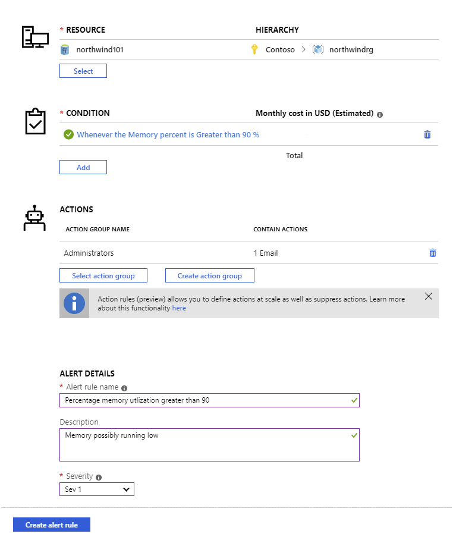
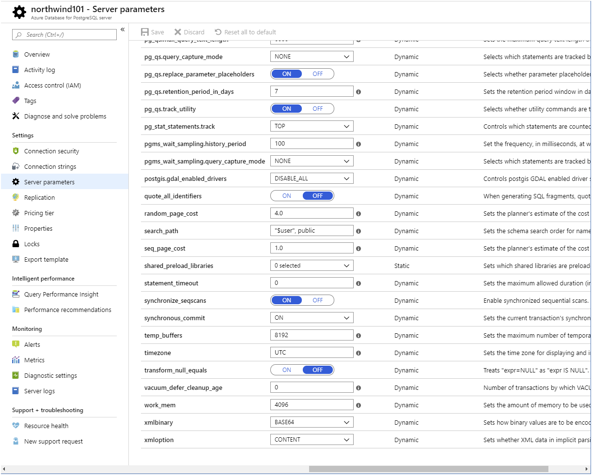

After a company has migrated their on-premises databases to Azure Database for MySQL/PostgreSQL, they still need a way to monitor their performance.

As the database developer you've been used to using databases-specific tools and on-premises VM monitoring. Now that your databases are running on Azure, you can take advantage of the portal to use a single tool to monitor all the different databases.

In this unit you'll look at how Azure Monitor can support you in monitoring the health of the databases you're responsible for. Once you've uncovered issues, you'll see how to change the configuration of your databases to resolve the problems.

## How to use Azure Monitor to view the health of your databases

Use Azure Monitor to track resource use in Azure Database for MySQL/PostgreSQL. The **Metrics** page for your server in the Azure portal enables you to create charts that help to detect trends in performance, and spot anomalies.

### Metrics for Azure Database for MySQL/PostgreSQL

The metrics available for monitoring a server fall into four broad categories:

- Storage metrics
- Connection metrics
- Data processing resource utilization metrics
- Replication metrics

#### Storage metrics

Storage metrics track the total size of your databases across the server (*Storage used*), and the current amount of storage space on the server (*Storage limit*). In an active system, you'll likely find the *Storage used* metric grows over time. If you have the auto-growth option selected for the server, the *Storage limit* metric occasionally increases as the amount of free space diminishes. Extra storage is added whenever the amount of free space drops below 5 percent of the current usage. Use the *storage percent* metric to view the proportion of used space to free space on your server.

If your server is regularly spending time increasing storage, consider assigning more space manually. Do this in the Azure portal by selecting the **Pricing tier** page for your server, and use the **Storage** slider. Remember you're charged for storage, so don't set the storage available to high to being with.

The *Backup Storage used* metric shows how much space your backups are taking. This metric is important from a cost perspective. You aren't charged for backup storage providing it remains below the size of the storage space allocated to your server (as specified by the pricing tier). When you go above this limit, you incur charges for backup storage.

#### Connection metrics

The *Active connections* metric shows how many concurrent connections the server is currently supporting. This might not be the same as the number of concurrent users, depending on whether you've configured any type of connection pooling. Azure Database for MySQL/PostgreSQL doesn't currently provide any connection pooling capability, but you could use a proxy service such as *PgBouncer** (for PostgreSQL) to implement this feature. For more information, see [Performance best practices for using Azure Database for PostgreSQL – Connection Pooling](https://azure.microsoft.com/blog/performance-best-practices-for-using-azure-database-for-postgresql-connection-pooling/)

The *Failed connections* metric shows how often users have presented invalid credentials. A large number of these events over a short period of time might indicate a brute-force attack.

#### Data processing resource utilization metrics

These metrics help you to monitor how your server handles the workload.

The *CPU percent* metric shows how busy the CPU is. High CPU usage isn't a problem, unless it has been increasing over time. CPU utilization that's over 90% and still rising indicates that your system is approaching processing capacity. You should consider scaling up to a pricing tier with more resources.

The *Memory percent* metric indicates memory occupancy. Azure Database for MySQL/PostgreSQL uses memory for caching data, and for running the processes initiated by each client request. High memory usage isn't a problem until it becomes excessive this is typically over 95%, depending on the actual amount of memory available. Very low memory availability can cause connection failures, and slow performance because of memory fragmentation. You should monitor this metric to determine whether memory occupancy is growing over time, and scale your server accordingly.

The *IO percent* metric tracks the amount of disk activity being performed by the server. Ideally, this value should be as low as possible. Disk IO is a slow operation. A high value for this metric, in conjunction with a high value for *Memory percent*, might indicate that the server has insufficient resources to cache data effectively, and is instead having to read and write data to disk storage. A degree of IO activity is inevitable, because your data must be persisted to disk at some point, and transaction logs must be maintained. In most database servers, this writing is performed by a separate process or thread that runs asynchronously.

The *Network In* and *Network Out* metrics show the volume of traffic entering and exiting the server across active connections. The limits to these figures are determined by the bandwidth of the path between the client applications and the server.

#### Replication metrics

Azure Database for PostgreSQL provides the *Max Lag Across Replicas*, and *Replica Lag* metrics to help you determine how up to date any replicas are. These metrics are only meaningful if you've configured read-only replicas. 

The *Max Lag Across Replicas* metric shows how many bytes the slowest replica is behind the master. You can only monitor this metric from the master.

The *Replica Lag* metric shows the time, in seconds, since the latest transaction was received from the master and applied to a replica. This metric only makes sense when viewed on a replica.

Azure Database for MySQL has the *Replication lag in seconds* metric. This metric, which you can only monitor from a replica, shows the number of seconds by which the replica is lagging behind the master.

### Creating charts and alerts to monitor performance

The **Metrics** page for a server in the Azure portal enables you to create charts that track metric values. Metrics are gathered at one-minute intervals. For each metric, you specify an aggregation that determines how to report that metric. 

- *Average* generates an average value for the metric in each minute
- *Max* shows the maximum value achieved during each minute
- *Min* shows the smallest value
- *Sum* totals the metric
- *Count* shows how many times the event generating the metric occurred

Not all aggregations are necessarily meaningful for every metric.

The example chart below captured the average minute-by-minute values for the CPU percent, Memory percent, IO percent, and Active connections metrics. You'll see that there are 101 active connections all running concurrently. The CPU and memory utilization are both stable, and the IO percent is at 0. In this example, the client applications are performing read-intensive workloads and the necessary data is cached in memory.

[](../media/5-metrics-chart.png#lightbox)

Note that there's a lag of up to five minutes between the metrics being captured and the results displayed on a chart.

If a metric indicates that a resource is reaching a critical point, you can set an alert to notify an administrator. The example below sends an email to an administrator if the memory utilization exceeds 90 percent.



## Configure server parameters

Native MySQL and PostgreSQL servers are highly configurable as both use configuration settings stored in parameter files. For PostgreSQL, this information is held in the *postgresql.conf* file. For MySQL, configuration data is stored in various *my.cnf* files. In Azure Database for MySQL/PostgreSQL, you don't have direct access to these files. Instead, you view and modify server parameters by using the Azure portal or the Azure CLI.

### View and set parameters using the Azure portal

The server configuration parameters are available on the **Server parameters** page for your server in the Azure portal. You can modify the parameter values as appropriate for your server. The image below shows the server parameters page for Azure Database for PostgreSQL. The corresponding page for Azure Database for MySQL is similar.

 [](../media/5-server-parameters.png#lightbox)

 Not all server configuration parameters are available because a large part of the server configuration is controlled by Azure. For example, parameters associated with memory allocation are missing. Additionally, Azure Database for MySQL doesn't support ISAM storage, so the *myisam* parameters aren't there.

 Changes to parameters that are marked as *Dynamic* come into effect immediately. Parameters marked as *Static* require you to restart the server. You do this on the **Overview** page for your server.

 

### View and set parameters using the Azure CLI

You can view and modify parameters programmatically with the `az mysql/postgres server configuration` commands. View the settings of every configuration parameter with `az mysql/postgres server configuration list`, and home in on a single parameter using `az mysql/postgres server configuration show [parameter-name]`. The code snippet below shows an example for Azure Database for PostgreSQL:

```azurecli
az postgres server configuration show \
    --resource-group northwindrg \
    --server-name northwind101 \
    --name vacuum_defer_cleanup_age
```

The result should look similar to this:

```Text
{
  "allowedValues": "0-1000000",
  "dataType": "Integer",
  "defaultValue": "0",
  "description": "Number of transactions by which VACUUM and HOT cleanup should be deferred, if any.",
  "id": "**********************",
  "name": "vacuum_defer_cleanup_age",
  "resourceGroup": "northwindrg",
  "source": "system-default",
  "type": "Microsoft.DBforPostgreSQL/servers/configurations",
  "value": "0"
}
```

The important item in the output is the **value** field, which shows the current setting for the parameter.

Use the `az mysql/postgres server configuration set` command to change the value of a configuration parameter, as follows:

```azurecli
az postgres server configuration set \
    --resource-group northwindrg \
    --server-name northwind101 \
    --name vacuum_defer_cleanup_age \
    --value 5
```

If you need to restart a server after changing a static parameter, run the `az mysql/postgres server restart` command:

```azurecli
az postgres server restart \
    --resource-group northwindrg \
    --name northwind101
```
