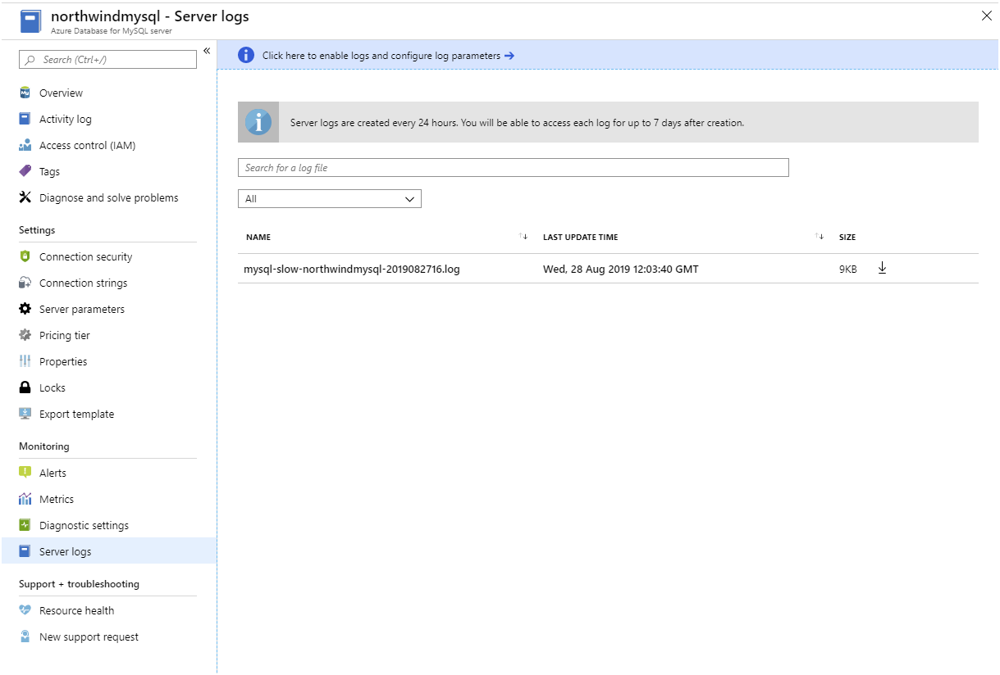
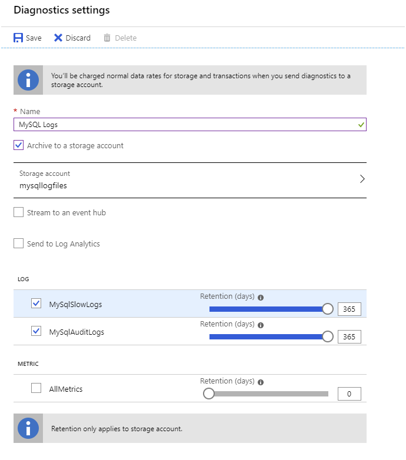
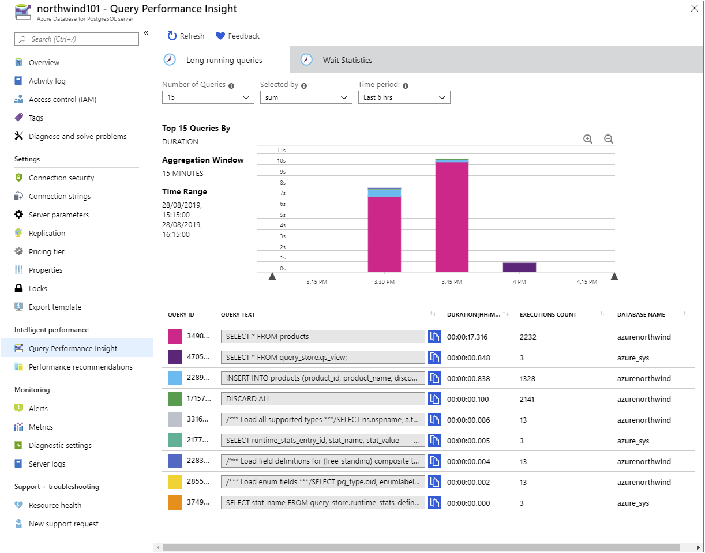
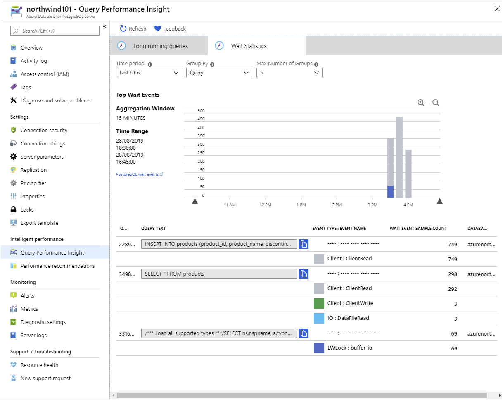

Azure Database for MySQL/PostgreSQL also records diagnostic information in the server logs. Server logs are the native message log files for MySQL and PostgreSQL (not the transaction log files, which are inaccessible in Azure Database for MySQL/PostgreSQL). These files contain messages, server status, and other error information that you use to debug problems with your databases. The server logs are retained for up to seven days (less, if the total size of the server log files exceeds 7 GB).

Azure Database for MySQL and Azure Database for PostgreSQL record different details in the server logs. The following sections describe the server logs for each service separately.

### Server logs in Azure Database for MySQL

In Azure Database for MySQL, the server log provides the information normally available in the *slow query log* and the *audit log* on a MySQL server.

You use the information in the slow query log to help identify slow-running queries. By default, the slow query log is disabled. You enable it by setting the **slow_query_log** server parameter to **ON**. You configure the slow query log to determine what is meant by a *slow query* using the following server parameters:

- **log_queries_not_using_indexes**. This parameter is either **ON** or **OFF**. Set it to **ON** to record all queries that are likely to perform a full table scan rather than an index lookup.
- **log_throttle_queries_not_using_indexes**. Specifies the maximum number of slow queries not using indexes that can be logged per minute.
- **log_slow_admin_queries**. Set this parameter to **ON** to include slow running administrative queries in the log.
- **long_query_time**. The threshold (in seconds) for a query to be considered *slow running*.

After you've enabled the slow query log and the audit log, the log files will start to appear in the **Server logs** page for the server. A new slow query log is created each day. Click a log file to download it:

[](../media/5-mysql-server-logs.png#lightbox)

To enable audit logging, set the **audit_log_enabled** server parameter to **ON**. You configure audit logging with the following parameters:

- **audit_log_events**. Specify the events to be audited. In the Azure portal, this parameter provides a drop-down list of events, such as **CONNECTION**, **DDL**, **DML**, **ADMIN**, and others.
- **audit_log_exclude_users**. This parameter is a comma-separated list of users whose activities won't be included in the audit log.

If you need to preserve the slow query log and audit log for more than seven days, you arrange for them to be transferred to Azure storage. Use the **Diagnostics settings** page for your server, and then select **+ Add diagnostic setting**. On the **Diagnostics settings** page, select **Archive to a storage account**, select a storage account in which to save the log files (this storage account must already exist), select **MySqlSlowLogs** and **MySqlAuditLogs**, and specify a retention period of up to 365 days. You can download the log files from Azure storage at any point during this time. Select **Save**:



Slow query log data will be written in JSON format to blobs in a container named **insights-logs-mysqlslowlogs**. It can take up to 10 minutes for the log files to appear in Azure storage. Audit records are stored in the **insights-logs-mysqlslowlogs** blob container, again in JSON format.

### Server logs in Azure Database for PostgreSQL

In Azure Database for PostgreSQL, the server log contains error log and query log files. Use the information in these files to help locate the sources of any errors and inefficient queries.

You enable logging by setting the various **log_** server configuration parameters to **ON**. These parameters include:

- **log_checkpoints**.  A checkpoint occurs whenever every data file has been updated with the latest information from the transaction log. If there's a server failure, this point marks the time at which recovery needs to commence by rolling forward from the transaction log.
- **log_connection** and **log_disconnections**. These settings record each successful connection, and the end of each session.
- **log_duration**. This setting causes the duration of each completed SQL statement to be recorded.
- **log_lock_waits**. This setting causes lock wait events to be recorded. Lock waits can be caused by poorly implemented transactions in application code.
- **log_statement_stats**. This setting writes cumulative information about the performance of the server to the log.

Azure Database for PostgreSQL also provides further parameters to fine-tune the information that's recorded:

- **log_error_verbosity**. This setting specifies the level of detail recorded for each logged message.
- **log_retention_days**. This is the number of days that the server retains each log file before removing it. The default is three days, and you can set it to a maximum of seven days.
- **log_min_messages** and **log_min_error_statement**. Use these parameters to specify the warning and error levels for recording statements.

As with Azure Database for MySQL, the log files generated by Azure Database for PostgreSQL are available on the **Server logs** page. You can also use the **Diagnostic settings** page to copy the logs to Azure storage.

## Track query performance

Query Store is an additional feature provided by Azure to help you identify and track poorly running queries. You use it with Azure Database for MySQL and Azure Database for PostgreSQL.

### Enabling query performance tracking

<!-- NOTE TO REVIEWER. Query Store seems to be currently unavailable in Azure Database for MySQL. It was there previously. If this is a permanent removal, then the text in this lesson that refers to Azure Database for MySQL will need to be removed -->
Query Store records information in the **mysql** schema in Azure Database for MySQL, and in a database named **azure_sys** in Azure Database for PostgreSQL. Query Store can capture two types of information—data about query execution, and information on wait statistics. Query Store is disabled by default. To enable it:

- If you're using Azure Database for MySQL, set the server parameters **query_store_capture_mode** and **query_store_wait_sampling_capture_mode** to **ALL**.
- If you're using Azure Database for PostgreSQL, set the server parameter **pg_qs.query_capture_mode** to **ALL** or **TOP**, and set the **pgms_wait_sampling.query_capture_mode** parameter to **ALL**.

### Analyzing query performance data

You can query the tables used by Query Store directly. If you're running Azure Database for MySQL, connect to your server, and run the following queries:

```SQL
SELECT * FROM mysql.query_store;

SELECT * FROM mysql.query_store_wait_stats;
```

If you're using Azure Database for PostgreSQL, run the following queries instead:

```SQL
SELECT * FROM query_store.qs_view;

SELECT * FROM query_store.pgms_wait_sampling_view;
```

In both cases, the first query will display the text for each recently run query, and a host of statistics about how long the query took to compile and execute. The second query displays information about wait events. A wait event occurs when one query is prevented from running because it requires the resources held by another.

If you examine the Query Store directly, you can generate your own custom reports and gain a detailed insight into how the system is functioning. However, the amount of data available can make it difficult to understand what's happening. Azure Database for MySQL/PostgreSQL provides two additional tools to help you navigate this data—**Query Performance Insight**, and **Query Recommendations**.

**Query Performance Insight** is a graphical utility, available from the **Query Performance Insight** page for your server. The **Long running queries** tab displays the statistics for the most long running queries. You specify the time period, and zoom in to within a few minutes. The legend shows the text of each query, together with the duration and number of times the query was run. The graph gives a comparative view of the duration of each query. You view the data by the average time for each query, but it's also instructive to display the total time (*duration* * *execution count*) for each query. The image below shows an example:

[](../media/5-query-insight.png#lightbox)

The **Wait Statistics** tab shows the wait event information for each query. You'll see the amount of time spent by a query waiting for various resources.

[](../media/5-query-insight-waits.png#lightbox)

Wait events typically fall into three categories:

- **Lock waits**. These events occur if a query is attempting to read or modify data that's locked by another query. If you experience a large number of lock waits, check for long running transactions, or operations that use a highly restrictive isolation level.
- **IO waits**. This type of wait occurs if a query is performing a significant amount of IO. This could be due to a poorly designed query (check the *WHERE* clause), an inefficient join operation, or a full table scan incurred because of a missing index.
- **Memory waits**. A memory wait occurs if there's insufficient memory available to process a query. Your query could be attempting to read a large amount of data, or it might be blocked by other queries hogging memory. Again, this might indicate that indexes are missing, causing queries to read entire tables into memory.
  
It's also highly likely that one form of wait triggers another, so you can't necessarily examine these issues in isolation. For example, a transaction that reads and updates data in different tables might be subject to a memory wait. In turn, this transaction could have locked data that causes another transaction to incur a lock wait.

The **Performance Recommendations** page for the server takes the information held in Query Store and uses it to make recommendations for tuning your database for the workloads it's experiencing.
