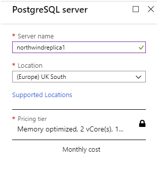
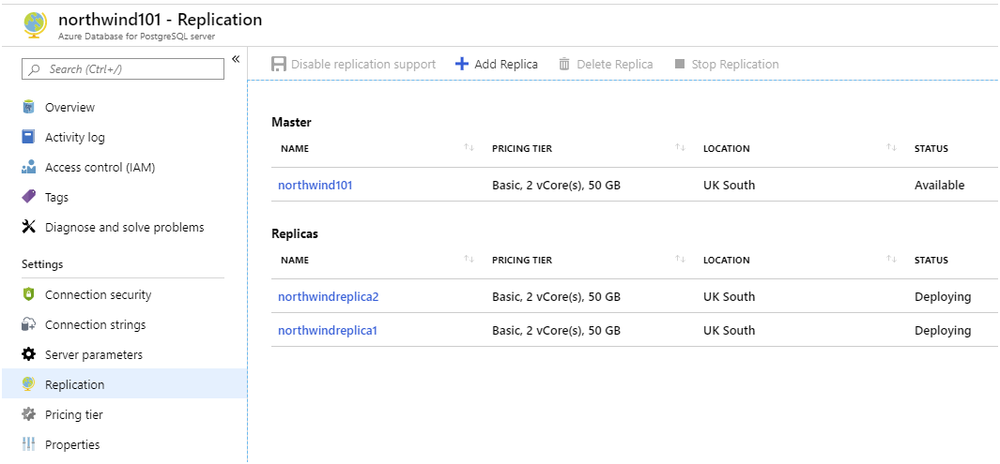

Companies can use read-only replicas of their databases to scale performance globally. Replicas are useful when an organization has customers distributed globally, and have users in their millions trying to access their data. Once in place, they can also handle regional disaster recover.

Your company has grown to an internationally renowned seller of bicycles. The CIO has asked your department to improve the responsiveness of your online shop for its users across the globe. You know that a quick and simple way to improve the performance is place read-only replicas of your databases in each geographical location.

In this unit, you'll see how easy it is to create and manage read-only replicas of data stored in an Azure Database for MySQL/PostgreSQL.

## How to use read replication

You use read replication to copy data from one instance of Azure Database for MySQL/PostgreSQL (referred to as the *master*) to up to five replicas. Use replication to spread the load across servers for read-heavy workloads. Replication is one-way only, and each replica is read-only. Replication operates asynchronously, so there's a lag between the time the data changes on the master and the point at which it appears in each replica.

Replicas can be in different regions from the master. You use replicas to place data close to the clients needing it, to reduce query latency. Cross-region replication also gives you a mechanism for handling regional disaster recovery.

> [!NOTE]
> Cross-region replication is not available in the Basic performance tier.

Each replica is an instance of Azure Database for MySQL/PostgreSQL in its own right, but configured as read-only. If the connection to the master server is lost, or the master server is deleted, each replica becomes an independent read-write server. In this case, replicas are no longer synchronized with each other, so the data they hold might start to diverge.

> [!NOTE]
> If you're using Azure Database for MySQL, read replicas are only available in the General Purpose and Memory Optimized pricing tiers. Additionally, read replicas aren't available in Azure Database for PostgreSQL, Hyperscale (Citus).

### Creating replicas

The simplest way to add replicas to a server is through the **Replication** page for the server in the Azure portal. On this page, select **+ Add Replica**.

[](../media/5-configure-replica.png#lightbox)

You'll be prompted for a name and location for the server. Apart from that, the other details for the replica, including the pricing tier, are set to the same as those used by the master. When the replica has been created, you can amend any settings for that server, including adjusting the pricing tier. However, make sure that each replica has sufficient resources available to handle the workload associated with receiving and storing the replicated data.



> [!NOTE]
> If you're using the General Purpose or Memory Optimized pricing tiers, you must also enable replication support. You do this on the **Replication** page by selecting **Enable replication support**. The server will be restarted before you can continue.

When you've added a replica, it'll be shown on the **Replication** page. Depending on the size of the master and the amount of data in the databases, deployment and synchronization of each replica might take a significant amount of time.

[](../media/5-replicas.png#lightbox)

You reconfigure and resize a replica by selecting it on the **Replication** page.

If you prefer to use the Azure CLI, create replicas with the `az mysql/postgres server replica create` command:

```azurecli
az postgres server replica create \
  --name northwindreplica3 \
  --resource-group northwindrg \
  --source-server northwind101
```

### Removing a replica

To remove a replica, select the replica on the **Replication** page, and select **Stop Replication**. The replica server will detach from the master and be converted into a read-write server instead. The replica won't be deleted, and you'll continue to be charged for the resources it consumes. If you need to delete the replica, use the **Delete Replica** command instead.

The Azure CLI provides the `az mysql/postgres server replica stop` command to halt replication and convert a replica into a read-write server. You then use the `az mysql/postgres server delete` command to delete the replica and free its resources.
