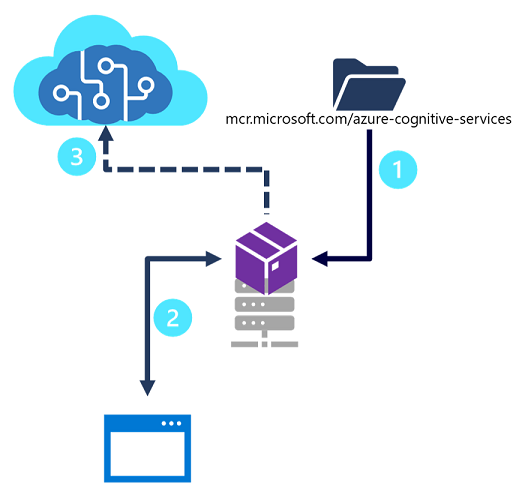

So far we've considered the use of the Language Understanding service by consuming a prediction resource endpoint in your Azure subscription.

Like many other cognitive services, the Language Understanding service can also be deployed as a container, running in a local Docker host, an Azure Container Instance (ACI), or in an Azure Kubernetes Service (AKS) cluster.

The following diagram shows the steps you need to perform to use a Language understanding app in a container.



1. The container image for the specific Cognitive Services API you want to use is downloaded and deployed to a container host, such as a local Docker server, an Azure Container Instance (ACI), or Azure Kubernetes Service (AKS).
2. Client applications submit data to the endpoint provided by the containerized service, and retrieve results just as they would from a Cognitive Services cloud resource in Azure.
3. Periodically, usage metrics for the containerized service are sent to a Cognitive Services resource in Azure in order to calculate billing for the service.

The easiest way to manage the deployment of a Language Understanding container is to use the Docker command line tool.

## Downloading the container image

The first step in using Language Understanding in a container is to use the **docker** command line tool to download the Language Understanding container image, like this:

```bash
docker pull mcr.microsoft.com/azure-cognitive-services/textanalytics/language:latest
```

## Run the container

To run the container, use the **docker run** command. You'll need two parameters to run the container: the **Endpoint** and **API key** from your language resource you want to use in the container.

This example runs the container in a local Docker instance:

```
docker run --rm -it -p 5000:5000 
--memory 4g 
--cpus 1 \
mcr.microsoft.com/azure-cognitive-services/textanalytics/language \
Eula=accept \
Billing={ENDPOINT} \
ApiKey={API_KEY}
```

|Placeholder  |Value  |
|---------|---------|
|`{ENDPOINT}`     | The endpoint for submitting usage information, used for billing. This value can be found in the resource **Overview** tab.   |
|`{API_KEY}`     | The API key for the resource, found on the **Keys** tab.   |

> [!NOTE]
> The **Eula**, **Billing**, and **ApiKey** parameters are used the same way they are for any Cognitive Services container - specifying acceptance of the license agreement, the prediction endpoint to which usage data should be sent for billing, and a valid subscription key for your prediction resource.

## Query the container's service

The container provides a REST endpoint for querying at a local URL: `http://localhost:5000/`.

Further details on Language containers, including the language detection container used here, see the [language detection container documentation](/azure/cognitive-services/language-service/language-detection/how-to/use-containers)

> [!NOTE]
> To learn more about using other Cognitive Services containers, see the [Cognitive Services container documentation](/azure/cognitive-services/cognitive-services-container-support).
