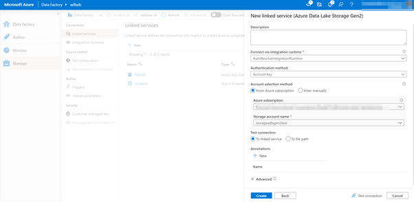
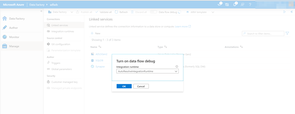

## Open the Azure Data Factory UX

Open the Azure portal through a browser. 

Navigate to the resource group in which you have deployed the Azure Data Factory and select, you’ll be redirected to the following page. 

Select ‘Author & Monitor’ which will redirect you to the following page:

## Create an Azure SQL database linked service

The authoring page is where you create data factory resources such as pipelines, datasets, data flows, triggers and linked services. To create a linked service, click on the Manage button 

Click New to add a new linked service and you’ll be directed to the following page:

The first linked service you will configure is an Azure SQL DB. You can use the search bar to filter the data store list. 

Click on the Azure SQL Database tile and click continue.

When you click continue you’ll get the following page in which you need to fill out some settings of your SQL Database:

In the SQL DB configuration pane, enter 'SQLDB' as your linked service name. Enter your credentials to allow data factory to connect to your database. 

If you're using SQL authentication, enter in the server name, the database, your user name and password. You can verify your connection information is correct by clicking Test connection. Click Create when finished.

## Create an Azure Synapse Analytics linked service

Repeat the same process to add an Azure Synapse Analytics linked service. In the connections tab, click New. Select the Azure Synapse Analytics (formerly SQL DW) tile and click continue.

Select Synapse Analytics and you’ll be redirected to the following screen:

Please fill out the settings and click create. The Linked service connection has then been established for the Synapse Analytics resource. 

## Create an Azure Data Lake Storage Gen2 linked service

The last linked service needed is an Azure Data Lake Storage gen2. In the connections tab, click New. Select the Azure Data Lake Storage Gen2 tile and click continue.

You’ll be redirected to the following screen:

Once you hit create you will be redirected to the following screen:

Select Data flow debug to be on. 

Turn on data flow debug mode

Now we are building a mapping data flow. A best practice before building mapping data flows is to turn on debug mode which allows you to test transformation logic in seconds on an active spark cluster.

To turn on debug, click the Data flow debug slider in the factory top bar. 

Click ok when the confirmation dialog pop-ups. The cluster will take about 5-7 minutes to start-up. 

## Ingest data from Azure SQL DB into ADLS gen2 using the copy activity

Now you will create a pipeline with a copy activity that ingests one table from an Azure SQL DB into an ADLS gen2 storage account by adding a pipeline, configure a dataset and debug a pipeline via the ADF UX. 

## Create a pipeline with a copy activity

In the factory resources pane, click on the plus icon to open the new resource menu. Select Pipeline.

You’ll be redirected to the following screen:

Give the pipeline a name and save. 

In the activities pane of the pipeline canvas, open the Move and Transform accordion and drag the Copy data activity onto the canvas.

Give the copy activity a descriptive name such as 'IngestIntoADLS'.

## Configure Azure SQL DB source dataset

Click on the Source tab of the copy activity. To create a new dataset, click New. 

Your source will be the table 'dbo.TripData' located in the linked service 'SQLDB'  that we configured in the previous exercise.

Search for Azure SQL Database and click continue.

Call your dataset 'TripData'. 

Select 'SQLDB' as your linked service. 

Select table name 'dbo.TripData' from the table name dropdown. 

Import the schema From connection/store.

Click OK when finished.

You have successfully created your source dataset. 

Make sure in the source settings, the default value Table is selected in the use query field.

## Configure ADLS Gen 2 sink dataset

Click on the Sink tab of the copy activity. 

To create a new dataset, click New.

Please select ADLS Gen 2 and click continue:

In the select format pane, select DelimitedText as you are writing to a csv file. 

Click continue.

Name your sink dataset 'TripDataCSV'. 

Select 'ADLSGen2' as your linked service. 

Enter where you want to write your csv file. For example, you can write your data to file trip-data.csv in container staging-container. 

Set First row as header to true as you want your output data to have headers. 

Since no file exists in the destination yet, set Import schema to None. 

Click OK when finished.

## Test the copy activity with a pipeline debug run

To verify your copy activity is working correctly, click Debug at the top of the pipeline canvas to execute a debug run. A debug run allows you to test your pipeline either end-to-end or until a breakpoint before publishing it to the data factory service.

To monitor your debug run, go to the Output tab of the pipeline canvas. 

The monitoring screen will auto-refresh every 20 seconds or when you manually click the refresh button. 

The copy activity has a special monitoring view which can be access by clicking the eye-glasses icon in the Actions column.

If you click on the eyeglass you’ll be redirected to the following screen. 

The copy monitoring view gives the activity's execution details and performance characteristics. You can see information such as data read/written, rows read/written, files read/written, and throughput. 

It’s suggested that you publish your changes to the data factory service by clicking Publish all in the factory top bar. Azure Data Factory supports full git integration. Git integration allows for version control, iterative saving in a repository, and collaboration on a data factory. For more information, see source control in Azure Data Factory.

If you click Publish All you’ll be redirected to the following screen to confirm:

Select Publish, and the pipeline will be published. 

