# Transform data using mapping data flow

Now that you have successfully copied data into Azure Data Lake Storage, it is time to join and aggregate that data into a data warehouse. 

We will use mapping data flow, Azure Data Factory's visually designed transformation service. Mapping data flows allow users to develop transformation logic code-free and execute them on spark clusters managed by the ADF service.

The data flow created in this step inner joins the 'TripDataCSV' dataset created in the previous section with the 'TripFares.csv' file shared via Azure Data Share. based on four key columns. Then the data gets aggregated based upon column payment_type to calculate the average of certain fields and written in a Azure Synapse Analytics table.

## Add a data flow activity to your pipeline

In the activities pane of the pipeline canvas, open the Move and Transform accordion and drag the Data flow activity onto the canvas.

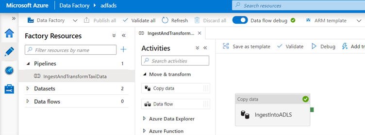

In the side pane that opens, select Create new data flow and choose Mapping data flow. 

Click OK.

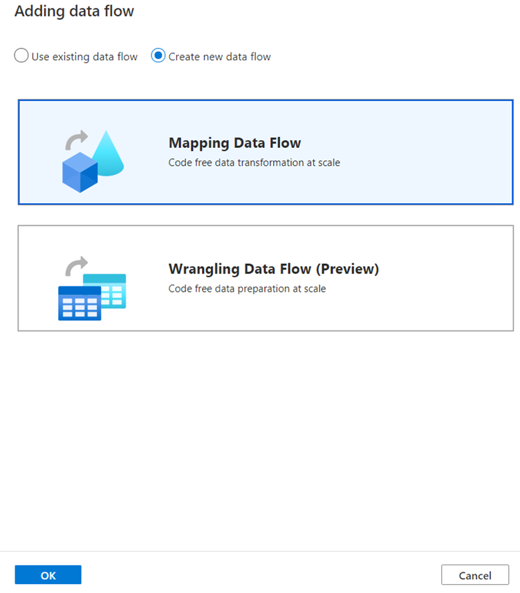

You'll be directed to the data flow canvas where you will be building your transformation logic. 

In the general tab, name your data flow 'JoinAndAggregateData'.

Configure your trip data csv source

The first thing you want to do is configure your two source transformations. The first source will point to the 'TripDataCSV' DelimitedText dataset. To add a source transformation, click on the Add Source box in the canvas.

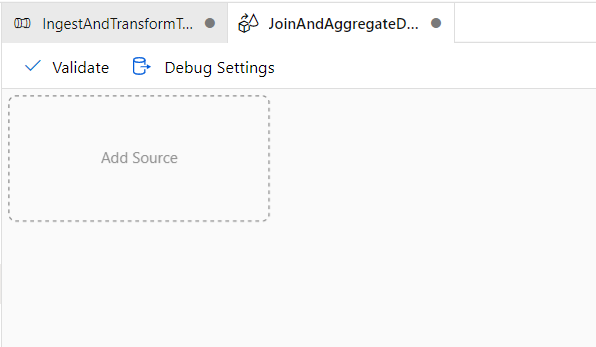

Name your source 'TripDataCSV' and select the 'TripDataCSV' dataset from the source drop-down. 

Since trip-data.csv exists now, click Open to go to the dataset settings tab.

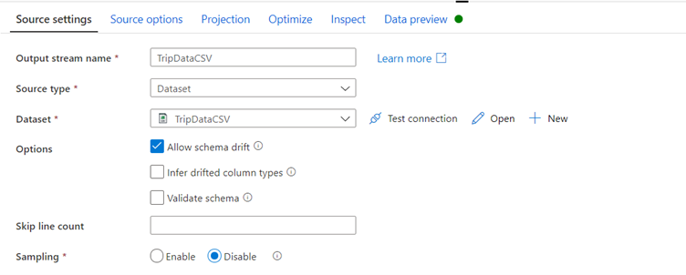

Go to tab Schema and click Import schema. 

Select From connection/store to import directly from the file store. 

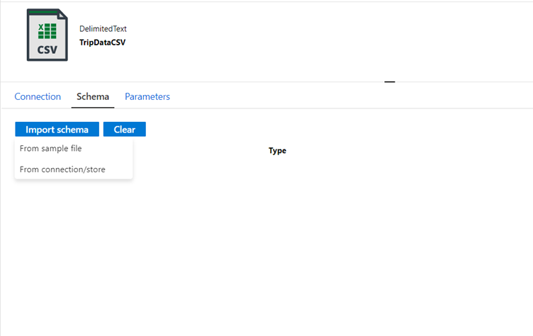

If you select From connection/store the columns should appear as following:

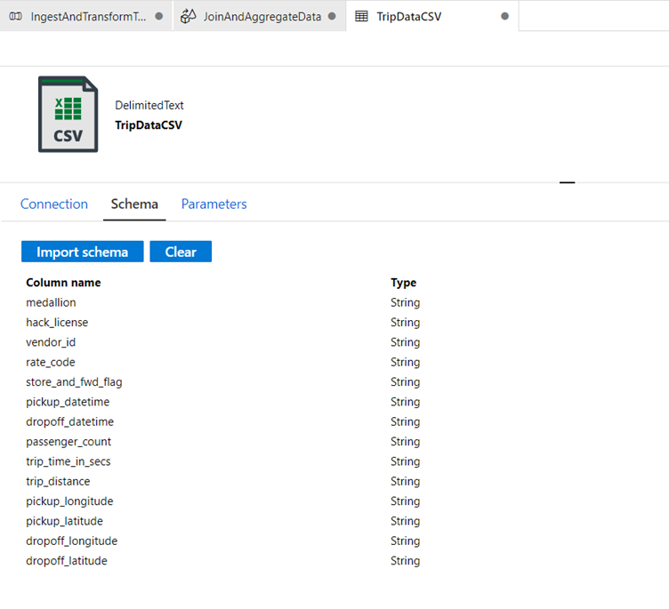

Go back to data flow 'JoinAndAggregateData'. 

If your debug cluster has started (indicated by a green circle next to the debug slider), you can get a snapshot of the data in the Data Preview tab. 

Click Refresh to fetch a data preview.

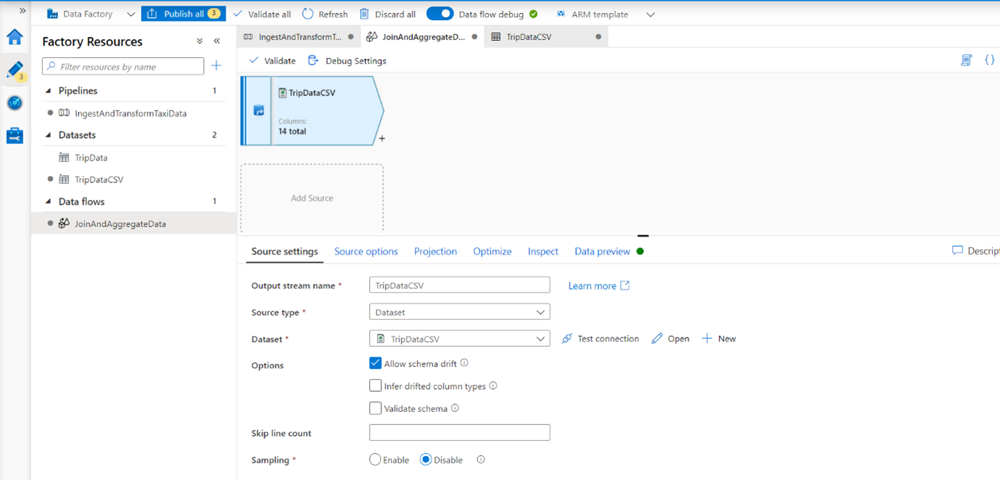

When you select the Data Preview tab and click refresh the data will be fetched as long as your debug cluster is green, however Data preview does not write data. 

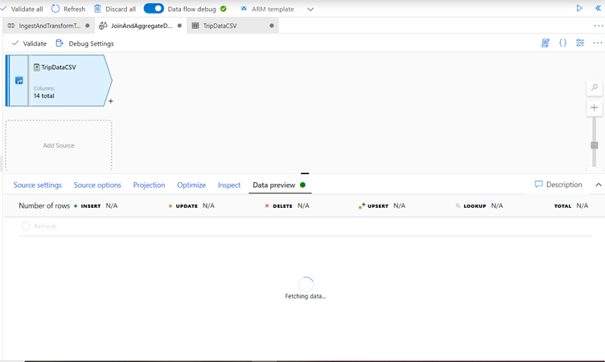

## Configure your trip fares csv source:

The second source you're adding will point at the csv file 'TripFares.csv' that was shared during the Azure Data Share exercise. 

Under your 'TripDataCSV' source, there will be another Add Source box. 

Click it to add a new source transformation.

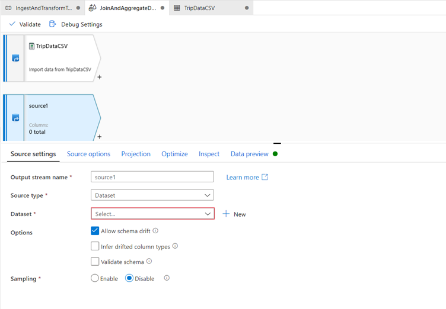

Name this source 'TripFaresCSV'. 

Click New next to the source dataset field to create a new ADLS gen2 dataset.

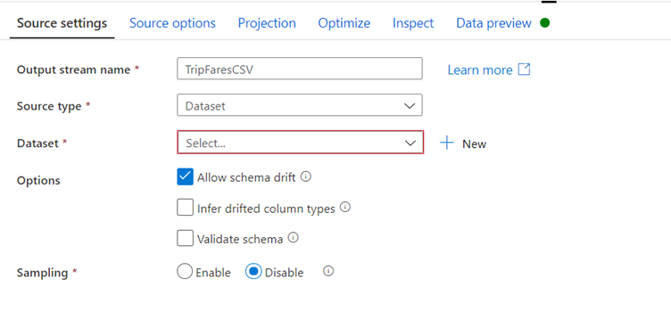

Select the Azure Data Lake Storage gen2 tile and click continue.

You may notice many of the connectors in data factory are not supported in mapping data flow. To transform data from one of these sources, ingest it into a supported source using the copy activity.

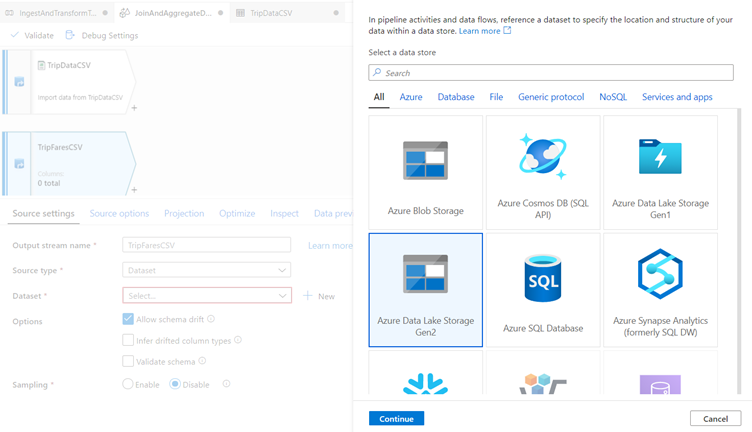

In the select format pane, select DelimitedText as you are reading from a csv file. Click continue.

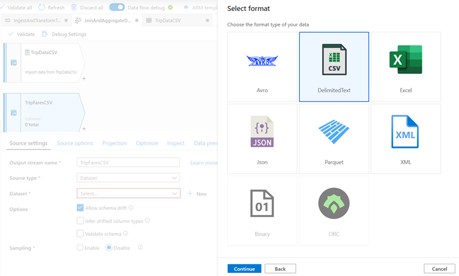

Name your dataset 'TripFaresCSV'. 

Select 'ADLSGen2' as your linked service. 

Set the file path to taxidata/TripFares.csv. In the Azure Data Share exercise you have called it TripFares.csv in container 'taxidata'. 

Set First row as header to true as the input data has headers. 

Import the schema From connection/store. 

Click OK when finished.

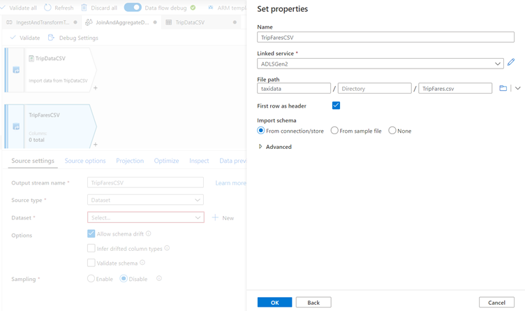

To verify your source is configured correctly, fetch a data preview in the Data Preview tab.

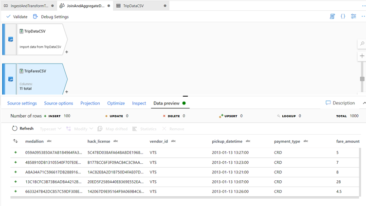

## Inner join TripDataCSV and TripFaresSQL

To add a new transformation, click the plus icon in the bottom-right corner of 'TripDataCSV'. 

Under Multiple inputs/outputs, select Join.

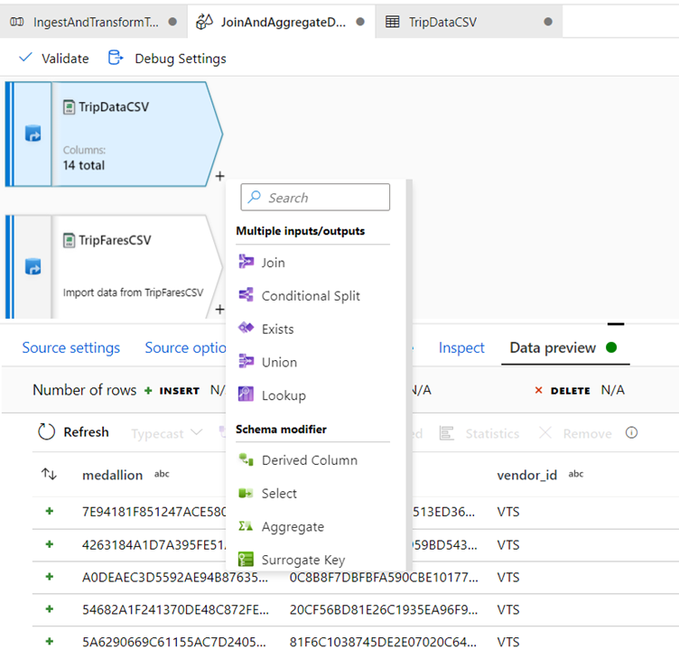

Name your join transformation 'InnerJoinWithTripFares'. 

Select 'TripFaresCSV' from the right stream dropdown. 

Select Inner as the join type. 

Select which columns you wish to match on from each stream via the Join conditions dropdown. 

To add an additional join condition, click on the plus icon next to an existing condition. 

By default, all join conditions are combined with an AND operator which means all conditions must be met for a match. 

We want to match on columns medallion, hack_license, vendor_id, and pickup_datetime

Verify you successfully joined 25 columns together with Data Preview.

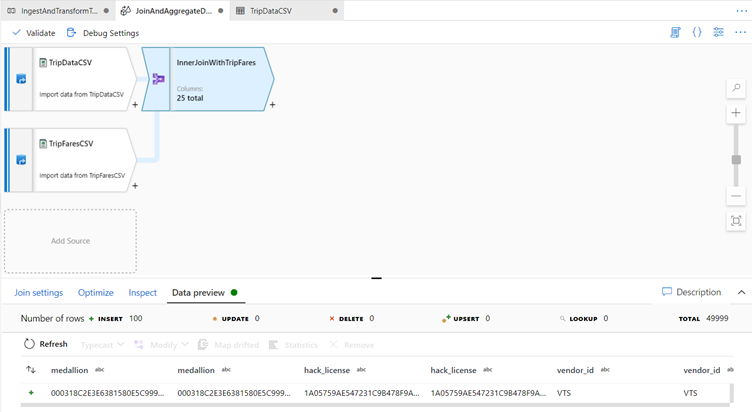

## Aggregate by payment_type

After you complete a join transformation, add an aggregate transformation by clicking the plus icon next to 'InnerJoinWithTripFares. 

Choose Aggregate under Schema modifier and call the Aggregate: ‘AggregateByPaymentType’

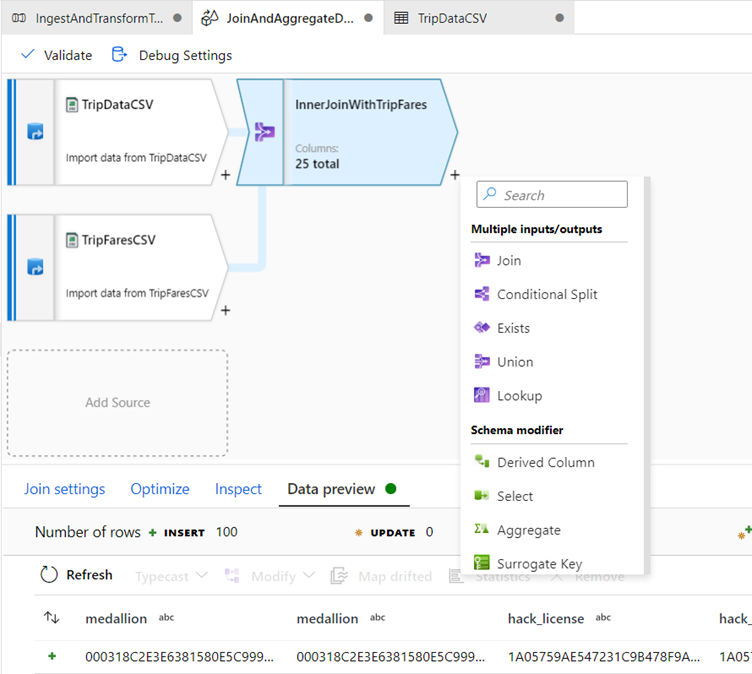

Name your aggregate transformation 'AggregateByPaymentType'. Select payment_type as the group by column.

Go to the Aggregates tab. Here, you will specify two aggregations:
    
    * The average fare grouped by payment type
    
    * The total trip distance grouped by payment type
    
Create  the average fare expression. 
    
In the text box labeled Add or select a column, enter 'average_fare'.

To enter an aggregation expression, click on the marker next to the  the blue box labeled Enter expression.  

This will open up the data flow expression builder, a tool used to visually create data flow expressions using input schema, built-in functions and operations, and user-defined parameters. For more information on the capabilities of the expression builder, see the expression builder documentation.

To get the average fare, use the avg() aggregation function to aggregate the total_amount column cast to an integer with toInteger(). In the data flow expression language, this is defined as avg(toInteger(total_amount)). 

Click Save and finish when you are done.

To add an additional aggregation expression, click on the plus icon next to average_fare. 

Select Add column.

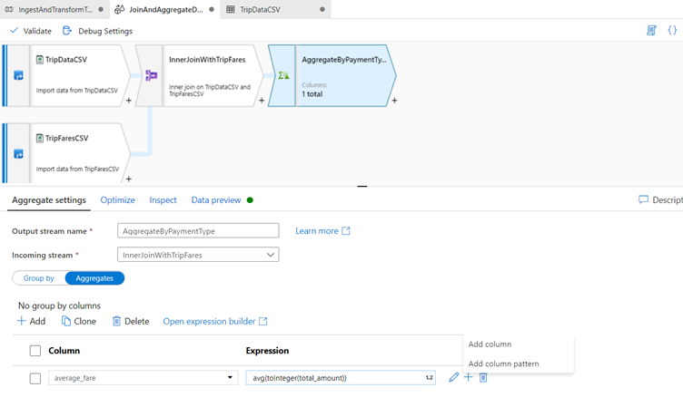

In the text box labeled  Add or select a column, enter 'total_trip_distance'. As in the last step, open the expression builder to enter in the expression.

To get the total trip distance, use the sum() aggregation function to aggregate the trip_distance column cast to an integer with toInteger(). 

In the data flow expression language, this is defined as sum(toInteger(trip_distance)).

Click Save and finish.

Test your transformation logic in the Data Preview tab.

