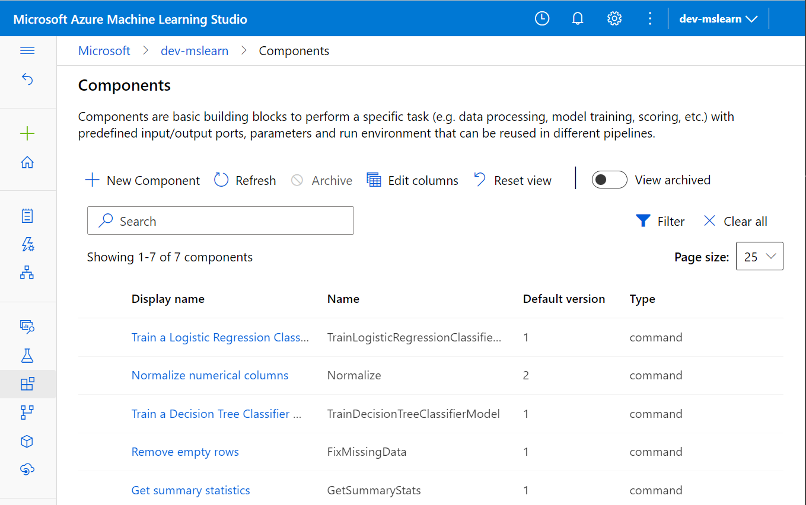

Components allow you to create reusable scripts that can easily be shared across users within the same Azure Machine Learning workspace.

The data science team at the bike company you work for has extensive experience exploring data and training machine learning models. The data scientists have mostly been using notebooks to write, store, and share code. Though notebooks are ideal for exploration, it can be challenging to find relevant code in a notebook. 

To optimize code sharing and prepare it for production, you want to refactor the code from notebooks into functions. Instead of interactive notebooks, you'll use scripts that include functions. To make the scripts reusable and sharable within the workspace, you'll create components.

You'll create the components using the Azure Machine Learning CLI (v2).

## Why use a component?

Within Azure Machine Learning, you can create a **component** to store a Python script within the workspace. Ideally, you design a component to perform a *specific action* that is relevant in your machine learning workflow. For example, a component may contain a Python script that normalizes your data, trains a machine learning model, or evaluates a model.

Next to the script, you can specify component features like:

- Name: Describe what the purpose of the component's script for easy searchability.
- Expected input: Set the input parameters like an input dataset or numerical value.
- Output: Any artifacts generated by the script that you want to save.
- Version: Allows you to update the component when the script is updated, while still maintaining previous versions.
- Distribution: Specify how you want to distribute the execution of your script.

After creating a component, obtain a list of all existing components in a workspace by using the CLI (v2):

```azurecli
az ml component list --resource-group
                     --workspace-name
```

You can also view all components that are stored in your workspace in the Azure Machine Learning studio under **Components**:



The main benefit of components is that it allows users to easily reuse code that has already been created by colleagues. Instead of writing a Python script from scratch to perform any machine learning task, components can be put together into a pipeline to perform that task.

To create a **component-based pipeline**:

- Use the CLI (v2) for a code-based approach. The pipeline is defined with a YAML file and integrates well with any automation tool you'd want to use.
- Use the Designer for a UI approach. The Designer provides a simple interface and hides the complicated logic behind each component and the complete pipeline.

Before creating a pipeline, you need to create the components you want to use.

## Create a component

To create a component, you need two files:

- A **script**: Provides the actual code you want to execute.
- A **YAML file**: Specifies the metadata of the component, the inputs and outputs, and the compute environment needed to execute the script.

For example, you may want to create a component that removes rows with empty fields before training a model. The script that removes missing data using pandas in Python may look like this:

```python
# import libraries
import argparse
import glob
from pathlib import Path
import pandas as pd

# get parameters
parser = argparse.ArgumentParser()
parser.add_argument("--input_data", type=str, help='Path to input data')
parser.add_argument('--output_data', type=str, help='Path of output data')
args = parser.parse_args()

# load the data (passed as an input dataset)
data_path = args.input_data
all_files = glob.glob(data_path + "/*.csv")
df = pd.concat((pd.read_csv(f) for f in all_files), sort=False)
    
# remove missing data
df = df.dropna()

# set the processed data as output
output_df = df.to_csv((Path(args.output_data) / "output_data.csv"))
```

To create the component, you'll need a YAML file that refers to the Python script and includes all the metadata of the component, as well as any inputs and outputs. 

For example, to register the Python script to remove missing rows from a dataset, you can use the YAML file below. The YAML file specifies:

- Name: The component will be named *Remove Empty Rows*.
- Version: It's the first version of the component.
- Type: Use command to specify you want to execute a Python script when using the component.
- Inputs: The path to the input dataset.
- Outputs: The path to the output dataset (by default stored in the default storage account).
- Code: The local path of where to find the Python script.
- Environment: What registered environment from the workspace is needed to run the script.
- Command: Specify the Python script (located in the *src* folder) and the values for the input and output parameters defined in the script.

```yml
$schema: https://azuremlschemas.azureedge.net/latest/commandComponent.schema.json
name: FixMissingData
display_name: Remove Empty Rows
version: 1
type: command
inputs:
  input_data: 
    type: path 
outputs:
  output_data:
    type: path
code:
  local_path: ./src
environment: azureml:basic-env-scikit:1
command: >-
  python fix-missing-data.py 
  --input_data ${{inputs.input_data}} 
  --output_data ${{outputs.output_data}}
```

> [!Tip]
> Refer to the YAML reference documentation to [learn which syntax is accepted for creating a component](/azure/machine-learning/reference-yaml-component-command).

To create a component through the CLI (v2), use the following command:

```azurecli
az ml component create --file ./component.yml
```

Review the reference documentation for a complete overview of how to [manage components with the CLI v2](/cli/azure/ml/component?view=azure-cli-latest).

