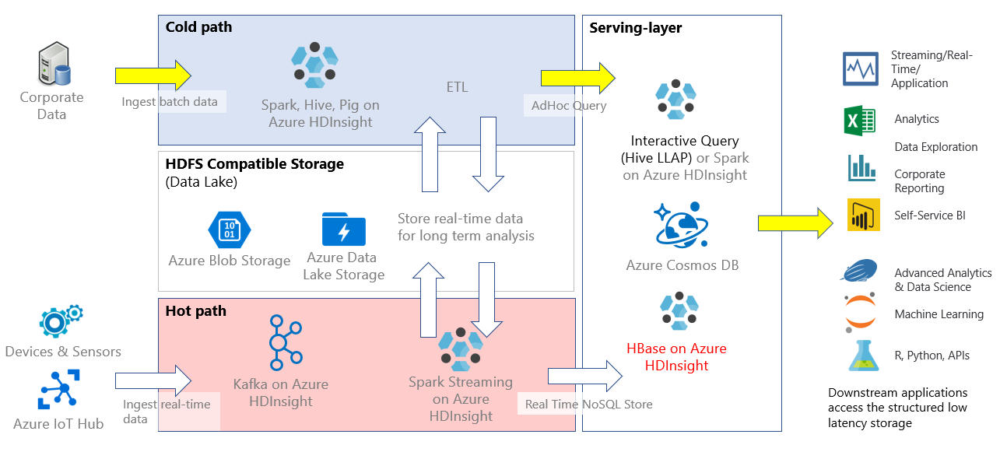

HBase on HDInsight runs with the separation of compute and storage. HDInsight HBase clusters are configured to store data directly in Azure Storage, which provides low latency and increased elasticity in performance and cost choices. This property enables customers to build interactive websites that work with large datasets. To build services that store sensor and telemetry data from millions of end points, and to analyze this data with Hadoop jobs. HBase and Hadoop are good starting points for big data projects in Azure. The services can enable real-time applications to work with large datasets. HDInsight HBase implementations use a scale-out architecture of HBase to provide automatic sharding of tables. It also provides strong consistency for reads and writes, and automatic failover. Performance is enhanced by in-memory caching for reads and high-throughput streaming for writes. HBase cluster can be created inside virtual network. For details, see [Create HDInsight clusters on Azure Virtual Network](https://docs.microsoft.com/en-us/azure/hdinsight/hdinsight-create-virtual-network).

As a data engineer, you need to determine the most appropriate kind of HDInsight cluster to create in order to build your solution. You will use HBase clusters in HDInsight for a NoSQL database that scales linearly, achieving massive amount of throughput, provides low latency reads and unlimited storage at the fraction of the cost. 

The following are the key scenarios for using HBase in HDInsight.

## Key-value store

HBase is typically used as a key-value store, and it is suitable for managing message systems.

## Sensor data

HBase is useful for capturing data that is collected incrementally from various sources. This includes social analytics, time series, keeping interactive dashboards up-to-date with trends and counters, and managing audit log systems. 

## Real-time query

Apache Phoenix is a SQL query engine for Apache HBase. It is accessed as a JDBC driver, and it enables querying and managing HBase tables by using SQL.

## HBase as a platform

Applications can run on top of HBase by using it as a datastore. Examples include Phoenix, OpenTSDB, Kiji, and Titan. Applications can also integrate with HBase. Examples include Apache Hive, Apache Pig, Solr, Apache Storm, Apache Flume, Apache Impala, Apache Spark , Ganglia, and Apache Drill.

In HDInsight, HBase can be used as standalone application, or deployed along with other big data analytics applications such as Spark, Hadoop, Hive or Kafka.

The HBase data model stores semi-structured data having different data types, varying column size and field size. The layout of the HBase data model eases data partitioning and distribution across the cluster. HBase data model consists of several logical components- row key, column family, table name, timestamp, etc. 

A Row Key is used to uniquely identify the rows in HBase tables. In HDInsight, you can either write the data to HBase directly using the multiple available API’s such as HBase REST, HBase RPC, Phoenix Query Server, HBase bulk load, or leverage the integration with several big data frameworks such as Apache Spark, Storm, Hive etc. 

You can leverage the [HBase accelerated writes](https://docs.microsoft.com/azure/hdinsight/hbase/apache-hbase-accelerated-writes) feature to enable significantly high write throughput. To learn more about HBase Architecture and Best practices please refer to [HBase Book](https://hbase.apache.org/book.html).
