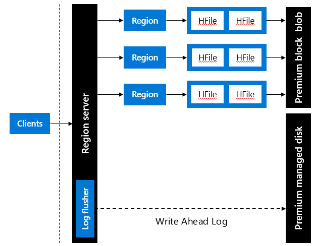
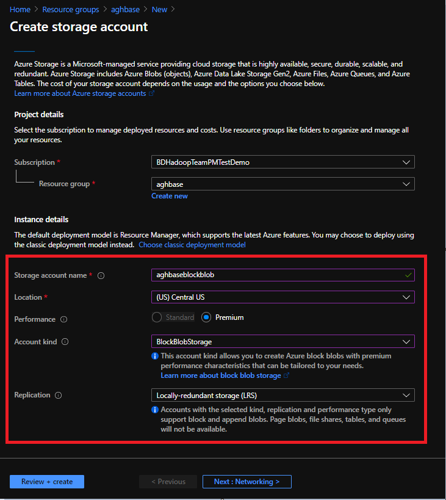
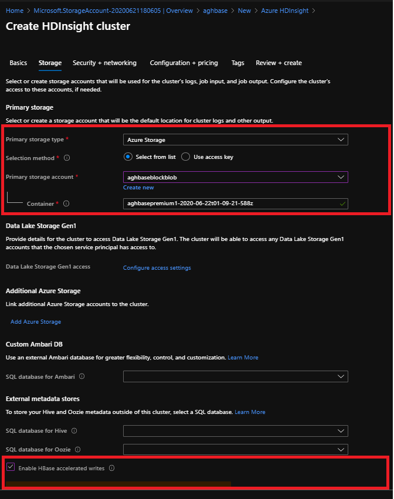
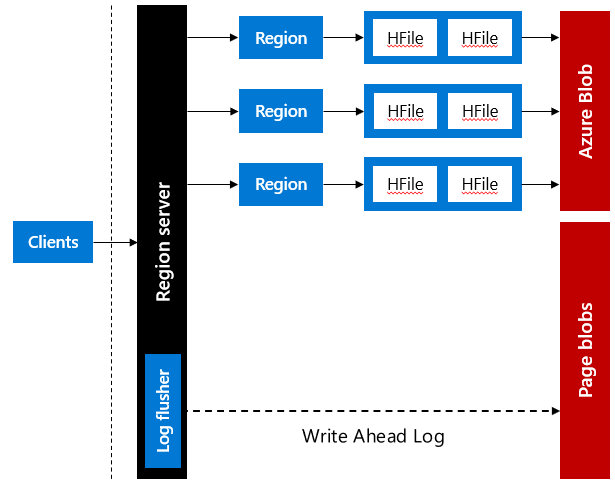

You can improve the read and write performance of HDInsight HBase using accelerated writes. Let's now look at the impact of performance with and without accelerated writes.

## Without Accelerated Writes Enabled 

Accelerated writes feature in Azure HDInsight attaches a premium SSD-managed disk to every HBase Region Server (worker Node) during cluster deployment. Write ahead logs (WAL) are written to the Hadoop Distributed File System (HDFS) mounted on the premium SSD-Managed disks instead of the Azure Page Blobs. 

Premium-Managed disks on SSDs offer far superior write performance and improves cluster I/O performance with fault tolerance.

Customer requirements for low latency writes and reads are constantly evolving over time. While separation of compute and storage in HDInsight HBase offers agility, scalability, reliability, and economies of scale for customers, it also adds network latency to write and read operations. While this latency might be suitable for most customers, customers who need ultra-low latency writes and reads can take advantage of the HDInsight HBase Accelerates writes feature. 

## With Accelerated Writes Enabled 

### Read performance

By default, HDInsight HBase provisions a storage account of type Storage (general purpose v1). In order to improve Read performance, Premium Block Blob Storage can be set instead of Storage (general purpose V1) to improve the performance of Reads. 

Create a Premium Block Blob Storage account before the cluster creation process.

During cluster creation, assign the Premium Block Blob as the Primary Storage account for the cluster as shown below. Premium Block Blocks will start showing only if the **Enable Accelerated Writes** is selected. 

To learn best practices around HDInsight HBase performance management, go to the [Troubleshooting HBase performance issues](/azure/hdinsight/hbase/troubleshoot-hbase-performance-issues) page.

### Write performance

In the standard HDInsight HBase offering, HBase Write Ahead Logs (WAL) are stored in Azure Page Blobs. While this works well for most business requirements, for some mission critical applications that require consistently low latency and high throughout I/O, inconsistent latencies in the WAL logs backed by Page Blobs can become a bottleneck for HBase write performance.

