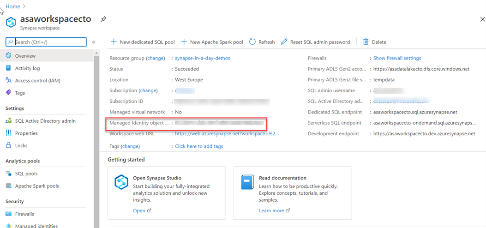
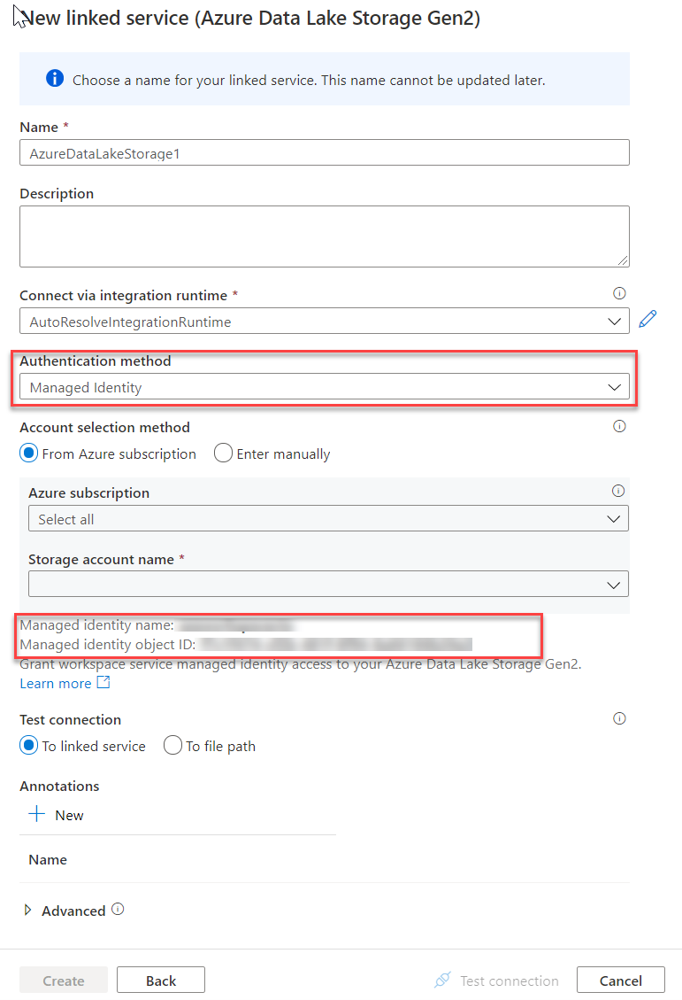
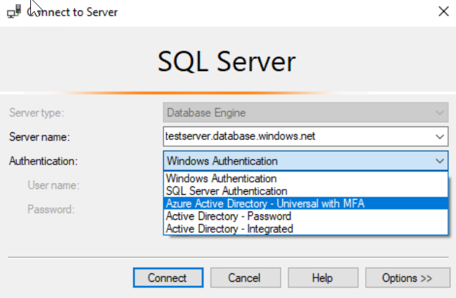

Authentication is the process of validating credentials as you access resources in a digital infrastructure. This ensures that you can validate that an individual, or a service that wants to access a  service in your environment can prove who they are. Azure Synapse Analytics provides several different methods for authentication.

## What needs to be authenticated

There are a variety of scenarios that means that authentication must take place to protect the data that is stored in your Azure Synapse Analytics estate.

The common form of authentication is that of individuals who want to access the data in the service. This is typically seen as an individual providing a username and password to authenticate against a service. However, this is also becoming more sophisticated with authentication requests working in combination with Conditional Access policies to further secure the authentication process with additional security steps.

What is less obvious is the fact that services must authenticate with other services so that they can operate seamlessly. An example of this is using an Azure Synpase Spark or serverless SQL pool to access data in an Azure Data Lake store. An authentication mechanism must take place in the background to ensure that Azure Synapse Analytics can access the data in the data lake in an authenticated manner.

Finally, there are situations where users and services operate together at the same time. Here you have a combination of both user and service authentication taking place under the hood to ensure that the user is getting access to the data seamlessly. An example of this is using Power BI to view reports in a dashboard that is being serviced by a dedicated SQL pool. Here you have multiple levels of authentication taking place that needs to be managed.

## Types of security

The following are the types of authentication that you should be aware of when working with Azure Synapse Analytics.

### Azure Active Directory

Azure Active Directory is a directory service that allows you to centrally maintain objects that can be secured. The objects can include user accounts and computer accounts. An employee of an organization will typically have a user account that represents them in the organizations Azure Active Directory tenant, and they then use the user account with a password to authenticate against other resources that are stored within the directory using a process known as single sign-on. 

The power of Azure Active Directory is that they only have to login once, and Azure Active Directory will manage access to other resources based on the information held within it using pass through authentication. If a user and an instance of Azure Synapse Analytics are part of the same Azure Active Directory, it is possible for the user to access Azure Synapse Analytics without an apparent login. If managed correctly, this process is seamless as the administrator would have given the user authorization to access Azure Synapse Analytics dedicated SQL pool as an example.

In this situation, it is normal for an Azure Administrator to create the user accounts and assign them to the appropriate roles and groups in Azure Active Directory. The Data Engineer will then add the user, or a group to which the user belongs to access a dedicated SQL pool.

### Managed identities

Managed identity for Azure resources is a feature of Azure Active Directory. The feature provides Azure services with an automatically managed identity in Azure AD. You can use the Managed Identity capability to authenticate to any service that support Azure Active Directory authentication.

Managed identities for Azure resources are the new name for the service formerly known as Managed Service Identity (MSI). A system-assigned managed identity is created for your Azure Synapse workspace when you create the workspace.

Azure Synapse also uses the managed identity to integrate pipelines. The managed identity lifecycle is directly tied to the Azure Synapse workspace. If you delete the Azure Synapse workspace, then the managed identity is also cleaned up.

The workspace managed identity needs permissions to perform operations in the pipelines. You can use the object ID or your Azure Synapse workspace name to find the managed identity when granting permissions.

You can retrieve the managed identity in the Azure portal. Open your Azure Synapse workspace in Azure portal and select **Overview** from the left navigation. The managed identity's object ID is displayed to in the main screen.
 
> [!div class="mx-imgBorder"]
> 

The managed identity information will also show up when you create a linked service that supports managed identity authentication from Azure Synapse Studio.

Launch **Azure Synapse Studio** and select the **Manage** tab from the left navigation. Then select **Linked services** and choose the **+ New** option to create a new linked service.

In the **New linked service** window, type Azure Data Lake Storage Gen2. Select the **Azure Data Lake Storage Gen2** resource type from the list below and choose **Continue**.

In the next window, choose **Managed Identity** for **Authentication method**. You'll see the managed identity's **Name** and **Object ID**.
 
> [!div class="mx-imgBorder"]
> 

### SQL Authentication

For user accounts that are not part of an Azure Active directory, then using SQL Authentication will be an alternative. In this instance, a user is created in the instance of a dedicated SQL pool. If the user in question requires administrator access, then the details of the user are held in the master database. If administrator access is not required, you can create a user in a specific database. A user then connects directly to the Azure Synapse Analytics dedicated SQL pool where they are prompted to use a username and password to access the service.

This approach is typically useful for external users who need to access the data, or if you are using third party or legacy applications against the Azure Synapse Analytics dedicated SQL pool

### Multifactor authentication

Synapse SQL support connections from SQL Server Management Studio (SSMS) using Active Directory Universal Authentication.
 
> [!div class="mx-imgBorder"]
> 

This enables you to operate in environments that use Conditional Access policies that enforce multifactor authentication as part of the policy.

### Keys

If you are unable to use a managed identity to access resources such as Azure Data Lake then you can use storage account keys and shared access signatures.

With storage account keys. Azure creates two of these keys (primary and secondary) for each storage account you create. The keys give access to everything in the account. You'll find the storage account keys in the Azure portal view of the storage account. Just select **Settings**, and then click **Access keys**.

As a best practice, you shouldn't share storage account keys, and you can use Azure Key Vault to manage and secure the keys. 

> [!VIDEO https://channel9.msdn.com/Shows/Learn-Azure/Azure-Key-Vault-Overview/player?format=ny]

Azure Key Vault is a secret store: a centralized cloud service for storing app secrets - configuration values like passwords and connection strings that must remain secure at all times. Key Vault helps you control your apps' secrets by keeping them in a single central location and providing secure access, permissions control, and access logging.

The main benefits of using Key Vault are:
- Separation of sensitive app information from other configuration and code, reducing risk of accidental leaks
- Restricted secret access with access policies tailored to the apps and individuals that need them
- Centralized secret storage, allowing required changes to happen in only one place
- Access logging and monitoring to help you understand how and when secrets are accessed

Secrets are stored in individual vaults, which are Azure resources used to group secrets together. Secret access and vault management is accomplished via a REST API, which is also supported by all of the Azure management tools as well as client libraries available for many popular languages. Every vault has a unique URL where its API is hosted.

### Shared access signatures

If an external third-party application need access to your data, you'll need to secure their connections without using storage account keys. For untrusted clients, use a shared access signature (SAS). A shared access signature is a string that contains a security token that can be attached to a URI. Use a shared access signature to delegate access to storage objects and specify constraints, such as the permissions and the time range of access. You can give a customer a shared access signature token.

### Types of shared access signatures

You can use a service-level shared access signature to allow access to specific resources in a storage account. You'd use this type of shared access signature, for example, to allow an app to retrieve a list of files in a file system or to download a file.

Use an account-level shared access signature to allow access to anything that a service-level shared access signature can allow, plus additional resources and abilities. For example, you can use an account-level shared access signature to allow the ability to create file systems.
