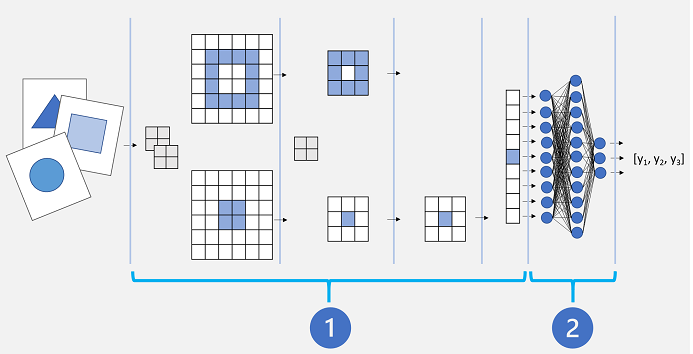

In life, it’s often easier to learn a new skill if you already have expertise in a similar, transferrable skill. For example, it’s probably easier to teach someone how to drive a bus if they have already learned how to drive a car. The driver can build on the driving skills they've already learned in a car, and apply them to driving a bus.

The same principle can be applied to training deep learning models through a technique called *transfer learning*.

## How transfer learning works

A Convolutional Neural Network (CNN) for image classification is typically composed of multiple layers that extract features, and then use a final fully connected layer to classify images based on these features.

Conceptually, this neural network consists of two distinct sets of layers:

1. A set of layers from the base model that perform *feature extraction*.
2. A fully connected layer that takes the extracted features and uses them for class *prediction*.

The feature extraction layers apply convolutional filters and pooling to find edges, corners, and other patterns in the images that can be used to differentiate them, and in theory should work for any set of images with the same dimensions as the input layer of the network. The prediction layer maps the features to a set of outputs that represent probabilities for each class label you want to use to classify the images.

By separating the network into these types of layers, we can take the feature extraction layers from a model that has already been trained and append one or more layers to use the extracted features for prediction of the appropriate class labels for your images. This approach enables you to keep the pre-trained weights for the feature extraction layers, which means you only need to train the prediction layers you have added.

There are many established convolutional neural network architectures for image classification that you can use as the base model for transfer learning, so you can build on the work someone else has already done to easily create an effective image classification model.
