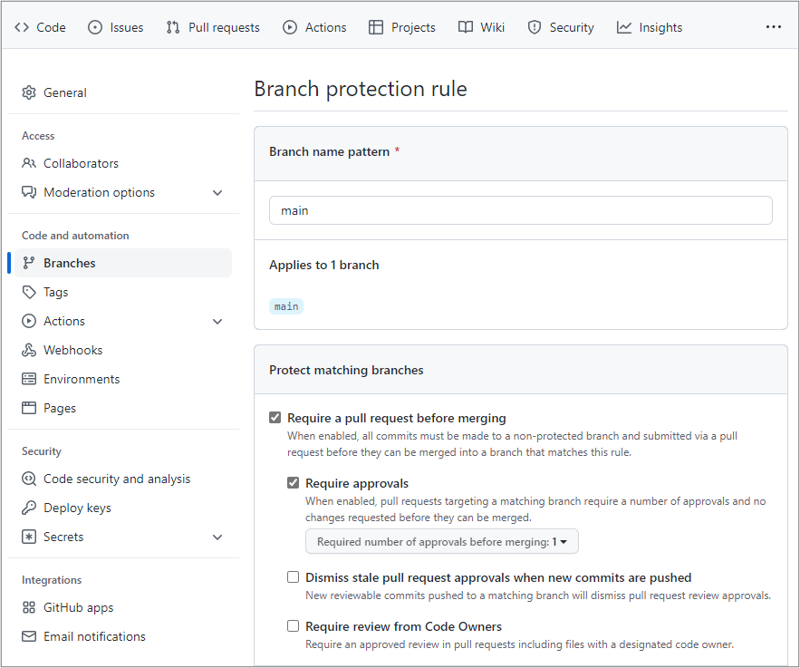

**No one** should be allowed to push any changes directly to the main branch in your code repository. Ideally, if any development is necessary, you should make changes to a copy of the code in a **branch**. 

A common approach is to work with **feature branches**, where a branch is used to work on a feature. For example, the data science team may need to improve the model performance and will try to do so by experimenting with hyperparameter values. The team can create a branch, update the hyperparameter value in the training script. And once done with experimenting, a data scientist can create a **pull request** to **merge** the branch with the main repo. 

Working with branches and pull requests allows you to verify any changes to your code before merging them with the main branch. Pull requests can also be used as a trigger for GitHub Actions to automate tasks that need to follow a proposed update to the code, like automatic code quality checks.

To use trunk-based development together with automation, you'll need to:

- Create a branch protection rule to block direct pushes to main.
- Create a branch to update the code.
- Trigger a GitHub Actions workflow when opening a pull request.

## Create a branch protection rule

To protect your code, you want to **block any direct pushes to the main branch**. Blocking direct pushes means that no one will be allowed to directly push any code changes to the main branch. Instead, changes to the main branch can be made by merging pull requests. 

To protect the main branch, enable a **branch protection rule** in GitHub:

1. Navigate to the **Settings** tab in your repo.
2. In the **Settings** tab, under **Code and automation**, select **Branches**.
3. Select **Add rule**. 
4. Enter `main` under **Branch name pattern**.
5. Enable **Require a pull request before merging** and **Require approvals**. 
6. Save your changes.



## Create a branch to update the code. 

Whenever you want to edit the code, you'll have to create a branch and work in there. Once you want to make your changes final, you can create a pull request to merge the feature branch with the main branch. 

> [!Tip]
> Learn more about [source control for machine learning projects and working with trunk-based development.](/training/modules/source-control-for-machine-learning-projects)

## Trigger a GitHub Actions workflow

Finally, you may want to use the creation of pull requests as a trigger for GitHub Actions workflows. For example, whenever someone makes changes to the code, you'll want to run some code quality checks. 

Only when the edited code has passed the quality checks and someone has verified the proposed changes, do you want to actually merge the pull request. 

To trigger a GitHub Actions workflow, you can use `on: [pull_request]`. When you use this trigger, your workflow will run whenever the pull request is created. 

If you want a workflow to run whenever a pull request is merged, you'll need to use another trigger. Merging a pull request is essentially a push to the main branch. So, to trigger a workflow to run when a pull request is merged, use the following trigger in the GitHub Actions workflow:

```yml
on:
  push:
    branches:
      - main
```
