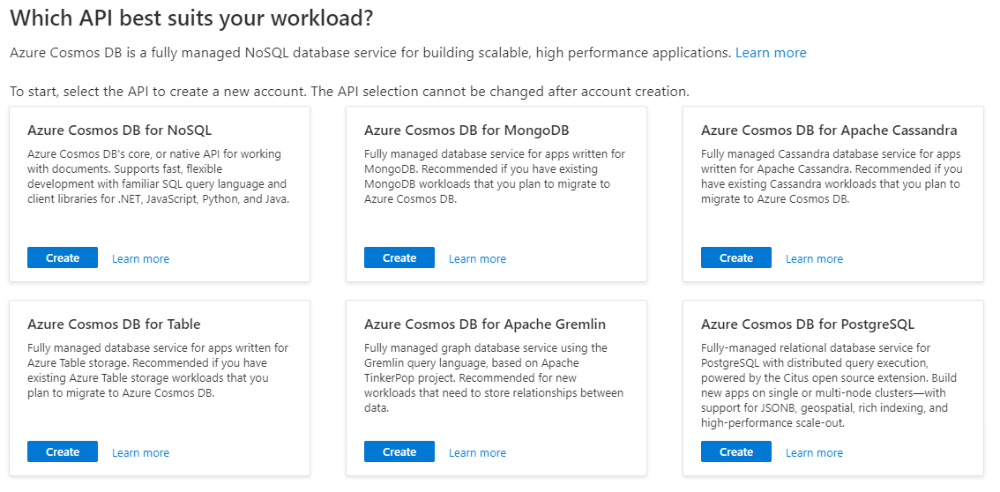
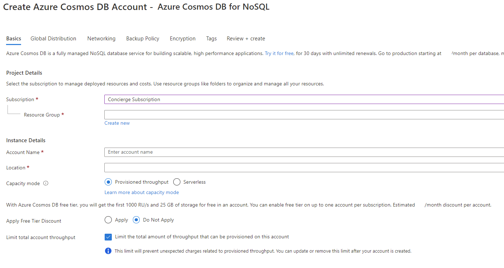

There are a few basic operations that you will need to perform anytime you create any Azure Cosmos DB SQL API account resource in Azure.

## Creating a new account

The first step to getting started with Azure Cosmos DB is to create a new account.

When creating a new account in the portal, you must first select an API for your workload. The API selection cannot be changed after the account is created. For the remainder of this section, we will assume that the SQL API has been selected.

[](../media/3-select-api.png#lightbox)

Next, the Azure portal will use a step-by-step wizard with tabs for various configuration options. Here you can configure options such as:

- The globally unique name of your account
- The location (Azure region) for the account
- Capacity mode (provisioned throughput or serverless)

[](../media/3-account-wizard.png#lightbox)

> [!NOTE]
> Only the options in the **Basics** tab are required to create an Azure Cosmos DB account.

## Creating a new database

Databases are logical units of management in Azure Cosmos DB SQL API, and don't require much to create. You only need a unique database name within the account to create a new database.

> [!NOTE]
> However, if you choose to provision throughput at the database level, configuring the database may require additional steps. This is explored deeper in other Azure Cosmos DB SQL API topics.

## Creating a new container

Containers are the primary unit of scalability in Azure Cosmos DB SQL API. When creating a container, you should specify:

- The parent database
- A unique name for the container with the database
- The path for the partition key value
- *Optional*: provisioned throughput if not inferred from database provisioning.

The Azure Cosmos DB service will automatically and transparently partition your data based on the value of the partition key for each individual item.

## Creating simple items

Once the database and container resources exist, you are ready to create your first item. In Azure Cosmos DB SQL API, and item is a JSON document.

> [!NOTE]
> JavaScript Object Notation (JSON) is an open standard file format, and data interchange format, that uses human-readable text to store and transmit data objects consisting of attribute–value pairs and array data types (or any other serializable value)

JSON is a language-independent data format with well-defined data types and near universal support across a diverse range of services and programing languages. Here is an example of a JSON document that could be an item in an Azure Cosmso DB account:

```json
{
  "id": "0012D555-C7DE",
  "type": "customer",
  "fullName": "Franklin Ye",
  "title": null,
  "emailAddress": "fye@cosmic.works",
  "creationDate": "2014-02-05",
  "addresses": [
    {
      "addressLine": "1796 Westbury Drive",
      "cityStateZip": "Melton, VIC 3337 AU"
    },
    {
      "addressLine": "9505 Hargate Court",
      "cityStateZip": "Bellflower, CA 90706 US"
    }
  ],
  "password": {
    "hash": "GQF7qjEgMk=",
    "salt": "12C0F5A5"
  },
  "salesOrderCount": 2
}
```
