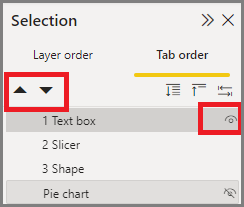

Accessbility is at the heart of Microsoft's values, and Power BI is committed to making Power BI experiences as accessible to as many people as possible. As the report creator, it's up to you to use the available tools to improve your users' experience.

[!Note]
This unit highlights some accessible design features, and more details including a checklist, can be found in the [Power BI Documentation](power-bi/create-reports/desktop-accessibility-creating-reports).

## Consider your audience

Without polling the audience, some immediate inclusive considerations are:

* Consistent font, colors, positioning
* **Colorblind-friendly** color schemes
* **Alt text** for shapes and images
* Using text or icons in addition to color
* Avoid jargon and acronyms
* Set sort order for visuals
* Disable auto-start videos and audio
* Provide captions and transcripts for videos and audio
* Avoid excess decorative shapes and images

## Set tab order

In Power BI Desktop, you can set the **tab order** for how a keyboard user will experience your report. First, navigate to the **View** tab in the ribbon, then select **Selection** in the **Show Panes** section.

You will see **Layer order** and **Tab order**, with a list of report elements. Layer order allows you to stack elements, whereas tab order dictates which item will be accessed next when the keyboard user *tabs* to the next item. Use the up/down arrows to set the order. You can also hide items by clicking the eye icon, which will move it to the bottom of the list, remove the numbered position, and put a line through the eye to indicate hidden state.

[!Tip]
Set tab order and turn off tab order (mark the item as hidden) on any decorative items.
