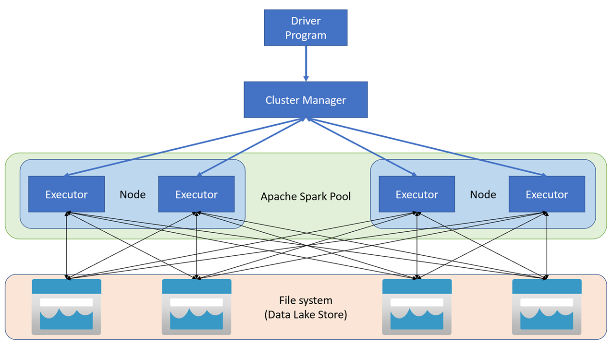

Apache Spark is distributed data processing framework that works enables large-scale data analytics by coordinating work across multiple processing nodes in a cluster.

## How Spark works

Apache Spark applications run as independent sets of processes on a cluster, coordinated by the *SparkContext* object in your main program (called the driver program). The SparkContext connects to the cluster manager, which allocates resources across applications using an implementation of Apache Hadoop YARN. Once connected, Spark acquires executors on nodes in the cluster to run your application code.

The SparkContext runs the main function and parallel operations on the cluster nodes, and then collects the results of the operations. The nodes read and write data from and to the file system and cache transformed data in-memory as *Resilient Distributed Datasets* (RDDs).

The SparkContext is responsible for converting an application to a *directed acyclic graph* (DAG). The graph consists of individual tasks that get executed within an executor process on the nodes. Each application gets its own executor processes, which stay up for the duration of the whole application and run tasks in multiple threads.

## Spark pools in Azure Synapse Analytics

In Azure Synapse Analytics, a cluster is implemented as a *Spark pool*, which provides a runtime for Spark operations. You can create one or more Spark pools in an Azure Synapse Analytics workspace [by using the Azure portal](/azure/synapse-analytics/quickstart-create-apache-spark-pool-portal?azure-portal=true), or [in Azure Synapse Studio](/azure/synapse-analytics/quickstart-create-apache-spark-pool-studio?azure-portal=true). When defining a Spark pool, you can specify configuration options for the pool, including:

- A name for the spark pool.
- The size of virtual machine (VM) used for the nodes in the pool, including the option to use [hardware accelerated GPU-enabled nodes](/azure/synapse-analytics/quickstart-create-apache-gpu-pool-portal?azure-portal=true).
- The number of nodes in the pool, and whether the pool size is fixed or individual nodes can be brought online dynamically to *auto-scale* the cluster; in which case, you can specify the minimum and maximum number of active nodes.
- The version of the *Spark Runtime* to be used in the pool; which dictates the versions of individual components such as Python, Java, and others that get installed.

> [!TIP]
> For more information about Spark pool configuration options, see [Apache Spark pool configurations in Azure Synapse Analytics](/azure/synapse-analytics/spark/apache-spark-pool-configurations?azure-portal=true) in the Azure Synapse Analytics documentation.

Spark pools in an Azure Synapse Analytics Workspace are *serverless* - they start on-demand and stop when idle.
