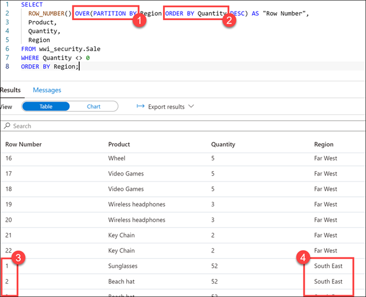
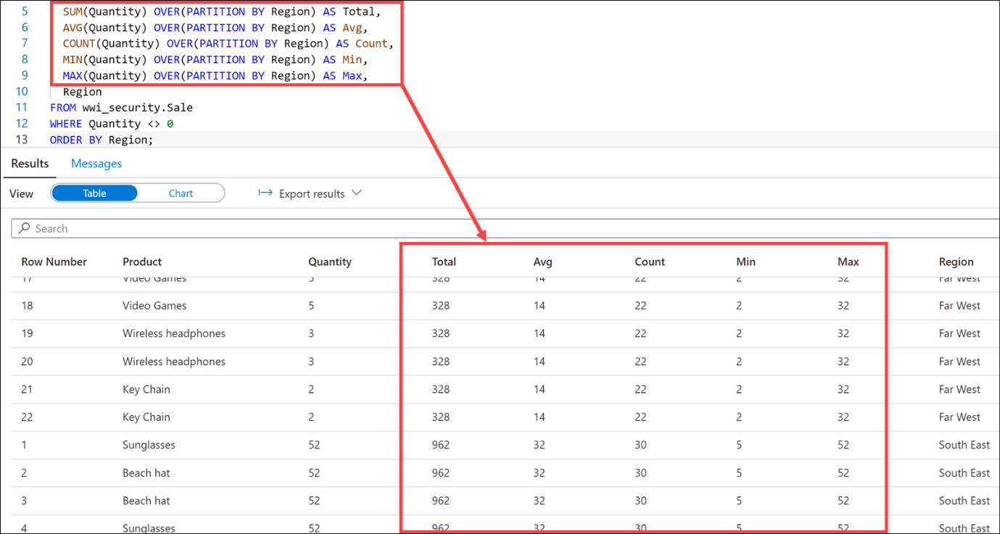
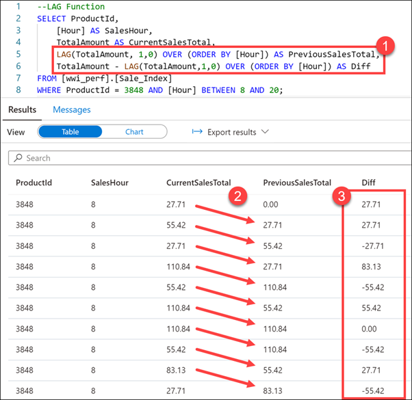
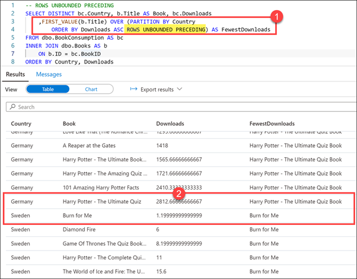

One of the key components of window functions is the OVER clause. This clause determines the partitioning and ordering of a rowset before the associated window function is applied. That is, the OVER clause defines a window or user-specified set of rows within a query result set. A window function then computes a value for each row in the window. You can use the OVER clause with functions to compute aggregated values such as moving averages, cumulative aggregates, running totals, or a top N per group results.

1.	Open Synapse Studio (https://web.azuresynapse.net/).
2.	Select the Develop hub.
 
    

3.	From the Develop menu, select the + button (1) and choose SQL Script (2) from the context menu.
 
    

4.	In the toolbar menu, connect to the SQL Pool database to execute the query.
 
    

5.	In the query window, replace the script with the following to use the OVER clause with data from the wwi_security.Sale table:

    ```sql
    SELECT
    ROW_NUMBER() OVER(PARTITION BY Region ORDER BY Quantity DESC) AS "Row Number",
    Product,
    Quantity,
    Region
    FROM wwi_security.Sale
    WHERE Quantity <> 0  
    ORDER BY Region;
    ```

6.	Select Run from the toolbar menu to execute the SQL command.
 
    

When we use PARTITION BY with the OVER clause (1), we divide the query result set into partitions. The window function is applied to each partition separately and computation restarts for each partition.
 


The script we executed uses the OVER clause with ROW_NUMBER function (1) to display a row number for each row within a partition. The partition in our case is the Region column. The ORDER BY clause (2) specified in the OVER clause orders the rows in each partition by the column Quantity. The ORDER BY clause in the SELECT statement determines the order in which the entire query result set is returned.

Scroll down in the results view until the Row Number count (3) starts over with a different region (4). Since the partition is set to Region, the ROW_NUMBER resets when the region changes. Essentially, we have partitioned by region and have a result set identified by the number of rows in that region.

## Aggregate functions

Now  use aggregate functions with our window by expanding on our query that uses the OVER clause.

1.	In the query window, replace the script with the following to add aggregate functions:

    ```sql
    SELECT
    ROW_NUMBER() OVER(PARTITION BY Region ORDER BY Quantity DESC) AS "Row Number",
    Product,
    Quantity,
    SUM(Quantity) OVER(PARTITION BY Region) AS Total,  
    AVG(Quantity) OVER(PARTITION BY Region) AS Avg,  
    COUNT(Quantity) OVER(PARTITION BY Region) AS Count,  
    MIN(Quantity) OVER(PARTITION BY Region) AS Min,  
    MAX(Quantity) OVER(PARTITION BY Region) AS Max,
    Region
    FROM wwi_security.Sale
    WHERE Quantity <> 0  
    ORDER BY Region;
    ```

2.	Select Run from the toolbar menu to execute the SQL command.
 
    

In our query, we added the SUM, AVG, COUNT, MIN, and MAX aggregate functions. Using the OVER clause is more efficient than using subqueries.
 


## Analytic functions

Analytic functions calculate an aggregate value based on a group of rows. Unlike aggregate functions, however, analytic functions can return multiple rows for each group. Use analytic functions to compute moving averages, running totals, percentages, or top-N results within a group.

Tailwind Traders has book sales data they import from their online store and wish to compute percentages of book downloads by category.

To do this, you decide to build window functions that use the PERCENTILE_CONT and PERCENTILE_DISC functions.

1.	In the query window, replace the script with the following to add aggregate functions:

    ```sql
    -- PERCENTILE_CONT, PERCENTILE_DISC
    SELECT DISTINCT c.Category  
    ,PERCENTILE_CONT(0.5) WITHIN GROUP (ORDER BY bc.Downloads)
                        OVER (PARTITION BY Category) AS MedianCont  
    ,PERCENTILE_DISC(0.5) WITHIN GROUP (ORDER BY bc.Downloads)
                        OVER (PARTITION BY Category) AS MedianDisc  
    FROM dbo.Category AS c  
    INNER JOIN dbo.BookList AS bl
        ON bl.CategoryID = c.ID
    INNER JOIN dbo.BookConsumption AS bc  
        ON bc.BookID = bl.ID
    ORDER BY Category
    ```

2.	Select Run from the toolbar menu to execute the SQL command.
 
    

    

In this query, we use PERCENTILE_CONT (1) and PERCENTILE_DISC (2) to find the median number of downloads in each book category. These functions may not return the same value. PERCENTILE_CONT interpolates the appropriate value, which may or may not exist in the data set, while PERCENTILE_DISC always returns an actual value from the set. To explain further, PERCENTILE_DISC computes a specific percentile for sorted values in an entire rowset or within a rowset's distinct partitions.

The 0.5 value passed to the percentile functions (1 & 2) computes the 50th percentile, or the median, of the downloads.

The WITHIN GROUP expression (3) specifies a list of values to sort and compute the percentile over. Only one ORDER BY expression is allowed, and the default sort order is ascending.

The OVER clause (4) divides the FROM clause's result set into partitions, in this case, Category. The percentile function is applied to these partitions.

3.	In the query window, replace the script with the following to use the LAG analytic function:

    ```sql
    --LAG Function
    SELECT ProductId,
        [Hour] AS SalesHour,
        TotalAmount AS CurrentSalesTotal,
        LAG(TotalAmount, 1,0) OVER (ORDER BY [Hour]) AS PreviousSalesTotal,
        TotalAmount - LAG(TotalAmount,1,0) OVER (ORDER BY [Hour]) AS Diff
    FROM [wwi_perf].[Sale_Index]
    WHERE ProductId = 3848 AND [Hour] BETWEEN 8 AND 20;
    ```

Tailwind Traders wants to compare the sales totals for a product over an hourly basis over time, showing the difference in value.

To accomplish this, you use the LAG analytic function. This function accesses data from a previous row in the same result set without the use of a self-join. LAG provides access to a row at a given physical offset that comes before the current row. We use this analytic function to compare values in the current row with values in a previous row.

4.	Select Run from the toolbar menu to execute the SQL command.
 
    

    

In this query, we use the LAG function (1) to return the difference in sales (2) for a specific product over peak sales hours (8-20). We also calculate the difference in sales from one row to the next (3). Notice that because there is no lag value available for the first row, the default of zero (0) is returned.

## ROWS clause

The ROWS and RANGE clauses further limit the rows within the partition by specifying start and end points within the partition. This is done by specifying a range of rows with respect to the current row either by logical association or physical association. Physical association is achieved by using the ROWS clause.

Tailwind Traders wants to find the books that have the fewest downloads by country, while displaying the total number of downloads for each book within each country in ascending order.

To achieve this, you use ROWS in combination with UNBOUNDED PRECEDING to limit the rows within the Country partition, specifying that the window start with the first row of the partition.

1.	In the query window, replace the script with the following to add aggregate functions:

    ```sql
    -- ROWS UNBOUNDED PRECEDING
    SELECT DISTINCT bc.Country, b.Title AS Book, bc.Downloads
        ,FIRST_VALUE(b.Title) OVER (PARTITION BY Country  
            ORDER BY Downloads ASC ROWS UNBOUNDED PRECEDING) AS FewestDownloads
    FROM dbo.BookConsumption AS bc
    INNER JOIN dbo.Books AS b
        ON b.ID = bc.BookID
    ORDER BY Country, Downloads
    ```

2.	Select Run from the toolbar menu to execute the SQL command.
 
    

    

In this query, we use the FIRST_VALUE analytic function to retrieve the book title with the fewest downloads, as indicated by the ROWS UNBOUNDED PRECEDING clause over the Country partition (1). The UNBOUNDED PRECEDING option set the window start to the first row of the partition, giving us the title of the book with the fewest downloads for the country within the partition.

In the result set, we can scroll through the list that of books by country, sorted by number of downloads in ascending order.
