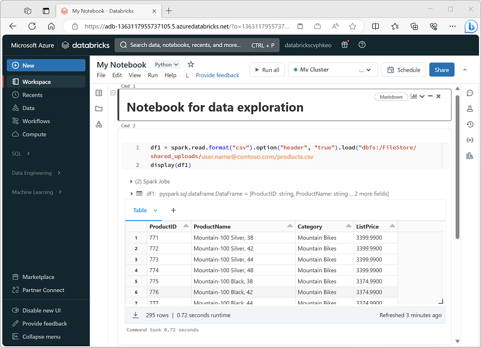

You can run many different kinds of application on Spark, including code in Python or Scala scripts, Java code compiled as a Java Archive (JAR), and others. Spark is commonly used in two kinds of workload:

- Batch or stream processing jobs to ingest, clean, and transform data - often running as part of an automated pipeline.
- Interactive analytics sessions to explore, analyze, and visualize data.

## Running Spark code in notebooks

Azure Databricks includes an integrated notebook interface for working with Spark. Notebooks provide an intuitive way to combine code with Markdown notes, commonly used by data scientists and data analysts. The look and feel of the integrated notebook experience within Azure Databricks is similar to that of Jupyter notebooks - a popular open source notebook platform.

Notebooks consist of one or more *cells*, each containing either code or markdown. Code cells in notebooks have some features that can help you be more productive, including:

- Syntax highlighting and error support.
- Code auto-completion​.
- Interactive data visualizations.
- The ability to export results.

> [!TIP]
> To learn more about working with notebooks in Azure Databricks, see the [Notebooks](/azure/databricks/notebooks/) article in the Azure Databricks documentation.

