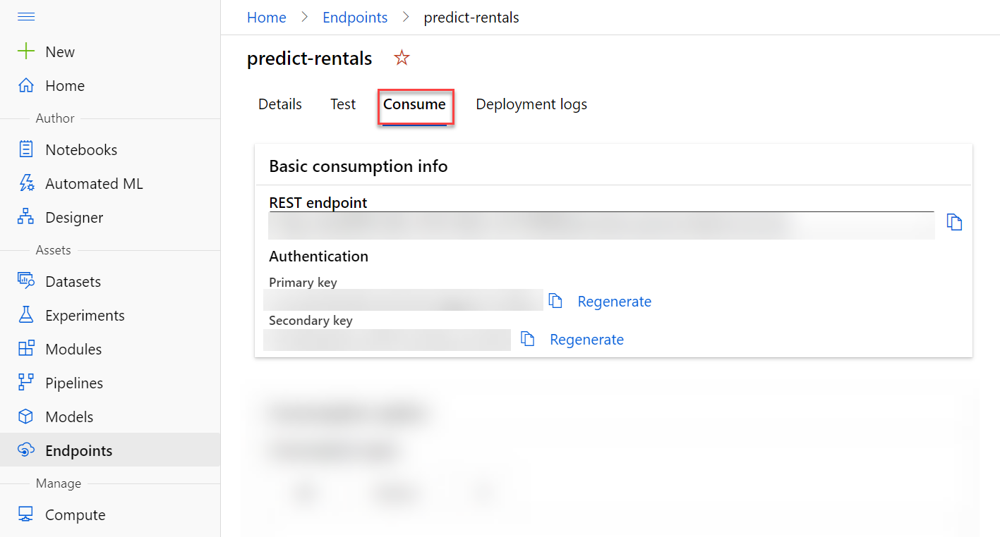
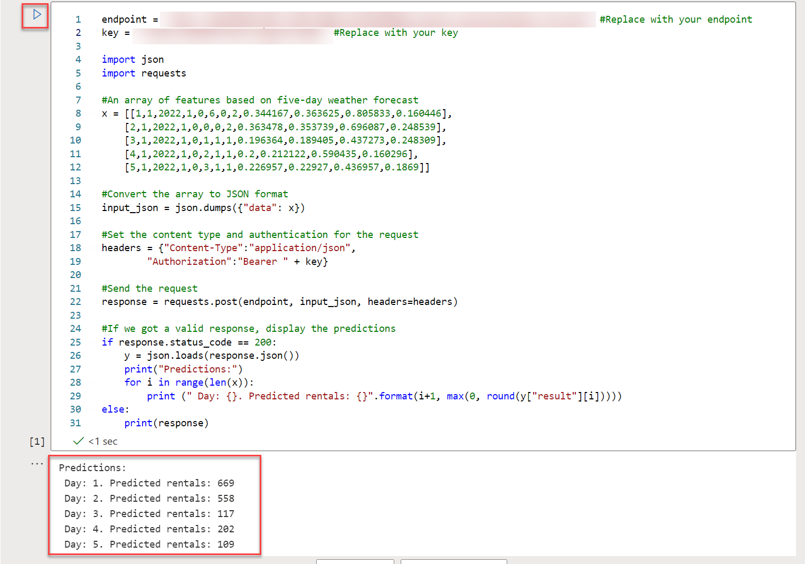

After you've used automated machine learning to train some models, you can deploy the best performing model as a service for client applications to use.

## Deploy a predictive service
In Azure Machine Learning, you can deploy a service as an Azure Container Instances (ACI) or to an Azure Kubernetes Service (AKS) cluster. For production scenarios, an AKS deployment is recommended, for which you must create an *inference cluster* compute target. In this exercise, you'll use an ACI service, which is a suitable deployment target for testing, and does not require you to create an inference cluster.

1. In [Azure Machine Learning studio](https://ml.azure.com?azure-portal=true), on the **Automated ML** page, select the run for your automated machine learning experiment.

2. On the **Details** tab, select the algorithm name for the best model. 
> [!div class="centered"]
> 

3. on the **Model** tab, use the **Deploy** button to deploy the model with the following settings:
    - **Name**: predict-rentals
    - **Description**: Predict cycle rentals
    - **Compute type**: Azure Container Instance
    - **Enable authentication**: Selected

4. Wait for the deployment to start - this may take a few seconds. Then, in the **Model summary** section, observe the **Deploy status** for the **predict-rentals** service, which should be **Running**. Wait for this status to change to **Successful**. You may need to select **&#8635; Refresh** periodically.
5. In Azure Machine Learning studio, view the **Endpoints** page and select the **predict-rentals** real-time endpoint. Then select the **Consume** tab and note the following information there. You need this information to connect to your deployed service from a client application.
    - The REST endpoint for your service
    - the Primary Key for your service

> [!div class="centered"]
> 

6. Note that you can use the &#10697; link next to these values to copy them to the clipboard.

## Test the deployed service

Now that you've deployed a service, you can test it using some simple code.

1. With the **Consume** page for the **predict-rentals** service page open in your browser, open a new browser tab and open a second instance of [Azure Machine Learning studio](https://ml.azure.com?azure-portal=true). Then in the new tab, view the **Notebooks** page (under **Author**).
2. In the **Notebooks** page, under **My files**, use the **&#128459;** button to create a new file with the following settings:
    - **File location**: Users/*your user name*
    - **File name**: Test-Bikes.ipynb
    - **File type**: Notebook
    - **Overwrite if already exists**: Selected
3. When the new notebook has been created, ensure that the compute instance you created previously is selected in the **Compute** box, and that it has a status of **Running**.
4. Use the **&#8810;** button to collapse the file explorer pane and give you more room to focus on the **Test-Bikes.ipynb** notebook tab.
5. In the rectangular cell that has been created in the notebook, paste the following code:

    ```Python
    endpoint = 'YOUR_ENDPOINT' #Replace with your endpoint
    key = 'YOUR_KEY' #Replace with your key

    import json
    import requests

    #An array of features based on five-day weather forecast
    x = [[1,1,2022,1,0,6,0,2,0.344167,0.363625,0.805833,0.160446],
        [2,1,2022,1,0,0,0,2,0.363478,0.353739,0.696087,0.248539],
        [3,1,2022,1,0,1,1,1,0.196364,0.189405,0.437273,0.248309],
        [4,1,2022,1,0,2,1,1,0.2,0.212122,0.590435,0.160296],
        [5,1,2022,1,0,3,1,1,0.226957,0.22927,0.436957,0.1869]]

    #Convert the array to JSON format
    input_json = json.dumps({"data": x})

    #Set the content type and authentication for the request
    headers = {"Content-Type":"application/json",
            "Authorization":"Bearer " + key}

    #Send the request
    response = requests.post(endpoint, input_json, headers=headers)

    #If we got a valid response, display the predictions
    if response.status_code == 200:
        y = json.loads(response.json())
        print("Predictions:")
        for i in range(len(x)):
            print (" Day: {}. Predicted rentals: {}".format(i+1, max(0, round(y["result"][i]))))
    else:
        print(response)
    ```

    > [!NOTE]
    > Don't worry too much about the details of the code. It just defines features for a five day period using hypothetical weather forecast data, and uses the **predict-rentals** service you created to predict cycle rentals for those five days.

6. Switch to the browser tab containing the **Consume** page for the **predict-rentals** service, and copy the REST endpoint for your service. The switch back to the tab containing the notebook and paste the key into the code, replacing YOUR_ENDPOINT.
7. Switch to the browser tab containing the **Consume** page for the **predict-rentals** service, and copy the Primary Key for your service. The switch back to the tab containing the notebook and paste the key into the code, replacing YOUR_KEY.
8. Save the notebook, Then use the **&#9655;** button next to the cell to run the code. You will get predictions for the number of bicycle rentals expected per day. 
> [!div class="centered"]
> 

9. Verify that predicted number of rentals for each day in the five day period are returned. 

Let's review what you have done. You used a dataset of historical bicycle rental data to train a model. The model predicts the number of bicycle rentals expected on a given day, based on seasonal and meteorological _features_. In this case, the _labels_ are number of bicycle rentals.  
