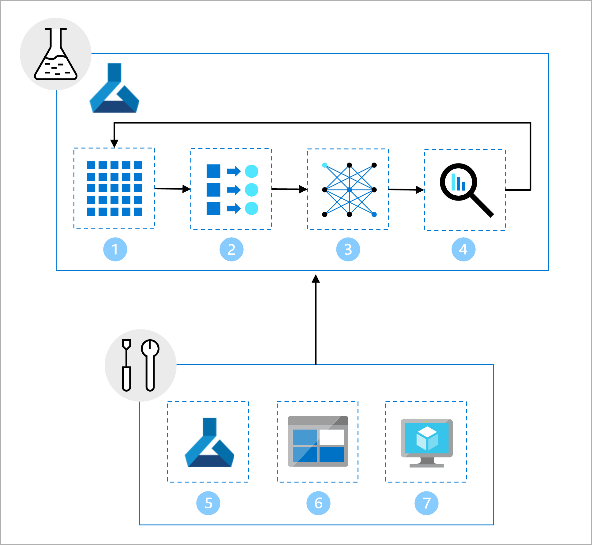

Before getting started, let’s explore the architecture to understand all requirements. Bringing a model to production means you need to scale your solution and work together with other teams. Together with the data scientists, data engineers and infrastructure team, you’ve decided on using the following approach:

- All data will be stored in an Azure Blob Storage, which will be managed by the data engineer.
- The infrastructure team will create necessary Azure resources like the Azure Machine Learning workspace.
- The data scientist will focus on the inner loop: developing and training the model.
- The machine learning engineer will take the trained model and deploy it in the outer loop.

Together with the larger team, you've designed an architecture to achieve machine learning operations (MLOps).

> [!Note]
> The diagram is a simplified representation of a MLOps architecture. To view a more detailed architecture, explore the various use cases in the [MLOps (v2) solution accelerator](https://github.com/Azure/mlops-v2).

The main goal of the MLOps architecture is to create a robust and reproducible solution. To achieve that the architecture includes:

1. **Setup**: Create all necessary Azure resources for the solution.
2. **Model development (inner loop)**: Explore and process the data to train and evaluate the model.
3. **Continuous integration**: Package and register the model.
4. **Model deployment (outer loop)**: Deploy and monitor the model.
5. **Continuous deployment**: Test and deploy the model.
6. **Monitoring**: Monitor model and compute performance.

At this point in your project, the Azure Machine Learning workspace is created, the data is stored in an Azure Blob Storage, and the data science team has trained the model.

You want to move from the inner loop and model development, to the outer loop by deploying the model to production. Therefore, you need to convert the data science team's output to a robust and reproducible pipeline in Azure Machine Learning. 

Ensuring all code is stored as scripts and executing the scripts as Azure Machine Learning jobs will make it easier to automate model training and retrain the model in the future.

The data science team has been working on model development. They give you a Jupyter notebook, which includes the following tasks:
1. Read and explore the data. 
2. Perform feature engineering.
3. Train the model.
4. Evaluate the model.

As part of the setup, the infrastructure team has created:

5. An Azure Machine Learning development (dev) **workspace** that can be used by the data science team for exploration and experimentation.
6. A **data asset** in the workspace, which refers to a folder in the Azure Blob Storage that contains the data.
7. **Compute resources** needed to run notebooks and scripts.

> [!Tip]
> In reality it's better to use ADLS

Your first task towards MLOps, is to convert the work from the data scientists, so that you can easily automate the model development. Whereas the data science team worked in a Jupyter notebook, you need to use scripts and execute them using Azure Machine Learning jobs. The input of the job will be the data asset created by the infrastructure team, which points to the data residing on the Azure Blob Storage, connected to the Azure Machine Learning workspace.