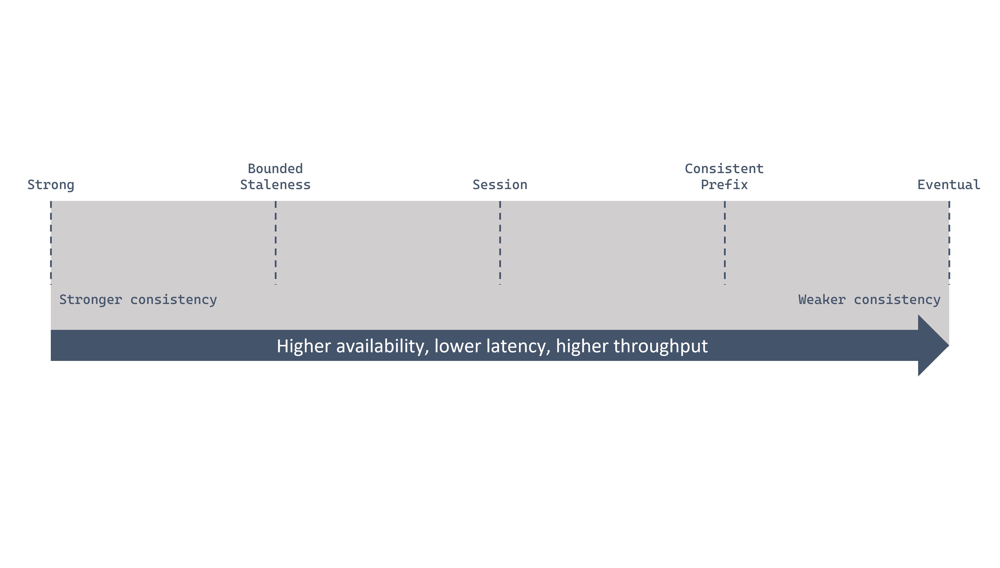

In a distributed database system when data is replicated over a wide area network to other regions to provide higher availability or lower read latency for users, tradeoffs must be made either on the data being completely consistent across the database or in higher write latency as data is synchronously committed to the other regions.

Azure Cosmos DB offers a sliding scale of consistency with many options between the traditional strong and weak options provided by other data storage solutions.

Each of the five consistency levels is well-defined with clear tradeoffs when compared with each other:

| **Consistency Level** | **Description** |
| ---: | --- |
| **Strong** | Linear consistency. Data is replicated and committed in all configured regions before acknowledged as committed and visible to all clients. |
| **Bounded Staleness** | Reads lag behind writes by a configured threshold in time or items. |
| **Session** | Within a specific session (SDK instance), users can read their own writes. |
| **Consistent Prefix** | Reads may lag behind writes, but reads will never appear out of order. |
| **Eventual** | Reads will eventually be consistent with writes. |

## Strong consistency

Strong consistency guarantees that all read operations will return the most recent version of the item. Client applications will never read an outdated item due to latency or inconsistency. Write operations are not fully committed until they are ready in all other regions.

This characteristic causes strong consistency to have the highest latency as it must wait for commits to replicate across large geographical distances.

## Bounded Staleness consistency

Bounded staleness is similar to Strong consistency except that reads are allowed to lag behind writes up to a defined threshold. That threshold could be defined as:

- **K** versions of an item lag behind the writes
- **T** time interval lag behind the writes

Bounded staleness is a good compromise for applications that want low write latency but need to enforce consistency up to a reasonable threshold.

> [!TIP]
> Bounded staleness provides strong consistency guarantees within the region in which data is written.

## Session consistency

Session consistency provides read your own write guarantees within a single client session or where the session token is passed between the SDK and client. Outside of that, the consistency guarantee is relaxed to either Consistent Prefix or Eventual consistency.

Session consistency is a great option for applications where the end users may be confused if they cannot immediately see any transaction they just made.

## Consistent Prefix consistency

Consistent Prefix consistency allows for looser consistency and higher performance while guaranteeing that reads, which lag behind the writes, will appear in order in which they were written.

Consistent Prefix consistency is ideal for applications where the order of read operations matters more than the latency.

## Eventual consistency

Eventual consistency is the weakest form of consistency where reads lag behind writes and reads may appear out of order. However, eventual consistency will have the lowest write latency, highest availability, and potential for most read scalability compared to other options.

Eventual consistency is a good option for applications that don't require any linear or consistency guarantees.
