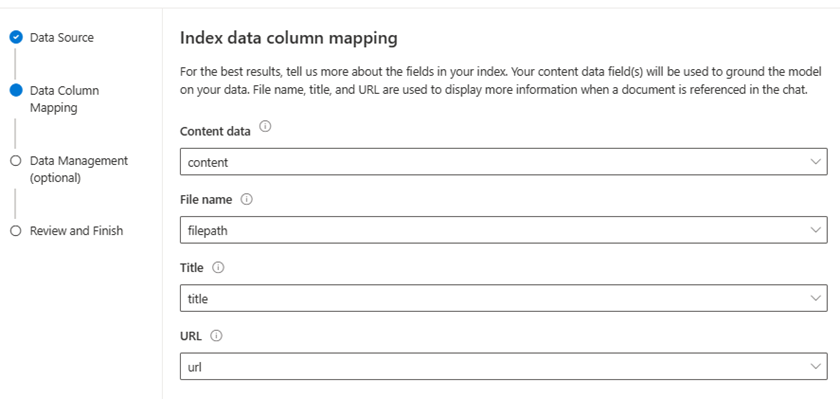

Adding your data is done through the Azure AI Studio, in the **Chat** playground. Currently, all of the data source options for Azure OpenAI on your data results in a Cognitive Search index that is used to augment the prompt sent to the model. When adding your data, you can choose to upload your data files, use data in a blob storage account, or connect to an existing Cognitive Search index.

If you are uploading or using files already in a storage account, Azure OpenAI on your data supports `.md`, `.txt`, `.html`, `.pdf`, and Microsoft Word or PowerPoint files. If any of these files contain graphics or images, the response quality depends on how well text can be extracted from the visual content.

When uploading data or connecting to files in a storage account, it's recommended to use the Azure AI Studio to create the search resource and index. Adding data this way allows the appropriate chunking to happen when inserting into the index, yielding better responses. If you're using large text files or forms, you should use the available [data preparation script](/azure/cognitive-services/openai/concepts/use-your-data#ingesting-your-data-into-azure-cognitive-search?azure-portal=true) to improve the AI model's accuracy.

Enabling [semantic search](/azure/search/semantic-search-overview?azure-portal=true) for your Cognitive Search service can improve the result of searching your data index and you are likely to receive higher quality responses and citations. However, enabling semantic search may increase the cost of the search service.

## Connect your data

To connect your data, navigate to the **Chat** playground in Azure AI Studio and select the **Add your data** tab in the **Assistant setup** pane. Select the **Add a data source** button to get your data connected. The prompts guide you through setting up the connection to each data source, and getting that data into a search index.

If you are using your own index that was not created through Azure AI Studio, one of the pages allows you to specify your column mapping. It's important to provide accurate fields, to enable the model to provide a better response, especially for **Content data**.

