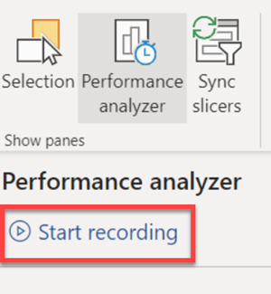
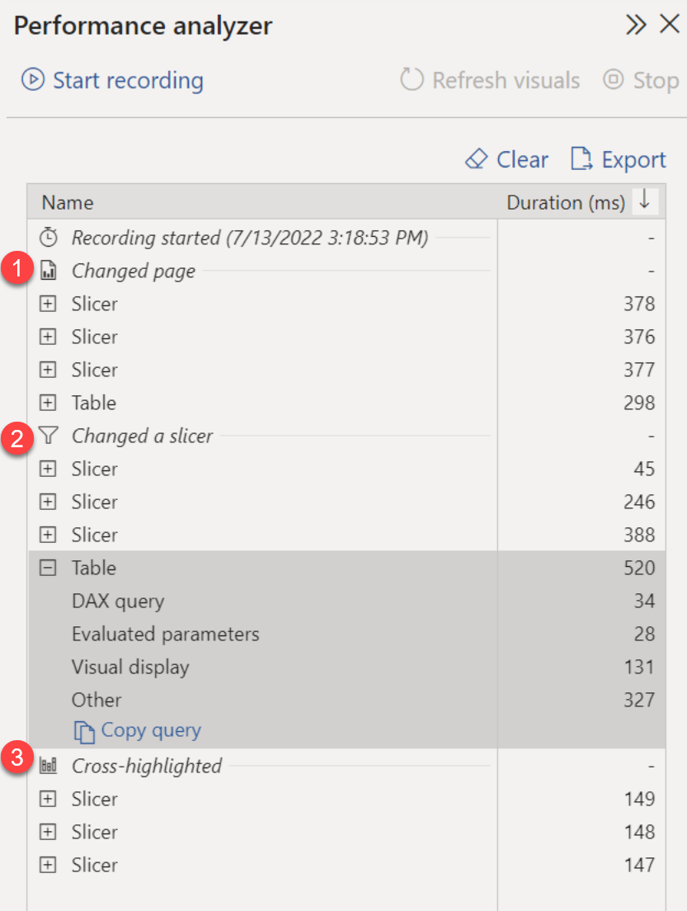
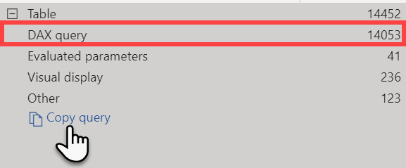

The first tool we're looking at is the [Performance analyzer](/power-bi/create-reports/desktop-performance-analyzer), which is built in to Power BI Desktop. The Performance analyzer helps you understand how report elements like visuals and DAX queries are performing.

The Performance analyzer helps you optimize at two of the four architecture levels, the *data model* and *report visuals*. The Performance analyzer is a great place to start when you're optimizing reports.

## Understand performance using Performance analyzer

The Performance analyzer displays and records logs that measure how each of your report elements performs when users interact with them. You can also see which aspects of their performance are most (or least) resource intensive. You can immediately see results, make changes, run the analyzer again, and see the impact of changes you've made.

The Performance Analyzer captures operations that occur in several major subsystems involved in executing a Power BI Report:
- **Report Canvas** provides the user interface for Power BI reports including hosting visuals and filters, managing user interactions for consuming and authoring reports, and retrieving data for display. The Report Canvas is written using web technologies and runs in web browsers or web browser components. The Report Canvas retrieves data using a high-level, internal, Power BI query language known as *Semantic Query*.
- **Data Shape Engine (DSE)** evaluates Semantic Queries by generating and running one, or more DAX queries against a data model hosted inside Power BI, Power BI Desktop, Azure Analysis Services, or SQL Server Analysis Services.
- **Data Model Engine (AS)** stores the data model and provides services to reports, such as DAX queries evaluation.  The model may be hosted in Power BI, Power BI Desktop, Azure Analysis Services, or SQL Server Analysis Services.  Depending on the data model host, a model may be tabular or multidimensional.  Tabular models may contain in-memory tables, Direct Query tables, or a mix of such tables.  DAX queries against tables in Direct Query mode will trigger queries to the Direct Query data source.  For example, a DAX query against a Direct Query table backed by a SQL Server database will trigger one, or more, SQL queries.

## Use Performance analyzer

To use the Performance analyzer, enable the Performance analyzer on the View tab of the ribbon, and select **Start recording**.

After you start recording, take actions in the report. For example, move from one report tab to the next, select a slicer item, or interact with any of your visuals. Any actions you take in the report are displayed and logged in real time in the Performance Analyzer pane, in the order that the visual is loaded by Power BI.

The Performance analyzer is looking at the time it takes for each visual to query the data model and render results. This is the time from when a user does something on the page to when the visual is rendered, in milliseconds.

In the example below, three actions were taken after recording started. 
1) Navigated to a new report page
2) Changed a slicer value
3) Cross highlighted a table

Each visual's log information includes the time spent (duration) to complete the following categories of tasks:

- **DAX query** - if a DAX query was required, this is the time between the visual sending the query, and for Analysis Services to return the results.
- **Evaluated parameters** (preview) - time spent evaluating the field parameters within a visual. Learn more about [field parameters (preview)](/power-bi/create-reports/power-bi-field-parameters).
- **Visual display** - time required for the visual to draw on the screen, including time required to retrieve any web images or geocoding.
- **Other** - time required by the visual for preparing queries, waiting for other visuals to complete, or performing other background processing.

After you've interacted with elements of the report you want to measure with Performance Analyzer, you can select the Stop button. The performance information remains in the pane after you select Stop for you to analyze.

You can select **Refresh visuals** in the Performance Analyzer pane to refresh all visuals on the current page of the report, which will gather information about all visuals.

If one particular visual appears to be performing slow, you can also refresh individual visuals. When Performance Analyzer is recording, you can select **Analyze this visual** found in the top-right corner of each visual, to refresh that visual, and capture its performance information.

> [!IMPORTANT]
> As users interact with visuals in Power BI reports, DAX queries are submitted to the dataset and cached into memory. Because of this, you may need to clear the DAX query cache to get accurate results in the Performance analyzer. You can clear the cache by either closing and re-opening your report, or using DAX Studio.

## Evaluate performance data further

There are many different ways you can dig deeper into information recorded by the Performance analyzer. 

You can use DAX Studio to investigate your queries in more detail by copying your query from the performance analyzer. After analyzing the query in DAX Studio, you can use your own knowledge and experience to identify where the performance issues are.

In the screenshot below, you can see that the DAX query in this table visual took 14 seconds. Users waited 14 seconds before seeing the results of the action that resulted in that query running, which in this case was a cross-highlight action. It's clear that this DAX needs to be optimized.

To analyze this query further, copy and paste the query into DAX Studio to repeat the execution of the query. In DAX Studio, you can activate more diagnostic tools using the Query Plan and Server Timings tracing options.

For DAX queries with long duration times, it's likely that a measure is written poorly or an issue has occurred with the data model. The issue might be caused by the relationships, columns, or metadata in your model, or it could be the status of the Auto date/time option.

You can also save Performance analyzer results by selecting the **Export** button, which creates a .json file containing results. Each event in the .json file contains timestamps, correlation information, and other metadata about the operation.

You can then load that data into DAX Studio to navigate through the performance metrics in more detail.

> [!TIP]
> For more information about the contents of the .json export file, see the [Performance analyzer export file documentation](https://github.com/microsoft/powerbi-desktop-samples/commits/main/Performance%20Analyzer/Power%20BI%20Performance%20Analyzer%20Export%20File%20Format.docx). 